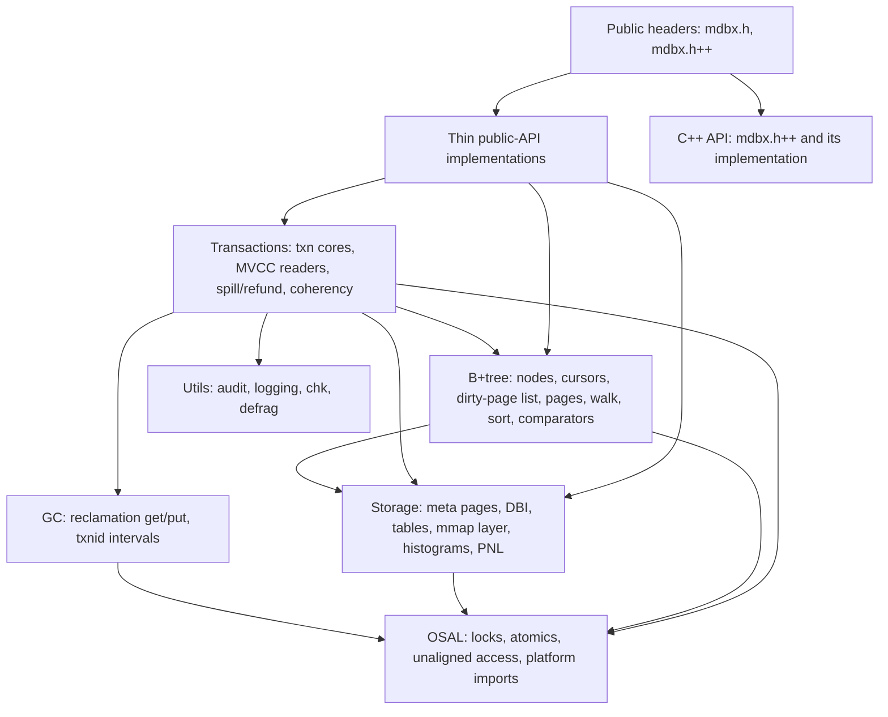

# libmdbx Architecture: mechanisms and internal organization

> Public edition for the amalgamated package: engine file names (`src/*.c`,
> `src/*.h`) refer to the development tree; in the amalgamated build the same
> logic lives in `mdbx.c`/`mdbx.h` (`mdbx.c++`/`mdbx.h++`). Fragments of
> interest only to tree developers are marked with dist-cutoff markers and
> stripped on publication.
> Related material: [`deep-dive.en.md`](deep-dive.en.md) — the detailed
> "how it works", [`improvements.en.md`](improvements.en.md) — the catalog of
> improvements over LMDB.

---

## 1. MVCC and snapshots

- The database file is a B+tree of pages in a shared mmap. Every write
  transaction builds a **new version** of the pages it changes (copy-on-write);
  old versions stay available to readers.
- A reader registers a slot in the **reader table (RLT)** and pins a snapshot
  number (`txn_id`); the oldest active snapshot (the **detention point**)
  defines the page-reuse watermark.
- Metadata is committed atomically through **three meta pages (Troika)**:
  a two-phase update with a minimum of memory barriers; the triple state
  machine covers all transitions between versions.
- Reading is wait-free: the read path takes no locks; 64-bit fields are read
  via safe64 atomics.

## 2. The durability/flush path

- Modified pages accumulate in the **dirty page list (DPL)**; when the limit is
  exceeded (`dp_limit`, by default ≈ 1/42 of the total plus available RAM), part
  of the pages is written out early (**spilling**).
- The commit pipeline proceeds in stages (measurable via `mdbx_txn_commit_ex()`
  → `MDBX_commit_latency`): preparation → **GC-update** → audit → **write** →
  **sync** → ending.
- Synchronization modes (`MDBX_SYNC_DURABLE`, `MDBX_NOMETASYNC`,
  `MDBX_SAFE_NOSYNC`, `MDBX_UTTERLY_NOSYNC`, `MDBX_WRITEMAP`) define what
  exactly is flushed to disk (data / meta / nothing) and how (direct writes /
  `fdatasync` / `msync`).
- Threshold-based auto-sync (`mdbx_env_set_syncbytes` /
  `mdbx_env_set_syncperiod`, `MDBX_opt_presync_threshold`) with a cheap poll
  (`mdbx_env_sync_poll`).

## 3. GC/freelist

- Freed pages are stored as **GC records** in the FREE_DBI tree, keyed by the
  retiring transaction number; the value is a page-number list (PNL).
- Reuse is allowed only for records keyed ≤ the detention point; pages newer
  than the oldest snapshot are "frozen".
- Selection policies: **FIFO** (default) or **LIFO** (`MDBX_LIFORECLAIM`).
- **BigFoot** splits giant free lists into chains of records with consecutive
  txnids.
- Search cost is regulated by `MDBX_opt_rp_augment_limit` and
  `MDBX_opt_gc_time_limit`; profiling — `MDBX_ENABLE_PROFGC` (fields in
  `MDBX_commit_latency.gc_prof`).
- **Refund / loose pages**: freed tail pages return to the unallocated space
  without a GC record; the loose cache speeds up intra-transaction reuse.

## 4. File growth and geometry

- Geometry is set by `mdbx_env_set_geometry()`: `size_lower`, `size_now`,
  `size_upper`, `growth_step`, `shrink_threshold`, `pagesize`.
- When GC is exhausted/frozen, the writer allocates pages from the
  **unallocated tail**, growing the file in `growth_step` steps on the fly
  (no process restarts).
- Shrinking happens only when the tail is free and invisible to anyone;
  `madvise(MADV_DONTNEED/REMOVE)` plus file truncation; hysteresis is required
  (the shrink step must exceed the growth step).
- At `size_upper` with GC/detention exhausted — `MDBX_MAP_FULL`; before that,
  mitigation kicks in: a new steady point, the HSR callback, eviction of parked
  readers.

## 5. mmap and memory

- The file is fully mapped into memory; reads are copy-free, writes go through
  CoW page copies (or directly in `MDBX_WRITEMAP` mode).
- `madvise(MADV_NOHUGEPAGE)` is applied to the mapping — THP is opted out; the
  database page size is geometry-driven (a power of two, 256…65536) and is not
  tied to OS pages.
- Large values are overflow page chains; fragmentation is controlled by
  spilling and GC limits.
- Weak memory models (ARM/AArch64/PPC/MIPS/RISC-V) — careful atomics
  (acquire/release, CAS, safe64); atomicity is verified at build time.

## 6. Single-writer

- At any moment exactly one write transaction is allowed; the lock is
  implemented with OS-specific primitives (POSIX `fcntl`/OFD, SysV semaphores,
  Windows `LockFileEx`).
- Ownership discipline violations are detected and reported with explicit
  codes: `MDBX_THREAD_MISMATCH`, `MDBX_TXN_OVERLAPPING`, `MDBX_BAD_RSLOT`,
  `MDBX_BUSY`.
- `MDBX_NOSTICKYTHREADS` allows handing a transaction between threads (for
  pools/coroutines); `mdbx_txn_park()`/`unpark()` lets a long-lived reader
  release its slot.

## 7. Layers and modular organization

The engine is split into subsystems with one-way top-down dependencies:



Includes are layered bottom-up: platform predefines → base types and utilities
→ internal structures (transaction, dirty-page list, DBI state, txnid
intervals) → modules. The cross-module function index is a single prototypes
header. In the amalgamated build all modules compile as one translation unit
(`MDBX_INTERNAL` becomes `static`), giving the compiler full visibility for
inlining and dead-code elimination.

<!-- dist-cutoff-begin -->
The precise per-subsystem file map (dev): public API — `src/api-*.c`;
transactions — `src/txn*.c`, `src/mvcc*.c`, `src/rthc.c`, `src/spill.c`,
`src/refund.c`, `src/coherency.c`; B+tree — `src/node.c`, `src/cursor*.c`,
`src/dpl.c`, `src/page-*.c`, `src/tree*.c`, `src/walk.c`, `src/sortzone*.c`;
storage — `src/meta*.c`, `src/dbi.c`, `src/table.c`, `src/dxb*.c`,
`src/histogram.c`, `src/pnl.c`, `src/global.c`; GC — `src/gc-get.c`,
`src/gc-put.c`, `src/rkl.c`; OSAL — `src/osal*.c`, `src/lck-*.c`,
`src/atomics-*.h`, `src/windows-import.c`; utils — `src/utils.c`,
`src/audit.c`, `src/logging_and_debug.c`, `src/chk.c`, `src/defrag.c`.
Module map: `structure.md`; build rules:
`build.md` (dev).
<!-- dist-cutoff-end -->

## 8. Key data structures

| Structure | Role |
| --- | --- |
| `MDBX_env` | Environment: DB mmap, lock-file mmap, options, DBI sequences, reader slots |
| `MDBX_txn` | Transaction: numbers (front/txnid), geometry, table descriptors (`dbs[]`), DBI states, cursor heads, the working set (meta troika, repnl, GC queues, dirtylist, retired/loose/spilled) |
| `meta_t` / `troika_t` | Meta page and the meta-version triple state machine |
| `tree_t` | Table descriptor: root, height, page/item counters, mod_txnid |
| `geo_t` | DB geometry: lower/current/upper bounds, growth/shrink steps, pagesize |
| `page_t` | Page header: txnid, flags, number, lower/upper free-space pointers |
| `node_t` | B+tree node: key/data sizes, flags (`N_BIG`, `N_DUP`, ...), inline payload |
| `MDBX_cursor` | Cursor: a (page, index) stack, state (poor/hollow/pointed/filled), comparator; dupsort uses a nested sub-cursor |
| `dpl_t`/`dp_t` | Dirty-page list: a lazily sorted pgno→page map with a reserve gap |
| `pnl_t` | Page-number list (a counter-prefixed sorted array) |
| `rkl_t` | A sorted txnid set = a contiguous interval + list (GC bookkeeping) |
| `txl_t` | A plain txnid list |
| `clc_t`/`kvx_t` | Comparators and key/value search callbacks, shared per environment |
| `reader_slot_t`, `lck_t` | Reader-table slot and the shared lock-file state (mutexes, reader table, statistics) |

## 9. Transaction lifecycles

### 9.1 Reading

```
mdbx_txn_begin(RDONLY)
  ├─ register a slot in the reader table (the lock file)
  └─ pick the recent/steady meta version → snapshot (txnid, geometry, trees)
reads via cursors → tree search → page_get (mmap, lock-free)
mdbx_txn_abort/reset → release or park the slot
```

Read transactions can be **cloned** and **parked** (`mdbx_txn_park`); parking
lets a long-lived reader release its slot, and "laggard" readers are kicked
(the HSR protocol) when their snapshots block page reuse.

### 9.2 Writing

```
mdbx_txn_begin(RW) → take the global write mutex + prepare the basal transaction
CRUD:
  tree search → page_get (a page from mmap) → page_touch (a CoW copy into the dirtylist)
  node insert/delete → page split/rebalance as needed
  freed pages → the retired list (+ the loose cache for fast reuse)
commit (stages: preparation → GC-update → audit → write → sync):
  1. GC-update: freed pages are recorded into the FREE_DBI GC tree
     (FIFO by default; LIFO with MDBX_LIFORECLAIM — the policy picks records by txnid)
  2. refund: tail pages return to the unallocated space
  3. spilling: when the dirtylist overflows — bulk page writes (+ fsync)
  4. audit (MDBX_CHECKING≥2): verify the page accounting totals
  5. two-phase meta commit + synchronization
  6. release the mutex, update readers, purge dead slots
abort → discard the dirtylist, restore the meta, release the lock
```

Nested transactions: the parent dirtylist is extended, children clone dirty
pages; the environment owns a reusable basal write transaction.

### 9.3 GC mechanics

- Freed pages are stored as **GC records keyed by the retiring txnid** in the
  FREE_DBI tree; the values are PNL page-number lists.
- Allocation: FIFO reuse by default; `MDBX_LIFORECLAIM` enables LIFO. Both
  policies support dense sequences and honor reclaiming obstacles (slow
  readers): a page reachable from an active older snapshot cannot be reused —
  the blockage is resolved by the HSR protocol.
- Reused/comeback record intervals are tracked by a dedicated structure
  (interval + list); "bigfoot" handling of large spans.
- Space-distribution histograms feed geometry decisions about growing and
  shrinking the file.

## 10. Cursors and search

- A cursor is a stack of (page, index) pairs down to a leaf; positioning via
  tree search (fast paths for first/last, branch search callbacks of the
  comparators).
- The state machine: `poor` (unset) / `hollow` (no data) / `pointed` / `filled`;
  end-of-data subtleties distinguish a "soft" EOF (logically at the end, the
  last row still readable) from a "hard" EOF (beyond the end, reading is
  forbidden) — this is the `mdbx_cursor_eof()` contract.
- Mutating operations go through CoW + node insert/delete with splitting
  (1→3 fallback), rebalancing, key propagation upwards and tree deepening.
- Massive deletions cut whole branches; multi-value (dupsort) is handled by
  nested sub-cursors and fast paths for fixed-size data.

## 11. Backup, integrity check, defragmentation

- **Backup** (`mdbx_env_copy*`): an ordered walk over all pages → bulk writes →
  a consistent snapshot without locking readers.
- **Integrity check** (`mdbx_chk`): structure validation, GC consistency, key
  ordering; per-area reports.
- **Defragmentation** (`mdbx_defrag`): a live-page map (parent/flags), moving
  live pages towards the file tail in cycles followed by remapping; coexists
  with GC.

## 12. Amalgamation and build variants

`make dist` produces the flat distribution (`mdbx.c`, `mdbx.h`, `mdbx.h++`,
`mdbx.c++`, `mdbx-internals.h`, tools): header inlining and stripping of
dev-only fragments by the dist-cutoff markers. The development tree is built
as a single "alloyed" translation unit by default; debug builds may use
per-module objects. Details — in the installation and building guide
(the "Getting started" section).

<!-- dist-cutoff-begin -->
## 13. Refactoring invariants (dev)

1. `MDBX_INTERNAL` functions stay module-internal unless exported by the
   prototypes header.
2. The read path must not take locks and must not allocate in hot loops
   (wait-free readers).
3. Page states (`frozen/spilled/shadowed/modifiable/tmp`) must be derivable
   from `mp->txnid` vs `txn->txnid/front_txnid` — predicates rely on it
   everywhere.
4. The two-phase meta commit order (`txnid_b=0` → `txnid_a=txnid` → bootid →
   `txnid_b=txnid`) must not be reordered.
5. GC must never return a page reachable from any active snapshot (reclaiming
   obstacles, HSR, interval bookkeeping).
6. The TLS destructor contract: on thread exit all of its reader registrations
   are removed across all envs.
7. The `txn->wr` layout and `__restrict` DBI-state arrays are
   performance-critical; changes require benchmarks and `pgop_stat`.
8. The on-disk format (`MDBX_MAGIC`, `MDBX_DATA_VERSION 3`, meta/tree/geo) is
   frozen — refactoring must not change the bytes written to disk.
9. Cursor EOF semantics (`z_eof_soft`/`z_eof_hard`) are the load-bearing
   contract of `mdbx_cursor_eof()`; pinned by tests.
10. `MDBX_CHECKING`/`MDBX_DEBUG` levels gate panic/assert/log paths; disabled
    checks must cost zero.
<!-- dist-cutoff-end -->

---

*The detailed mechanism exposition — [`deep-dive.en.md`](deep-dive.en.md);
the catalog of improvements over LMDB —
[`improvements.en.md`](improvements.en.md); the module map and build rules —
`structure.md`, `build.md` (dev).*
