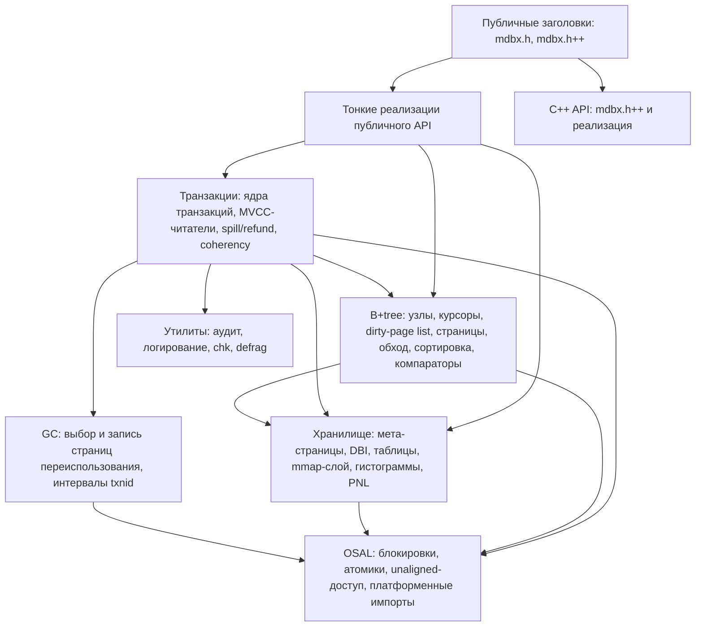

# Архитектура libmdbx: механизмы и внутренняя организация

> Публичная редакция для амальгамированного пакета: имена файлов движка
> (`src/*.c`, `src/*.h`) относятся к дереву разработки; в амальгамированной
> сборке та же логика находится в `mdbx.c`/`mdbx.h` (`mdbx.c++`/`mdbx.h++`).
> Фрагменты, интересные только разработчикам дерева, помечены маркерами
> dist-cutoff и вырезаются при публикации.
> Смежные материалы: [`deep-dive.ru.md`](internals.md) — подробное
> «как это работает», [`improvements.ru.md`](improvements.md) — каталог
> доработок над LMDB.

---

## 1. MVCC и снапшоты

- Файл БД — B+tree страниц в общем mmap. Каждая write-транзакция строит **новую версию**
  изменяемых страниц по принципу copy-on-write; старые версии остаются доступными читателям.
- Читатель регистрирует слот в **таблице читателей (RLT)** и фиксирует номер снапшота (`txn_id`);
  старейший активный снапшот (**детент**) определяет водораздел переиспользования страниц.
- Мета-данные фиксируются атомарно через **три мета-страницы (Troika)**: двухфазное обновление
  с минимумом барьеров памяти; конечный автомат тройки покрывает все переходы между версиями.
- Чтение — wait-free: путь чтения не берёт блокировок; 64-битные поля читаются через safe64.

## 2. Путь durability/flush

- Изменённые страницы накапливаются в **грязном списке (DPL)**; при превышении лимита (`dp_limit`,
  по умолчанию ≈ 1/42 суммы всей и доступной ОЗУ) часть страниц выгружается заранее (**спилл**).
- На коммите конвейер идёт по стадиям (измеримо через `mdbx_txn_commit_ex()` →
  `MDBX_commit_latency`): подготовка → **GC-update** → аудит → **запись** (`write`) →
  **синхронизация** (`sync`) → завершение.
- Режимы синхронизации (`MDBX_SYNC_DURABLE`, `MDBX_NOMETASYNC`, `MDBX_SAFE_NOSYNC`,
  `MDBX_UTTERLY_NOSYNC`, `MDBX_WRITEMAP`) определяют, что именно сбрасывается на диск
  (данные / мета / ничего) и каким способом (прямая запись / `fdatasync` / `msync`).
- Авто-синхронизация по порогам (`mdbx_env_set_syncbytes` / `mdbx_env_set_syncperiod`,
  `MDBX_opt_presync_threshold`) с дешёвым опросом (`mdbx_env_sync_poll`).

## 3. GC/freelist

- Освобождённые страницы записываются в **GC-дерево** (FREE_DBI) записями, ключ которых — номер
  освободившей транзакции; значение — список номеров страниц (PNL).
- Переиспользование допустимо только для записей с ключом ≤ детента; страницы новее
  старейшего снапшота «заморожены».
- Политики выбора: **FIFO** (по умолчанию) или **LIFO** (`MDBX_LIFORECLAIM`).
- **BigFoot** дробит гигантские списки освобождений на цепочки записей последовательных txnid.
- Стоимость поиска регулируется лимитами `MDBX_opt_rp_augment_limit` и `MDBX_opt_gc_time_limit`;
  профилирование — `MDBX_ENABLE_PROFGC` (поля в `MDBX_commit_latency.gc_prof`).
- **Refund / loose-страницы**: освобождённые хвостовые страницы возвращаются в неразмеченное
  пространство без записи в GC; loose-кэш ускоряет переиспользование внутри транзакции.

## 4. Рост файла и геометрия

- Геометрия задаётся `mdbx_env_set_geometry()`: `size_lower`, `size_now`, `size_upper`,
  `growth_step`, `shrink_threshold`, `pagesize`.
- Когда GC исчерпан/заморожен, писатель выделяет страницы из **неразмеченного хвоста**, расширяя
  файл шагами `growth_step` на лету (без перезапуска процессов).
- Сжатие — только когда хвост свободен и никем не виден; применяется `madvise(MADV_DONTNEED/
  REMOVE)` + усечение файла; гистерезис обязателен (шаг сжатия > шага роста).
- При достижении `size_upper` и исчерпании GC/детента — `MDBX_MAP_FULL`; перед этим срабатывают
  разрешающие меры: новый steady-point, HSR-колбэк, выселение припаркованных читателей.

## 5. mmap и память

- Файл отображён в память целиком; чтение без копирования, запись через CoW-копии страниц
  (или напрямую в `MDBX_WRITEMAP`).
- Для области mmap применяется `madvise(MADV_NOHUGEPAGE)` — отказ от THP; размер страницы БД
  управляется геометрией (степень двойки 256…65536), не связан со страницами ОС.
- Большие значения — overflow-цепочки страниц; фрагментация контролируется спиллом и лимитами GC.
- Слабые модели памяти (ARM/AArch64/PPC/MIPS/RISC-V) — аккуратные атомики (acquire/release,
  CAS, safe64); проверка атомарности на этапе сборки.

## 6. Single-writer

- В любой момент времени допускается одна write-транзакция; блокировка реализована через
  OS-зависимые примитивы (POSIX `fcntl`/OFD, SysV семафоры, Windows `LockFileEx`).
- Нарушения дисциплины владения/пересечения детектируются и возвращаются явными кодами:
  `MDBX_THREAD_MISMATCH`, `MDBX_TXN_OVERLAPPING`, `MDBX_BAD_RSLOT`, `MDBX_BUSY`.
- `MDBX_NOSTICKYTHREADS` разрешает передачу транзакции между потоками (для пулов/корутин);
  `mdbx_txn_park()`/`unpark()` — освобождение слота долгоживущим читателем.

## 7. Слои и модульная организация

Движок разделён на подсистемы с односторонними зависимостями «сверху вниз»:



Включения выстраиваются снизу вверх: платформенные предопределения → базовые типы и
утилиты → внутренние структуры (транзакция, dirty-page list, состояния DBI, интервалы
txnid) → модули. Реестр межмодульных функций — единый заголовок прототипов. В
амальгамированной сборке все модули компилируются как один трансляционный блок
(`MDBX_INTERNAL` превращается в `static`), что даёт компилятору полную видимость для
инлайнинга и устранения мёртвого кода.

<!-- dist-cutoff-begin -->
Точная карта файлов по подсистемам (dev): публичный API — `src/api-*.c`; транзакции —
`src/txn*.c`, `src/mvcc*.c`, `src/rthc.c`, `src/spill.c`, `src/refund.c`, `src/coherency.c`;
B+tree — `src/node.c`, `src/cursor*.c`, `src/dpl.c`, `src/page-*.c`, `src/tree*.c`,
`src/walk.c`, `src/sortzone*.c`; хранилище — `src/meta*.c`, `src/dbi.c`, `src/table.c`,
`src/dxb*.c`, `src/histogram.c`, `src/pnl.c`, `src/global.c`; GC — `src/gc-get.c`,
`src/gc-put.c`, `src/rkl.c`; OSAL — `src/osal*.c`, `src/lck-*.c`, `src/atomics-*.h`,
`src/windows-import.c`; утилиты — `src/utils.c`, `src/audit.c`,
`src/logging_and_debug.c`, `src/chk.c`, `src/defrag.c`. Карта модулей:
`structure.md`; правила сборки: `build.md` (dev).
<!-- dist-cutoff-end -->

## 8. Ключевые структуры данных

| Структура | Роль |
| --- | --- |
| `MDBX_env` | Окружение: mmap БД, mmap файла блокировок, опции, последовательности DBI, слоты читателей |
| `MDBX_txn` | Транзакция: номера (front/txnid), геометрия, дескрипторы таблиц (`dbs[]`), состояния DBI, головы курсоров, рабочий набор (troika мета, repnl, GC-очереди, dirtylist, retired/loose/spilled) |
| `meta_t` / `troika_t` | Мета-страница и конечный автомат тройки мета-версий |
| `tree_t` | Дескриптор таблицы: корень, высота, счётчики страниц/записей, mod_txnid |
| `geo_t` | Геометрия БД: нижняя/текущая/верхняя границы, шаги роста/сжатия, pagesize |
| `page_t` | Заголовок страницы: txnid, флаги, номер, указатели свободного места (lower/upper) |
| `node_t` | Узел B+tree: размеры ключа/данных, флаги (`N_BIG`, `N_DUP`, ...), инлайн-данные |
| `MDBX_cursor` | Курсор: стек (страница, индекс), состояние (poor/hollow/pointed/filled), компаратор; dupsort — вложенный подв-курсор |
| `dpl_t`/`dp_t` | Dirty-page list: отложенно-сортируемое отображение pgno → страница с резервным зазором |
| `pnl_t` | Список номеров страниц (отсортированный массив со счётчиком-префиксом) |
| `rkl_t` | Отсортированное множество txnid = непрерывный интервал + список (бухгалтерия GC) |
| `txl_t` | Простой список txnid |
| `clc_t`/`kvx_t` | Компараторы и поисковые колбэки по ключу/значению, общие на окружение |
| `reader_slot_t`, `lck_t` | Слот таблицы читателей и общее состояние файла блокировок (мьютексы, таблица читателей, статистика) |

## 9. Жизненный цикл транзакций

### 9.1 Чтение

```
mdbx_txn_begin(RDONLY)
  ├─ регистрация слота в таблице читателей (файл блокировок)
  └─ выбор недавней/steady мета-версии → снапшот (txnid, геометрия, деревья)
чтение через курсоры → поиск по дереву → page_get (mmap, без блокировок)
mdbx_txn_abort/reset → освобождение или парковка слота
```

Read-транзакции можно **клонировать** и **парковать** (`mdbx_txn_park`); парковка
позволяет долгоживущему читателю освободить слот, а «отстающие» читатели вытесняются
(протокол HSR), когда их снапшоты блокируют переиспользование страниц.

### 9.2 Запись

```
mdbx_txn_begin(RW) → захват глобального мьютекса записи + подготовка базальной транзакции
CRUD:
  поиск по дереву → page_get (страница из mmap) → page_touch (CoW-копия в dirtylist)
  вставка/удаление узлов → расщепление/ребалансировка страниц при необходимости
  освобождённые страницы → retired-список (+ loose-кэш для быстрого переиспользования)
commit (стадии: подготовка → GC-update → аудит → запись → синхронизация):
  1. GC-update: освободившиеся страницы записываются в GC-дерево FREE_DBI
     (FIFO по умолчанию; LIFO с MDBX_LIFORECLAIM — политика выбирает записи по txnid)
  2. refund: возврат хвостовых страниц в неразмеченное пространство
  3. спилл: при переполнении dirtylist — выгрузка страниц (bulk-запись + fsync)
  4. аудит (MDBX_CHECKING≥2): сверка суммарной бухгалтерии страниц
  5. двухфазная фиксация мета-страниц + синхронизация
  6. освобождение мьютекса, обновление читателей, чистка мёртвых слотов
abort → отбросить dirtylist, восстановить мета, снять блокировку
```

Вложенные транзакции: родительский dirtylist расширяется, дочерние клонируют
грязные страницы; окружение владеет переиспользуемой базальной write-транзакцией.

### 9.3 Механика GC

- Свободные страницы хранятся **GC-записями, ключ — освобождающий txnid**, в дереве
  FREE_DBI; значения — PNL-списки номеров страниц.
- Аллокация: переиспользование FIFO по умолчанию; `MDBX_LIFORECLAIM` включает LIFO.
  Обе политики поддерживают плотные последовательности и уважают препятствия
  (медленные читатели): страница, достижимая из активного старого снапшота,
  не может быть переиспользована — блокировка разрешается протоколом HSR.
- Интервалы переиспользованных/возвратных записей учитываются отдельной структурой
  (интервал + список); «bigfoot»-обработка крупных диапазонов.
- Гистограммы распределения пространства используются геометрией для решений
  о росте/сжатии файла.

## 10. Курсоры и поиск

- Курсор — стек пар (страница, индекс) до листа; позиционирование через поиск по
  дереву (быстрые пути first/last, branch-колбэки компараторов).
- Машина состояний: `poor` (не позиционирован) / `hollow` (данных нет) / `pointed` /
  `filled`; тонкости конца данных различают «мягкий» EOF (логически в конце,
  последняя строка ещё читаема) и «жёсткий» EOF (за концом, чтение запрещено) —
  это контракт `mdbx_cursor_eof()`.
- Изменяющие операции идут через CoW + вставку/удаление узлов с расщеплением
  (fallback 1→3), ребалансировкой, распространением ключей вверх и углублением дерева.
- Массовые удаления срезают ветви целиком; multi-value (dupsort) обрабатывается
  вложенными под-курсорами и быстрыми путями для фиксированного размера данных.

## 11. Backup, проверка целостности, дефрагментация

- **Backup** (`mdbx_env_copy*`): упорядоченный обход всех страниц → bulk-запись →
  консистентный снапшот без блокировки читателей.
- **Проверка целостности** (`mdbx_chk`): валидация структуры, согласованности GC,
  порядка ключей; отчёты по областям.
- **Дефрагментация** (`mdbx_defrag`): карта живых страниц (родитель/флаги),
  перенос живых страниц к хвосту файла циклами с последующим ремапом;
  сосуществует с GC.

## 12. Amalgamation и варианты сборки

`make dist` формирует плоскую поставку (`mdbx.c`, `mdbx.h`, `mdbx.h++`, `mdbx.c++`,
`mdbx-internals.h`, утилиты): инлайнинг заголовков и вырезание dev-фрагментов по
маркерам dist-cutoff. Дерево разработки по умолчанию собирается единым «alloyed»
трансляционным блоком; отладочные сборки могут использовать помодульные объекты.
Подробности — в руководстве по сборке (раздел «Установка и сборка»).

<!-- dist-cutoff-begin -->
## 13. Инварианты рефакторинга (dev)

1. `MDBX_INTERNAL`-функции остаются модульно-внутренними, если не экспортированы
   прототип-заголовком.
2. Путь чтения не берёт блокировок и не аллоцирует в горячих циклах (wait-free читатели).
3. Состояния страниц (`frozen/spilled/shadowed/modifiable/tmp`) обязаны выводиться
   из `mp->txnid` vs `txn->txnid/front_txnid` — предикаты повсеместно опираются на это.
4. Порядок двухфазной фиксации мета (`txnid_b=0` → `txnid_a=txnid` → bootid →
   `txnid_b=txnid`) менять нельзя.
5. GC не имеет права вернуть страницу, достижимую из любого активного снапшота
   (препятствия переиспользованию, HSR, бухгалтерия интервалов).
6. Контракт TLS-деструкторов: при завершении потока все его регистрации читателей
   снимаются во всех env.
7. Раскладка `txn->wr` и `__restrict`-массивы состояний DBI — производительно-критичны;
   изменения требуют бенчмарков и `pgop_stat`.
8. Дисковый формат (`MDBX_MAGIC`, `MDBX_DATA_VERSION 3`, мета/tree/geo) заморожен —
   рефакторинг не меняет байты на диске.
9. Семантика курсорного EOF (`z_eof_soft`/`z_eof_hard`) — несущий контракт
   `mdbx_cursor_eof()`; закреплена тестами.
10. Уровни `MDBX_CHECKING`/`MDBX_DEBUG` гейтируют panic/assert/log-пути; стоимость
    выключенных проверок должна быть нулевой.
<!-- dist-cutoff-end -->

---

*Подробное изложение механизмов — [`deep-dive.ru.md`](internals.md);
каталог доработок над LMDB — [`improvements.ru.md`](improvements.md);
карта модулей и правила сборки — `structure.md`, `build.md` (dev).*
