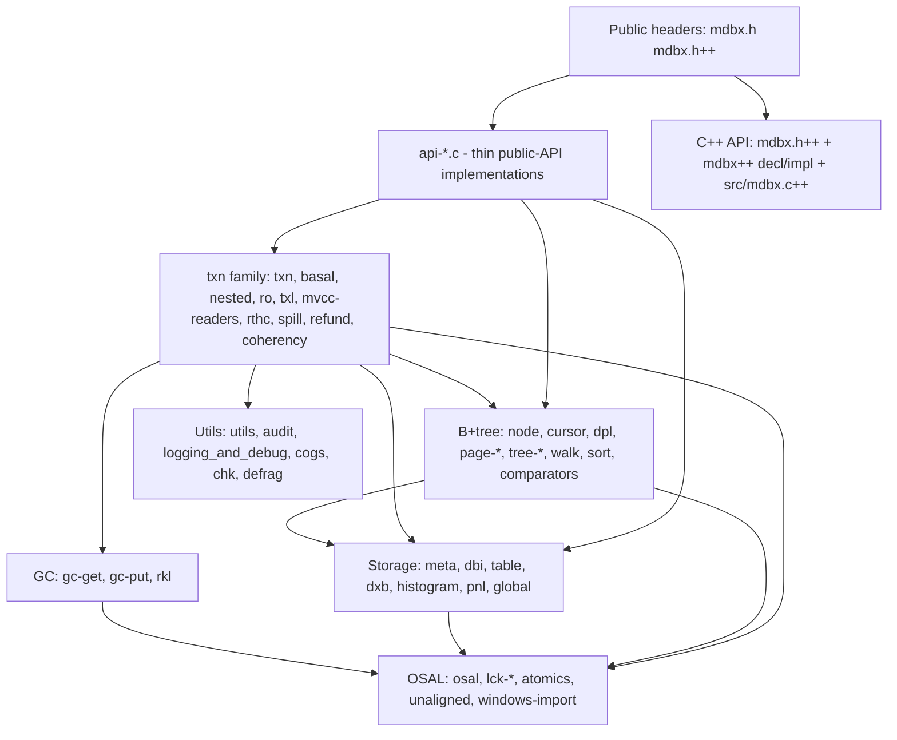

# Internal Architecture

> Part of the [Skynet project index](README.md).
> How the libmdbx engine is organized: layering, core structures, transaction/MVCC mechanics,
> commit pipeline, page states, concurrency model and key invariants. Written for refactoring;
> companion docs: [`structure.md`](structure.md) (module map), [`build.md`](build.md) (build/
> tests/amalgamation).

---

## 1. Layering



Include backbone (bottom-up): `preface.h` (platform predefines) ← `essentials.h`
(`MDBX_INTERNAL`, base types, pulls preface/options/osal/atomics/layouts) ← `internals.h`
(core structs: `troika_t`, `MDBX_txn`, `dpl_t`, `clc_t`, DBI state; pulls rkl/txl/unaligned/
proto-relevant headers) ← every module `.c`. `proto.h` = cross-module function index.
`MDBX_INTERNAL` linkage flips to `static` in alloyed builds (`xMDBX_ALLOY`, see
[`build.md`](build.md) §7.4).

## 2. Core structures (where they live)

| Structure | Defined in | Role |
| --- | --- | --- |
| `MDBX_env` | `mdbx.h` (public) + internals | Environment: mmap of DB (`dxb_mmap`), lock file (`lck_mmap`), options, per-DBI seqs, reader slots, `basal_txn` |
| `MDBX_txn` | `internals.h` | Transaction: `txnid/front_txnid`, `geo`, `dbs[]` (tree records), `dbi_state[]/dbi_seqs[]/dbi_sparse`, cursors heads, `wr.{troika, repnl, gc.{reclaimed,ready4reuse,comeback}, dirtylist, retired_pages, loose_pages, spilled}` |
| `meta_t` / `troika_t` | `layout-dxb.h` / `internals.h` | Meta page + triple-meta state machine (`fsm/recent/prefer_steady/tail`) |
| `tree_t` | `layout-dxb.h` | Per-table descriptor: root pgno, height, pages counts, items, sequence, mod_txnid |
| `geo_t` | `layout-dxb.h` | DB geometry: grow/shrink pv, lower/upper/now, first_unallocated |
| `page_t` | `layout-dxb.h`/internals | Page header: `txnid`, flags (`P_*`), `pgno`, `lower/upper` free space pointers |
| `node_t` | `layout-dxb.h`/`node.h` | B+tree node: `ksize`, `dsize`, `flags` (`N_BIG`, `N_DUP`, ...), inline key/data |
| `MDBX_cursor` | `cursor.h`/internals | Cursor: page stack `pg[]/ki[]`, `top`, flags (`z_*`), `clc`, dbi slot; nested dupsort via `cursor_couple_t` |
| `dpl_t`/`dp_t` | `internals.h` | Dirty-page list (lazy-sorted pgno→page map with reserve gap) |
| `pnl_t` | `pnl.h` | Page-number list (counter-prefixed sorted array) |
| `rkl_t` | `rkl.h` | Sorted txnid set = contiguous interval + list (GC recycling bookkeeping) |
| `txl_t` | `txl.h` | Plain txnid list |
| `clc_t`/`kvx_t` | `internals.h` | Comparator + min/max lengths + search callbacks per key/value, shared per-env |
| `reader_slot_t` | `layout-lck.h` | Reader Lock Table slot (pid/tid/txnid) in the shared lock file |
| `lck_t` | `layout-lck.h` | Shared lock-file state: mutexes, reader table, `pgop_stat`, `gc_prof` |

## 3. Concurrency model

- **One writer**: a single global write-txn mutex (`lck_txn_lock/unlock`); write txns are fully
  serialized — no conflicts, no deadlocks.
- **Wait-free readers**: readers never block and never take locks on the data path; they just
  register in the Reader Lock Table (`mvcc_bind_slot`) and read the committed meta snapshot.
- **MVCC + copy-on-write**: pages are immutable after their committing txnid; a write txn clones
  (`page_touch`/`page_get`) any page it must modify (`is_modifiable` iff `mp->txnid == front`).
- **Page states** (by `mp->txnid` vs `txn->txnid`/`front_txnid`, `page-ops.h`):
  `frozen` (older) / `spilled` (== txnid, written out) / `shadowed` (> txnid) / `modifiable`
  (== front) / `tmp` (signature marker for not-yet-committed).
- **TLS discipline**: per-thread reader registration is bound to TLS keys with destructor
  cleanup (`rthc_thread_dtor`); glibc TLS-destructor bugs (#21031/#21032) are worked around in
  `rthc.c`. This is what keeps the readers table free of dead threads and safe under DSO/DLL
  unloading.
- **Two-phase meta update**: `meta_update_begin` zeroes `txnid_b` then stores `txnid_a`;
  `meta_update_end` copies bootid and stores `txnid_b` — readers observe either old or new
  committed txnid, never a torn one.

## 4. Transaction lifecycles

### 4.1 Read transaction

```
mdbx_txn_begin(RDONLY) → txn_ro_start
  ├─ mvcc_bind_slot: acquire reader slot in LCK-file reader table
  └─ meta_tap: read troika, pick recent/prefer_steady meta → snapshot (txnid, geo, trees)
CRUD via cursors → tree_search → page_get_* (mmap, no locks)
mdbx_txn_abort/reset → txn_ro_free / park (txn_ro_park, auto-unpark on reuse)
```

Read txns can be **cloned** (`txn_ro_clone`) and **parked** (`mdbx_txn_park`); parking lets a
long-lived reader release its slot while "outsiders" (laggards) are kicked via
`mvcc_kick_laggards` when GC reclamation is blocked.

### 4.2 Write transaction

```
mdbx_txn_begin(RW) → lck_txn_lock + txn_setup_primal (basal txn reuse) + troika copy
CRUD:
  tree_search → page_get (mmap page) → page_touch (CoW clone into dirtylist via dpl)
  node_add_leaf/branch / node_del → page_split/rebalance as needed
  freed pages → wr.retired_pages (+ loose_pages fast reuse within txn)
commit → txn_commit:
  stage timestamps: start → prep → gc → audit → write → sync → gc_cpu
  1. gc_update (gc-put): retire freed pages into FREE_DBI GC records
     (txn.wr.repnl ← reclaimed pages via gc-get in LIFO order; rkl tracks record ids)
  2. refund: return reclaimed/loose pages adjacent to file tail (first_unallocated shrink)
  3. spilling (if dirtylist over dp_limit): iov bulk write + msync/fsync (dxb_*)
  4. audit pass (MDBX_CHECKING>=2): sum pages across GC + DBs, verify accounting
  5. meta_update_begin/end: two-phase meta commit + dxb_sync_locked
  6. release write mutex, update readers (mvcc), purge dead readers
abort → txn_abort: discard dirtylist, restore meta, release lock (nested: txn_nested_*)
```

Nested txns: `txn_nested_create/commit/abort/checkpoint/rollback`; parent dirtylist is
extended, children clone dirty pages (`pgop_stat.clone`). The environment owns a reusable
`basal_txn` (`env_owned_wrtxn` returns it when the caller thread owns the write lock).

### 4.3 GC mechanics

- Free pages are stored as **GC records keyed by retiring txnid** in the FREE_DBI tree
  (`gc-put.c`); records contain PNLs of page numbers.
- Allocation (`gc-get.c`): LIFO recycling by default (`ALLOC_LIFO`), supporting dense
  sequences and honoring reclaiming obstacles (slow readers) — pages protected by an active
  older snapshot must not be reused; `mvcc_kick_laggards`/Handle-Slow-Readers resolve blockage.
- `rkl` keeps the set of reclaimed/comeback record ids; `gc_update` merges, coalesces and
  "bigfoot" handles large spans (`MDBX_ENABLE_BIGFOOT`).
- `histogram.c` tracks space distribution for geometry decisions; `dxb_resize` grows/shrinks
  the file per `geo_t` (`implicit_grow/implicit_shrink/explicit_resize`).

## 5. Cursor & search internals

- Cursor = stack of (page,index) pairs down to a leaf; positioning via `tree_search`
  (fast path for first/last, `Z_FIRST/Z_LAST`, branch search callbacks in `clc_t`).
- State machine: `poor` (unset) / `hollow` (no data) / `pointed` / `filled`; end-of-data
  subtleties encoded by `z_eof_soft` (logically at end, last row still readable, `prev` moves
  to the second-to-last row) vs `z_eof_hard` (beyond end, no read allowed). See the
  Russian-language doc-comment in `src/cursor.h` for the exact semantics.
- Mutating ops go through `page_touch` + `node_add/del` with splitting
  (`page_split`, 1-into-3 fallback), rebalancing (`tree_rebalance`), key propagation
  (`tree_propagate_key`), deepening (`tree_deepen_*`).
- Massive deletes cut whole branches (`tree_cutoff_*`, bunches removal).
- Multi-value (dup) handling: `dpl.c` dup-list processing, nested dupsort sub-cursors
  (`cursor_couple_t`, inner tree), `N_DUPFIXED` fixed-size data fast paths.

## 6. Backup, check, defrag

- **Backup** (`api-copy.c` + `walk.c`): ordered walk over all pages → `iov` bulk writes →
  consistent snapshot without locking readers.
- **Integrity check** (`chk.c` + `walk.c` + `histogram.c`): validates structure, GC
  consistency, key ordering (`dont_check_keys_ordering` off), reports via `chk_line_*` scopes.
- **Defrag** (`defrag.c` + `dml.c` + `gc.h::defract_context`): builds `dml_t` arc map
  (page→parent, mapped/engaged/gc flags), moves live pages towards the file tail in cycles,
  then remaps; coexists with GC and `mdbx_defrag` tool.

## 7. Amalgamation & build-time shaping (summary)

Dev tree is built as a single "alloyed" TU (`src/alloy.c`) by default; DEBUG builds may use
per-module objects (`MDBX_ALLOY_BUILD=OFF`). `make dist` produces the flat single-file
distribution (`mdbx.c`, `mdbx.h`, `mdbx.h++`, `mdbx.c++`, `mdbx-internals.h`, tools) by sed
inlining and removing `dist-cutoff` regions — see [`build.md`](build.md) §7 for the full
pipeline and marker conventions (relevant when integrating GoogleTest or other dependencies).

## 8. Key invariants to preserve during refactoring

1. `MDBX_INTERNAL` functions stay module-internal unless exported via `proto.h`.
2. Read path must not take locks and must not allocate in hot loops (wait-free readers).
3. Page states (`frozen/spilled/shadowed/modifiable/tmp`) must remain decidable from
   `mp->txnid` vs `txn->txnid/front_txnid` — used by `page-ops.h` predicates everywhere.
4. Two-phase meta commit order (`txnid_b=0` → `txnid_a=txnid` → bootid → `txnid_b=txnid`)
   must not be reordered.
5. GC must never return a page still reachable by any active reader snapshot
   (`gc_reclaiming_obstacle`, `mvcc_kick_laggards`, `rkl` bookkeeping).
6. TLS destructor contract in `rthc.c` must hold: on thread exit, all reader entries of that
   thread must be removed across env objects.
7. `txn->wr` union layout and `__restrict` arrays (`dbi_state`, `dbi_seqs`) are performance-
   critical; changing them requires benchmark/`pgop_stat` validation.
8. On-disk format (`layout-dxb.h`: `MDBX_MAGIC`, `MDBX_DATA_VERSION 3`, `meta_t`, `tree_t`,
   `geo_t`) is frozen — refactoring must not alter bytes written to disk.
9. Cursor EOF semantics (`z_eof_soft`/`z_eof_hard`) are load-bearing for the public API
   contract (`mdbx_cursor_eof`) — pinned by `tests/ut/cursor_closing.c++` etc.
10. `MDBX_CHECKING`/`MDBX_DEBUG` levels gate panic/assert/log paths; keep the cost of
    `CHECKS0/1/2_ENABLED()` checks at zero when disabled.