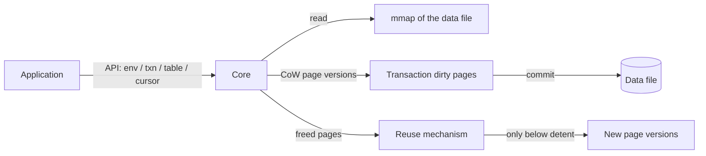
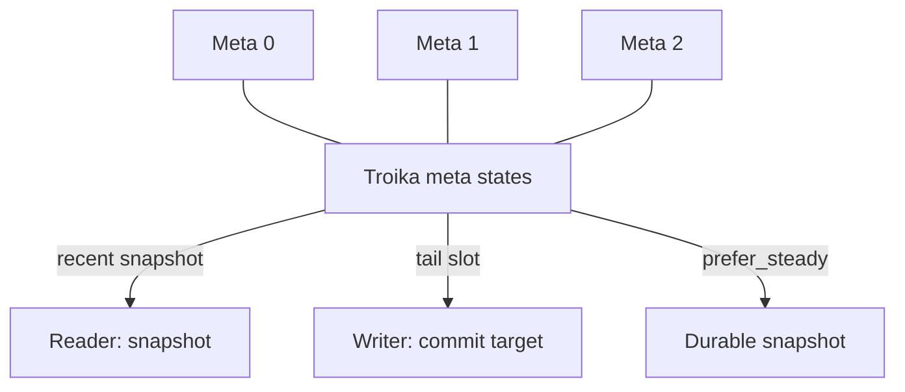
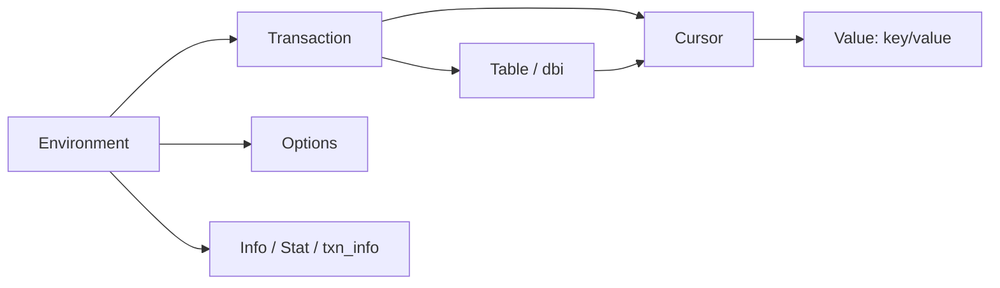
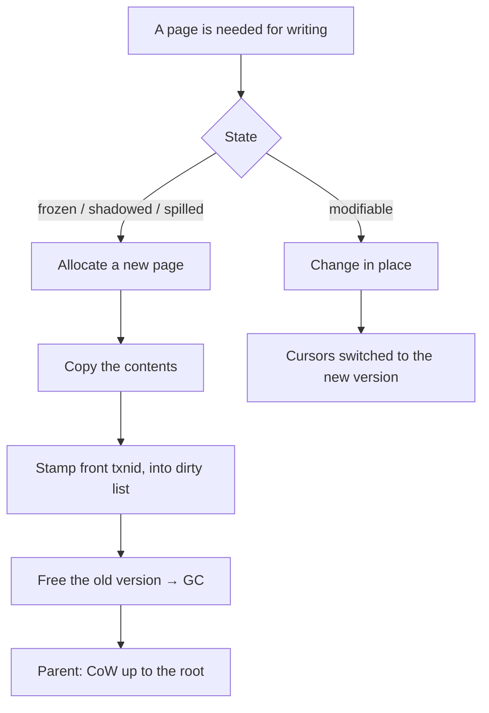
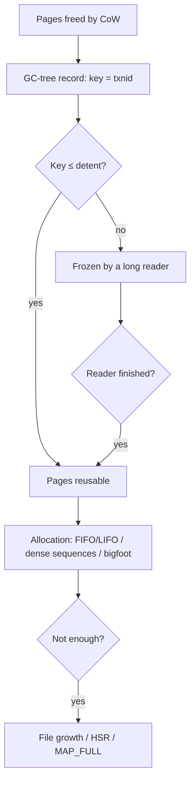

# How libmdbx works (functional architecture)

> Part of the [Skynet](README.md) index.
> A functional view of the architecture: subsystems, mechanisms, API entities and their interplay —
> "how it works" — **without binding to source-code files and modules**.
> Companion documents: [`architecture.md`](architecture.md) (internal structure and invariants,
> module-bound), [`structure.md`](structure.md) (file map),
> [`test-coverage.md`](test-coverage.md).

---

## 1. Overview

**libmdbx** is an embedded transactional key-value database, a deeply reworked descendant of LMDB.
The library is linked into the application process; there is no server process.

The properties that shape the whole architecture:

| Property | Consequence |
| --- | --- |
| **B+tree** | Data lives in balanced pages; lookup is a descent from root to leaf |
| **MVCC** (multiversion concurrency control) | Every page is stamped with the transaction number that created it; readers see a consistent snapshot without locks |
| **Copy-on-Write (CoW)** | A write transaction never modifies a page already visible to readers; it creates a new version instead |
| **Memory-mapped data file** | Reading is memory access (mmap); there is no separate buffer cache inside the library |
| **No WAL, no crash-recovery** | Atomicity comes from two-phase updates of the meta-pages; after a crash it is enough to pick the last consistent meta |
| **Wait-free readers, a single writer** | Readers take no locks on the read path; all write transactions are serialized by one global mutex |
| **Built-in page reuse (GC)** | Freed pages are recycled only when no reader can see them anymore |

The data flow in its most general form:

---

## 2. Conceptual data model

### 2.1. Tables and records

- A **table** (in API terms — `dbi`/map/sub-DB) is a named B+tree inside the common file.
  Inside the database there is a **main table** holding descriptors of all other tables
  (name → tree root, flags, counters).
- A **record** is a "key → value" pair (in API terms — `MDBX_val`/`slice`). Keys within a table
  are ordered by the table's comparator.
- **Multivalues** (multimap, the dupsort flag): a single key may be associated with several values.
  They are either kept in a nested subtree (dupsort-tree) or packed into specialized
  fixed-size pages (dupfix).
- Values that do not fit into a leaf page are moved to **overflow pages** (section 7).

Size limits:
- Keys are limited to about half a page (the exact limit depends on page size and table mode);
  for integer keys — 8 bytes.
- Values — up to `MDBX_MAXDATASIZE ≈ 2 GiB`.
- The maximum number of tables (`MDBX_MAX_DBI`) and readers is bounded by constants/settings of the environment.

### 2.2. The page — the unit of storage and I/O

The page size is chosen at database creation (256…65536 bytes, 4096 by default) and never changes.

Page types by purpose:

| Type | Purpose |
| --- | --- |
| branch | Internal B+tree node: separator keys and child pointers |
| leaf | Leaf node: actual key→value pairs |
| large / overflow | Contiguous run of pages for large values (header only on the first one) |
| meta | One of three meta-pages: a global snapshot of database state |
| dupfix / subpage | Dense packing of multivalues / a nested page for a small number of values |

Each page carries a **transaction stamp** (`txnid`) of the version that created it, plus its page number.
These stamps let the CoW machinery determine the page state relative to the current transaction (section 5).

### 2.3. Meta-pages (the troika) and geometry

- There are always three meta-pages (`NUM_METAS = 3`). This allows holding **two valid snapshots**
  (the recent one and the "steady" one — with data guaranteed flushed to disk) plus one tail slot
  for rewriting. The meta update is **two-phase**: first half is invalidated (writing the transaction
  number into one half while zeroing the other), then the fields are filled and the second half is
  validated. A reader sees either the old intact meta or the new intact meta, never a "half-updated"
  one. The troika is a finite-state machine: each meta's state is encoded independently, and the full
  transition table covers 216 (6³) combinations, verified exhaustively by internal validation.
- **File geometry** is set by parameters: lower bound (`lower`), current size (`now`), upper bound
  (`upper`), growth step (`growth_step`), shrink threshold (`shrink_threshold`). The file grows
  automatically as needed (by pages aligned to the growth step) and can shrink when the free tail
  exceeds the threshold and nobody holds it.
- The "first unallocated page" pointer (`first_unallocated`) separates used space from the pure tail
  of the file, where new pages can be appended.

### 2.4. The reachability invariant

Every non-meta page below `first_unallocated` is reachable exactly once: either it belongs to some
tree (a user table, the main table, or the GC tree) or it is listed in a GC record. This invariant
underlies both the commit-time audit and the integrity checker.

---

## 3. Hierarchy of API entities

All application operations go through a small set of entities. Their functional roles:

| Entity | Role | Key operations |
| --- | --- | --- |
| **Environment** | The "connection" to the file pair (data + lock file); owns geometry, options, the reader table, the writer mutex | create/open/close, set options, sync, backup, chk, defrag, set HSR |
| **Transaction** | An atomic unit of work. Read — a lock-free snapshot; Write — serialized writes with CoW; nested transactions are supported | begin/commit/abort, reset/renew, park/unpark, clone, checkpoint/rollback/amend |
| **Table** (dbi handle) | A conditional descriptor of a table within a particular transaction | open/create/drop/rename, flags, stat |
| **Cursor** | A search/iteration position in a table | open/bind, get/put/del, seek, count, scan, distance/scroll |
| **Value** (`MDBX_val`/slice/buffer) | An opaque window on a key/value; usually points straight into mmap | — (container) |
| **Info/Stat** | Diagnostics: environment, table, transaction, GC state | env_info, stat, txn_info, gc_info |
| **Options** (`MDBX_opt_*`) | Fine tuning: dirty-page limits, spill, GC, sync, density | set_option/get_option |

How typical actions map to internal mechanisms:

| Action | Mechanisms involved |
| --- | --- |
| `begin read` | Register a reader slot, take a snapshot from the meta troika |
| `get` / cursor search | B+tree descent from root to leaf (no locks) |
| `put` / `del` | CoW copies of affected pages → dirty list → (possibly) split/rebalance |
| `commit` (write) | GC processing of freed pages → refund → spill → audit → two-phase meta update → sync |
| `sync` | Forced flush of data and meta according to the durability mode |
| backup | Walk all pages in page-number order + bulk write of a consistent snapshot |
| integrity check | Validating walk of trees, GC and counters via a special open mode |

---

## 4. Transactions and MVCC

### 4.1. Snapshot and wait-free reading

- A write transaction publishes a new transaction number in the meta when it finishes. All pages it
  changed are stamped with this number.
- A **reader** takes a "snapshot" at start: it reads the meta troika and fixes the number of the last
  stable commit. Whatever the reader sees is the database state at snapshot time, regardless of later
  commits.
- The reader **registers its snapshot number in the reader lock table** (RLT) in the shared lock file.
  This is the only "writing" action on the read path, done once at transaction start (or renew).
- On read operations themselves (search, iteration) the reader takes **no locks at all** — it simply
  walks the mmap. That is why readers are called wait-free.

Protection against "torn" reads of 64-bit values (transaction numbers in the reader table and meta) is
provided by a dedicated atomic protocol: values are written "low word first, high word second", reads
are retried upon detecting a fragment, and the in-progress registration value is marked with a special
constant threshold that cannot be confused with a real transaction number.

### 4.2. The write transaction

- Writes are **serialized**: there is exactly one global writer mutex (in the shared lock file). Two
  writers cannot work simultaneously in any process/machine.
- At start the writer gets a **tentative transaction number** (`front txnid = txnid+1`): new and
  CoW-copied pages are stamped with it and remain invisible to readers until commit.
- Changing any page goes through CoW (section 5): the old version stays untouched for readers, the new
  one lands in the transaction's dirty list.
- Freed pages are collected and handed to the reuse mechanism (section 6).

### 4.3. Lifecycle

| Operation | Meaning |
| --- | --- |
| begin / commit / abort | Open and close a transaction (commit publishes changes, abort discards them) |
| reset / renew | Give away / return a reader slot without creating a new transaction |
| park / unpark | Park a long read transaction (release the slot) and later continue it |
| clone | Multiply a read transaction (several positions on one snapshot) |
| nested | Nested transactions: a child "sub-commit" inside a parent write |
| checkpoint / rollback | Commit without releasing the lock + immediate continuation / restart |
| amend | Turn a read transaction into a write one |

### 4.4. The commit pipeline (write transaction)

1. Close/verify cursors.
2. **GC processing**: pages freed by this transaction are added as GC-tree records (section 6).
3. **Refund**: if the freed pages adjoin the file tail, return them to the unallocated space instead of
   writing GC records (reduces WAF and enables online shrinking).
4. **Spill**: if there are too many dirty pages, flush part of them to disk early.
5. **Audit** (in higher checking modes): reconcile page sums across trees and GC.
6. **Two-phase meta update** + sync per the durability mode (section 8).
7. Release the writer mutex, refresh the oldest-reader cache, reap dead readers.

### 4.5. Nested transactions

- Allow grouping changes with the possibility of a "partial rollback" inside one write.
- Built on the same CoW model: parent dirty pages are inherited, child cursor shadows make it possible
  to roll back positions. Not compatible with WRITEMAP mode.
- For reading threads there are "fake" nested read-only transactions.
- The implementation and the fate of tables created/deleted inside a nested transaction — section 14.8.

---

## 5. Copy-on-Write and the page lifecycle

### 5.1. Page states

The state of a page is determined by comparing its stamp (`mp->txnid`) with the current transaction's
snapshot number (`txn->txnid`) and its tentative number (`front txnid`):

| State | Condition | Meaning |
| --- | --- | --- |
| frozen | `txnid < txn->txnid` | Visible to readers as the old version; must not be changed — only copied |
| spilled | `txnid == txn->txnid` | Already written to disk by the current writer (after spill) |
| shadowed | `txnid > txn->txnid` | A newer version exists; this one is obsolete |
| modifiable | `txnid == front txnid` | A new version created by the current writer; can be modified in place |
| tmp | signature | Bookkeeping mark of not-yet-committed entities |

The state predicates are the foundation of CoW correctness: they decide whether a page must be copied.

### 5.2. The CoW mechanism (touch)

When an operation needs to change a page:

1. If the page is already "modifiable" (owned by the current writer) — change in place.
2. Otherwise (page is "frozen") — **allocate a new page** (from GC or the file tail), copy the
   contents, stamp the new version with `front txnid`, put it into the dirty list; the old page is
   **freed** (goes to GC, section 6).
3. The parent (branch) page that pointed to the old version also becomes "modifiable"
   (CoW propagates upward to the root — the whole modified path).
4. All cursors that referenced the old version are switched to the new one.

### 5.3. The dirty list and spill

- The transaction's **dirty list** collects pages modified in memory and awaiting a disk write at
  commit. Within one transaction a page enters it once, however many times it was changed — a key
  factor in keeping WAF in check.
- When dirty pages exceed the limit (`dp_limit`, by default ~1/42 of RAM) and further accumulation is
  impossible, **spill** kicks in: part of the dirty pages is flushed to disk early. Pages still
  referenced by cursors are not spilled; the selection order is controlled by the denominator options
  (minimum/maximum fraction of spill).
- In non-WRITEMAP modes dirty pages are separate in-memory buffers written at commit; in WRITEMAP mode
  they live directly in the mmap with subsequent sync.
- **Loose pages** — a small cache of pages freed within the current transaction (limit `loose_limit`,
  64 by default), reused quickly without touching GC.
- **Refund** returns freed tail pages to the unallocated space (see section 10 on shrinking).

---

## 6. Reuse (GC, garbage collection)

### 6.1. The record model

libmdbx has no classic free-list. Freed pages are accounted **persistently, inside the data file
itself**, in a dedicated **GC tree** (a separate table whose root is in the meta):

- **Record key** — the number of the transaction that freed the pages.
- **Record value** — the list of page numbers (descending, stored as compressed ranges).

Since every page knows the transaction that freed it, reuse safety follows directly from the MVCC model:

> Pages from a record with key `T` may be reused only when **every active reader has a snapshot newer
> than `T`**, i.e. `T` is less than or equal to the **detent** — the oldest active reader snapshot.

### 6.2. Detent and reading GC

- The oldest active reader snapshot is computed by scanning the reader table (lock-free, with result
  caching) and serves as the "watershed": GC records with key ≤ detent are reuse candidates; records
  above the detent are "frozen" until the corresponding reader finishes.
- **The reuse policy** is chosen by an environment flag: by default — **FIFO** (pages freed earliest
  are reused first); the `MDBX_LIFORECLAIM` flag switches on **LIFO** (the freshest frees first).
  Mechanics, benefits and pitfalls — section 14.1.
- For finding **dense sequences** (needed by large values) vectorized (SIMD) kernels scan page-number lists.
- A bookkeeping set of GC record identifiers is maintained as a sorted set of transaction numbers
  (rkl): interval + list; it supports "take the next free number" and "find holes" in the retirement
  sequence.

### 6.3. Large retirement volumes (bigfoot)

A single GC record is physically bounded (≈1000 page numbers at a 4 KB page). If one transaction frees
many pages (e.g., replacing or deleting a huge value), the records are laid out as a **chain over
consecutive transaction numbers** — the bigfoot mode — so that no single value exceeds the limit.
The cost is more records and a taller GC tree. What problem BigFoot solves and what we pay for it —
section 14.2.

### 6.4. Bounding the search cost

- **`rp_augment_limit`**: the limit on accumulating page-number lists when searching contiguous
  sequences for large values. Exceeding it means it is cheaper to append new pages to the file tail
  (possibly growing the file) than to dig deeper into GC records.
- **`gc_time_limit`**: a time limit (in 1/65536 s) on searching sequences in GC within a write
  transaction after `rp_augment_limit` is reached. Keeps the commit predictable in time even under
  heavy fragmentation.

### 6.5. Exhausting reusable pages

When GC is empty or frozen by readers:
- the writer tries to **reclaim the steady commit** (see section 8) or trigger a new steady point to
  move the detent;
- it calls the **HSR callback** (Handle-Slow-Readers) to deal with stuck readers (section 9);
- as a last resort it **grows the file** (up to the geometry upper bound) or returns `MDBX_MAP_FULL`.

---

## 7. Large values and overflow pages

### 7.1. The overflow threshold

A value that does not fit into a leaf node together with the node header and the key (practically —
larger than about half a page) is not stored in the leaf as a whole. Instead the leaf node gets a
short pointer `{pgno, npages}`, and the value itself lives on **overflow pages**: a contiguous run of
`P_LARGE` pages with a header only on the first one.

### 7.2. Consequences for writes, lookups and GC

1. **Contiguity**: to place a large value the allocator must find a continuous range of pages. Instead
   of "any free page" it needs "a run of length N". Finding such a run may require scanning and merging
   many GC records (dense sequences, SIMD kernel) — this is the expensive "deep search" for free space,
   bounded by the options of section 6.4.
2. **Churn on replacement**: updating a large value is CoW of the whole run: allocate a new contiguous
   range, copy the data, free the old one. Every replacement produces GC records.
3. **GC volume**: one GC record holds ≈1000 pages (≈4 MB at 4 KB). A value spanning hundreds of
   thousands of pages produces **bigfoot chains** — dozens or hundreds of records. The GC tree grows,
   its height ("search depth in GC") increases, and commit-time GC processing becomes costlier and is
   bounded by the time limit.
4. **Per-byte cost**: writing a large value costs proportionally to its size (rewriting/copying), not
   "one page" as for small values.

This mechanism is analyzed in detail in the answer to reader question №1 (section 17.1).

---

## 8. Durability and synchronization

### 8.1. What "commit" means

A commit must (in strict modes) do two things: write **data** to disk (the new page versions) and write
the **meta** to disk (make the snapshot "visible" to future opens). Between these events there is a
window described by the "steady" notion:

- **Weak meta** — data is reflected in the file but not guaranteed flushed to durable storage;
- **Steady meta** — data is flushed to disk and the meta is valid; after that the snapshot survives a
  system crash.

### 8.2. Durability modes

| Mode | Behavior | Risk |
| --- | --- | --- |
| `MDBX_SYNC_DURABLE` (default) | After writing data — flush data, then two-phase meta update and flush meta | None: full ACID |
| `MDBX_NOMETASYNC` | Data is flushed, meta is deferred | Loss of the last commits on crash (ACI without D) |
| `MDBX_SAFE_NOSYNC` | Nothing is flushed immediately, but the previous steady commit is kept | On crash — rollback to the last steady; **a "long-lived reader" effect**: pages newer than steady are not reused until a new steady point (hurts reuse, section 10) |
| `MDBX_UTTERLY_NOSYNC` | No flushes at all, no steady guarantees | Maximum risk; the DB may not survive a crash |
| `MDBX_WRITEMAP` | Writes via mmap (+msync); enables LRU tracking and extra strategies | Properties depend on the combination with the modes above |

`SAFE_NOSYNC` is a compromise: write performance can grow manifold (up to 10× and more), but at the
price of file growth and more I/O, because page reuse pauses until the next steady point. Automatic
synchronization (`syncbytes`/`syncperiod`) helps manage this.

### 8.3. Recovery without WAL

There is intentionally no WAL. Atomicity and recovery are provided by the meta:
- after a crash, the last **intact and valid** meta is chosen at open (troika consistency, matching
  txnid halves, checksum verification);
- "half-written" transactions that did not manage to publish the meta simply do not exist;
- a special recovery mode (`open for recovery`) rewrites metas with monotonically increasing numbers
  under an exclusive lock, resolving a "stuck" troika.

---

## 9. Concurrency and inter-process coordination

### 9.1. The reader table (RLT) and the oldest snapshot

- Readers register their snapshot number in the **reader table** located in the shared lock file;
  the record ties together process, thread and snapshot number.
- Writers and GC scan the table (lock-free, with caching) to compute the **detent** — the oldest active
  snapshot. This is the central element of page-reuse safety (section 6).
- Reader slots have "liveness": a thread that terminated without explicit cleanup is detected and
  reaped (OS-level liveness checks, protection against pid/tid reuse).
- When a read transaction is **parked**, its slot is marked with a special pseudo-identifier and stops
  affecting the detent; an **ousted** reader learns about it on the next use and must restart reading.
  Parking and ousting in detail — section 14.9.

### 9.2. Handle-Slow-Readers (HSR)

When space is exhausted precisely because of readers (the DB is "full", but the cause is frozen GC
records), the **HSR callback** is invoked with information about the problematic reader (pid, tid,
snapshot number, lag, the amount of space that would be freed when it finishes, retry counter).
The return value controls what happens next: wait, kill the thread/process, agree to grow the file, or
return `MDBX_MAP_FULL`. This is the standard way to resolve the "long reader vs writer" conflict.

### 9.3. The lock file and locking flavors

- Inter-process synchronization goes through a separate **lock file** (next to the data file): the
  global writer mutex, the reader table, statistics, cached oldest snapshots.
- Several primitives are supported (POSIX mutexes, semaphores, SysV, Windows primitives), chosen at
  build time; a lock-file-less mode (single process, exclusive) also exists.
- The lock file format is versioned separately from the data format.

### 9.4. Threads, TLS and fork

- The reader slot is tied to a **thread** via thread-local storage (TLS). The thread destructor reaps
  its slots from all open environments — preventing "leaked readers" and related page-reuse races after
  thread death. Known glibc TLS-destructor bugs are worked around.
- After `fork()`, the child does not inherit mmap and record locks: the library drops the mapping and
  registrations, moving the environment into a safe "lock-free" state from which read transactions can
  be correctly reopened.

---

## 10. Database growth and overflow

This section assembles the mechanisms of sections 6–9 into the picture that explains why a database
grows and when it overflows.

### 10.1. Non-reusable pages

While at least one reader is alive and its snapshot is old, all pages freed after its snapshot
**cannot be reused** (section 6.2). Writers are forced to take new pages from the unallocated file
tail. Hence:

- **Even with an unchanged logical data volume** (for example, a "put key → delete key" loop) the
  database grows, because each time new pages are physically allocated while the old ones lie frozen
  in GC.
- The amount of "potentially releasable" space is directly measurable: for a read transaction, the
  `txn_space_retired` field shows the total size of pages retired by writers after this reader's
  snapshot — the space that will be released for reuse right after this reader finishes.

### 10.2. When the database "overflows"

Growth is bounded by the **geometry upper bound** (`upper`). When:
- GC is empty/frozen, and
- the file is at the upper bound and cannot be extended,

the write transaction gets `MDBX_MAP_FULL`. Before that, resolving mechanisms kick in whenever
possible: a new steady point (detent shift), the HSR callback, ousting parked readers.

### 10.3. Short-term and long-term outlook

**Short-term** (a single long reader): file growth is a temporary "bubble". After the reader finishes,
the frozen GC records become available, their reuse starts; tail free ranges return via refund, and the
database can auto-shrink (if allowed by geometry and not used by other processes).

**Long-term** (systematic long readers — an architectural trait of the application):
- the file constantly sits near the upper bound; WAF grows and allocation becomes more random
  (locality degradation);
- the GC tree bloats (many records), its maintenance becomes costlier;
- the probability of `MDBX_MAP_FULL` and write errors increases;
- the application has to manage the symptoms: HSR callback, parking, a proper geometry upper bound,
  diagnostics via `txn_info`/`env_info`.

Also important: `MDBX_SAFE_NOSYNC` creates a **permanent quasi-long-reader** (the last steady commit),
so by itself it leads to file growth until the next steady point — the price paid for performance.

The full analysis — in the answer to reader question №2 (section 17.2). The on-the-fly resize machinery
and the free auto-compaction — sections 14.10–14.11.

---

## 11. The B+tree engine

### 11.1. Search and positioning

- Any lookup is a descent from the root to a leaf: at each branch level a binary search over separators
  picks the child page (with branchless/CMOV acceleration), at the leaf — a search for the key/value.
- Search routines are specialized by key type (plain, reversed, integer, fixed-length, custom
  comparator) — chosen once per table.
- A cursor keeps a stack (page, index) from root to leaf, which makes moving between neighboring nodes
  and positioning in any direction efficient.

### 11.2. Insert, delete, update

- **Insert**: find the leaf → (if needed) CoW the leaf → add the node; when space runs out — **split**
  the page (an ordinary half-half split; in degenerate cases a "1-into-3" split), recursively upward,
  including the possibility of a new root.
- **Update**: find the node → CoW → rewrite; for large values — replace the whole overflow run
  (section 7).
- **Delete**: CoW the leaf → remove the node → when it empties below the threshold — **rebalance/merge**
  with a neighbor (tuned by `merge_threshold` and the "prefer an already modified page" option versus
  "fill uniformity" — a direct WAF lever, section 17.4).
- **Mass deletion** of whole ranges "in bunches" (cutting pages and branches) — section 14.5.

### 11.3. Multivalues

- A small number of values for one key is packed into a nested page (sub-page); a large set — into a
  separate nested tree; fixed-size values — into dense dupfix pages. The choice between these forms is
  regulated by subpage options.
- The structure and use of dupsort tables in detail — section 14.3.

### 11.4. Cursor states

A cursor has a finite state machine of positions: "unset", "empty" (no data), "set" (on a pair),
"set and filled". Two ends of the data are distinguished: "logically at the end, the last record is
still readable" and "past the end, reading is forbidden" — these subtleties matter for correct `eof`
semantics and navigation.

---

## 12. Service mechanisms

### 12.1. Backup

An online copy of the database without stopping the writer: walking all pages in page-number order (a
consistent snapshot thanks to MVCC) + bulk writes (iovec). Two modes:
- **as-is** — the copy keeps the page layout (fast, the file is the same size);
- **compacting** — pages are renumbered and packed densely toward the beginning (compact file).

### 12.2. Integrity check (chk)

Deep validation: meta and troika consistency, walks of all trees with ordering checks, reconciliation
of page coverage (the reachability invariant of section 2.4), GC state, per-scope reports. Runs in a
special "validation" open mode that enables additional structural checks on every operation.

### 12.3. Defragmentation

Online compaction: a map of page links is built, live pages are moved closer to the beginning of the
file in cycles, then pointers are updated (accounting for GC). Result — less fragmentation, a compact
file, better locality. Interacts with GC and reuse; can run under time limits and free-space goals.
In detail — section 14.12.

### 12.4. Statistics and diagnostics

- `env_info`/`stat` — environment state, geometry, meta, pages.
- `txn_info` — **per-transaction** space diagnostics (section 10): used, limits, space retired after
  the snapshot (`txn_space_retired`), "headroom before the HSR fires" (`txn_space_leftover`), the
  volume of dirty pages.
- `gc_info` — reuse state.
- page-operation counters (CoW, split, merge, spill, msync, prefault, mincore, etc.) — a data source
  for WAF and locality assessment.

### 12.5. Validation and debugging

Checking levels (`MDBX_CHECKING`) add assertions, commit audit, tracing. This is also the
infrastructure through which tests and diagnostic tools observe internal state.

---

## 13. The API surface: C and C++

### 13.1. The C API: groups by purpose

| Group | Purpose | Examples |
| --- | --- | --- |
| Environment | Create/open/close, flags, file names, geometry, options | env_create/open/close, env_set_geometry, env_set_option |
| Transactions | begin/commit/abort, reset/renew, park/unpark, clone, checkpoint/rollback/amend | txn_begin/commit/abort/park/... |
| Tables (dbi) | Open/create/drop/rename a table, flags, enumeration | dbi_open/drop/rename/enumerate_tables |
| CRUD | get/put/del (incl. multivalue, reserve, append, batch), cache reads | get/put/del, cache_get |
| Cursors | Positioning, iteration, put/del via cursor, count, distance, scroll, distribute | cursor_open/get/put/del/scan/... |
| Info | env_info, stat, txn_info, gc_info, reader list/check | env_info, txn_info, gc_info, reader_list |
| Diagnostics & service | chk, defrag, copy, warmup, hsr, panic, userctx | env_chk, env_defrag, env_copy*, env_set_hsr |
| Range estimation | Heuristic estimates of distance/range between keys | estimate_distance/range |
| Key transforms | float/double↔key, JSON integers | key_from_double / ... |
| Errors/utility | error codes, version, strerror, comparators | strerror, version, cmp_* |

### 13.2. The lazy-search cache (get-cached)

A separate read service for "recurring" keys: instead of a full tree descent the cache stores the value
address in mmap plus version stamps and, on repeated reads, performs minimal work with early exit.
Details — the answer to reader question №3 (section 17.3).

### 13.3. The C++ API

The C++ wrappers mirror the C entity hierarchy with RAII and safety:
- `env` / `env_managed`, `txn` / `txn_managed`, `cursor` / `cursor_managed` — managed handles;
- `map_handle` — the table wrapper; `slice` / `buffer` — owning key/value wrappers;
- typed operations (typed maps over keys/values via type translation);
- parameter structs with fluent setters (geometry, mode, durability, reclaiming);
- an exception hierarchy mapped onto the C error codes; fatal errors terminate.

C++ is a thin type-safe layer over the same C core: the semantics (MVCC, CoW, GC, durability) are fully
determined by the mechanisms described above.

---

## 14. Deep dive: selected mechanisms

> This part is ordered "from simple to complex": each topic builds on the previous ones and on the
> material of sections 2–13. The goal is working, not reference, understanding: how it is built,
> which problems it solves, and what it costs.

### 14.1. LIFO reuse: how it works, advantages and pitfalls

**How it works.** Freed pages land in GC records keyed by the freeing transaction number (section 6.1).
Records with key ≤ detent are eligible for reuse (section 6.2). The order of choosing pages within this
pool is set by the policy:

- **FIFO (default)** — pages from the oldest eligible record are taken: "first freed, first returned".
  The list of freed pages lives "long", staying cold on disk.
- **LIFO (`MDBX_LIFORECLAIM`)** — pages from the freshest eligible record are taken: "last freed,
  first returned". The circulation loop of pages becomes **minimally short**.

**Why LIFO helps.** Pages freed just now are likely still in RAM and in the disk write-back cache.
Returning exactly those pages to circulation:
- minimizes the number of pages rewritten in memory and on disk across a series of write
  transactions — the working set stays "hot";
- creates ideal conditions for the disk write-back cache, which can coalesce writes of the same page.

On systems with a disk write-back cache this can increase write performance by several times.

**Pitfalls and limitations.**
- LIFO gives almost no gain combined with `MDBX_SAFE_NOSYNC`/`MDBX_UTTERLY_NOSYNC`: there, reuse is
  anyway bounded to the zone before the last steady commit, and the loop length is determined by the
  frequency of `env_sync()`, not by the FIFO/LIFO choice.
- LIFO intensifies the "hotness" of a small page set: fill unevenness grows, which matters when
  assessing WAF and locality.
- The PNL order inside records is fixed (page numbers descending); the policy choice affects which
  records and in what order the lists are merged when searching sequences (section 17.1).

### 14.2. BigFoot: what problem and how it is solved

**The problem.** A single GC record is physically bounded: it must fit in one page and holds no more
than `MAX_GC1OVPAGE ≈ 1000` page numbers (~4 MB coverage at a 4 KB page). If one transaction frees more
pages than fit in one record, the "ordinary" record format breaks: there is nowhere to write hundreds
of thousands of page numbers of a single huge value.

**The solution.** For such retirements the GC record is "smeared" into a **chain of records over
consecutive transaction numbers** — this is BigFoot. The chain's transaction number increases; the
"effective" retirement number becomes the last one in the chain, and readers must be newer than the
whole chain before these pages may be reused.

**What it gives.**
- The uniform record format is preserved: there is no "unlimited-size" record;
- very large values (up to `MDBX_MAXDATASIZE ≈ 2 GiB`) are served without special exceptions in the
  GC tree;
- the mechanism is reused for mass deletions and defragmentation as well.

**What we pay.** A chain means more records in the GC tree → a taller tree → deeper searches and
costlier commit-time GC processing (the full chain — in the answer to reader question №1, section 17.1).
That is why commits have cost limiters (section 6.4): when limits are exceeded it is cheaper to append
pages to the file tail than to keep growing a chain.

### 14.3. dupsort tables: structure, advantages, use cases

**Structure.** The `MDBX_DUPSORT` flag turns a table into a multimap: one key is associated with an
ordered set of values. A value in such a table plays the role of a "second key" and follows the same
sorting rules (can be combined with `MDBX_REVERSEDUP`, `MDBX_INTEGERDUP`, `MDBX_DUPFIXED`). Storage is
chosen by the number of values per key:
- few values — a dense **sub-page** (a nested page inside the leaf), tunable via subpage options;
- many values — a separate **nested B+tree**;
- fixed-size values — specialized **dupfix pages** with dense packing.

A dupsort "multivalue" cannot go to overflow pages, so it is bounded by key-like limits (about half a
page). The nesting depth for a given key is available via `mdbx_dbi_dupsort_depthmask`.

**Advantages.** A single table expresses "one-to-many" relations without separate join tables:
- sets, labels, buckets — key = entity, values = elements;
- secondary indexes: key = index value, values = record identifiers;
- time series / sensor data: key = identifier, values = samples;
- per-key queues: ordered multivalues give a natural dequeue order.

The API offers counting (`cursor_count`/`count_ex`), positioning on a concrete value, navigation over
the first/last value of a key, and selective add/delete of individual values.

**What we pay.** Nesting adds a level of indirection (and depth); leaf nodes of the main tree can fill
with many small nodes; changes on sub-pages require CoW copies — under intensive writes this is costlier
than a flat table.

### 14.4. DBI handles: lifecycle, state, and huge counts

**What a handle is functionally.** `MDBX_dbi` is a number-index into per-transaction arrays: tree
descriptors, cursors, state, generation counters. A handle is not a global object but a **conditional
binding to a table within a particular transaction**: it is valid in the transaction where it was
opened and is inherited by nested ones.

**State.** Publicly observable state bits (`mdbx_dbi_flags_ex`):
- `DIRTY` — the table was modified in this transaction;
- `STALE` — the cached table descriptor is older than the transaction number;
- `FRESH` — the handle was opened in this transaction;
- `CREAT` — the table was created in this transaction.

Internally there are more marks (`VALID`, `POISON`, `LINDO`, `OLDEN`, `SLAIN`) for lazy initialization,
recognizing close/reopen, and marking "deleted". A per-environment generation counter (`dbi_seqs`) lets
the engine distinguish "a handle closed in another transaction" from "a handle that never existed":
reusing a closed handle yields `MDBX_BAD_DBI`, and with dangling cursors — `MDBX_DANGLING_DBI`.
Recognition relies on signature checksums.

**Lifecycle.** open (optionally with `MDBX_CREATE`/`MDBX_DB_ACCEDE`) → use → close. A descriptor once
created stays in the table-of-tables; the handle itself can be opened and closed many times in different
transactions. The internal service tables (main and GC) have fixed reserved numbers.

**Relation to nested transactions.** The handle state is copied from the parent (with the "fresh" bits
cleared); on commit the child's tree and state changes are merged into the parent preserving its status
bits; on abort the parent's state is restored (section 14.8).

**Huge handle counts.** The hard limit `MDBX_MAX_DBI = 32765` is real, but the practical cost is the
per-transaction array memory and the size of the main table. Ways to work with a large number of tables:
- **sparse initialization** — a "slot used" bitmap avoids zeroing the whole array on every transaction
  start;
- opening handles **in bulk** within one transaction (expensive once);
- **reusing handles** via "close → reopen under a new name";
- a deliberate trade-off: a main table with thousands of entries becomes a noticeable B+tree itself,
  affecting the cost of all table operations.

### 14.5. Bulk ("bunch") deletion

**The problem.** Deleting N neighboring keys one by one makes N CoW operations, each with a tree
descent and page copies. For large ranges this is disproportionately expensive.

**The solution.** `mdbx_cursor_bunch_delete()` with an action mode (`MDBX_bunch_action_t`): delete the
current value / the whole current multivalue / everything before or after the position
(inclusive/exclusive) / everything. Instead of iterating items the engine **cuts whole pages and
branches** whose content is to be deleted: the tree is restructured at the "cut the subtree" level,
not at the "erase records" level.

**What it gives.**
- cost proportional to the **number of pages/branches**, not items;
- significantly fewer CoW copies and dirty-list entries;
- freed pages reach GC in large batches (up to BigFoot chains);
- handy for data expiration, partition cleanup, sensor-bucket resets.

**Pitfalls.** Cutting a branch requires correct restructuring of parent pages (reverse split/rebalance),
repositioning the cursor after deletion, and agreement with cursor tracking (section 14.7). For mass
reads there is the symmetric `mdbx_cursor_get_batch()`.

### 14.6. Range estimation

**Why.** To build query plans without executing them: "how many elements between key A and key B?",
"how far is the next key?". These are `mdbx_estimate_range()`, `mdbx_estimate_distance()`,
`mdbx_estimate_move()`.

**How it works.** The estimate is built from the B+tree without scanning data: the **pages common to
two cursor stacks** are analyzed (tree height and node fullness on the common path). The distance is
estimated proportionally to the leaf fill density in the shared zone. Open-ended ranges are encoded
with the special sentinel `MDBX_EPSILON`.

**Accuracy.** It is an estimate, after all:
- in the worst case (pages filled between 25% and 100% due to split/merge rules) the result may diverge
  up to **4× per level** of the tree except the first and the last;
- in practice extreme cases are rare, the typical error is a few percent;
- accuracy depends on the insert/delete history and the spread of key lengths.

**Use cases.** Query planners (index choice, selectivity estimates), pagination sizing, pre-estimating
result volumes, balancing range-based tasks.

### 14.7. Change tracking and cursor state in a write transaction

**The problem.** A cursor keeps a stack of positions (page, index) straight in mmap. In a write
transaction any CoW operation creates new page versions: if the cursor kept pointing to the old version,
it would either "freeze" on stale data or get a pointer to a reused page.

**The mechanism.** Every write transaction tracks cursors:
- page versions carry signatures; cursors are re-checked on operations that can shift data
  (put/del/split/merge);
- when data is moved onto a new page version, the cursor stack is **repointed** to the new version, or
  the position is marked for lazy repositioning;
- for nested transactions the **coupled/shadow cursor** pattern is used: parent cursors are projected
  into the child transaction and projected back when it finishes;
- debug probes check all cursor stacks for dangling references after changes.

**What it gives.** Cursors remain valid during writes: "read-fix-delete" iteration within one
transaction is correct and safe. Application code can additionally use `mdbx_is_dirty()` to avoid
copying data from dirty pages that will be overwritten.

**What we pay.** Each write operation carries a small overhead for maintaining the stack; the cursor
"reset" is written as a single value so that state transitions stay as cheap as possible.

### 14.8. Nested transactions: implementation and the fate of tables

**Implementation.** A nested transaction is a child write transaction inside a parent one, at the same
transaction number and tentative `front txnid`. It inherits from the parent:
- the page space and dirty list (it gets its own copy of the list with a shadow of the parent's);
- retired pages, the spill list, GC buffers (rkl/pnl) — with the ability to merge back;
- table descriptors and handle states (copied with the "fresh" bits cleared);
- cursors — via the coupled-cursor mechanism (section 14.7).

The flag `MDBX_TXN_HAS_CHILD` marks the parent.

**Commit (join).** The child's changes are **fused into the parent**: dirty pages are merged into the
parent list (merging lists accounting for overlaps), loose/refund are transferred, GC counters are moved
over. If the child was "clean" (changed nothing), a fast path skips page merging. Parent cursors are
switched to the new page versions.

**Abort (undo).** All child changes are **discarded**: dirty pages return to the parent in their
original form, retired pages are "un-retired", handle states and cursors are restored.

**The fate of tables.** Since table creation/deletion is a change of the main table (CoW), it follows
the same rules:
- a table **created** in a nested transaction: on commit it stays (the main-table record reaches the
  parent); on abort it disappears and the handle loses the `CREAT` bit, becoming an ordinary one;
- a table **deleted** in a nested transaction: on commit it is removed (marked `SLAIN` in the parent);
  on abort it "comes back to life": the handle state is restored and the tree is in place.

Bottom line: nested transactions provide "sub-rollback" for groups of operations, including table
operations.

### 14.9. Parking and ousting transactions

**The problem.** A read transaction living "server-style" (a connector, an event handler) pins the
detent and blocks reuse (section 17.2). Killing it is not an option — its data is needed.

**The solution — parking.** `mdbx_txn_park()` puts the reader into the `MDBX_TXN_PARKED` state: the slot
in the reader table is marked with a special pseudo-identifier and **stops affecting the detent**. The
snapshot is no longer retained, so GC can proceed. Resumption (`mdbx_txn_unpark()`) "revives" the slot
with the same thread — and, if no ousting happened, continuation is cheap (no full restart needed). The
`autounpark` option enables transparent revival on the first data-reading API call.

**Ousting.** When a writer lacks space, it "kicks out" parked readers: the slot is atomically moved from
`PARKED` to `OUSTED` (CAS), and the snapshot becomes reusable. On the next access the ousted
transaction finds out:
- with `restart_if_ousted=true` — it is immediately restarted on a fresh snapshot (like renew);
- otherwise — it is reset and returns `MDBX_OUSTED`, after which it can be resumed explicitly.

The `MDBX_TXN_OUSTED` flag is visible via `txn_flags()`; parking is the standard "shelf" for HSR
scenarios (section 9.2): first parked readers are ousted, then the callback is invoked for the rest.

**What it gives.** Long-lived logical reads coexist with active writes without freezing GC; resumption
under no pressure is cheap; ousting guarantees that memory will eventually be freed.

**An important caveat.** After parking the snapshot is not retained: dereferencing data pointers
obtained before parking is forbidden — pages may be reused at any moment.

### 14.10. On-the-fly database size management

**Growth.** When GC is exhausted, the writer allocates pages from the unallocated file tail
(section 10). Extending the file happens "on the fly":
- the growth step is aligned to the geometry `growth_step` (section 2.3); new pages are not touched by
  the kernel until the first access (no page-fault storm over the whole region);
- other processes learn about the extension transparently at the start of the next transaction; if the
  address space cannot be extended — `MDBX_UNABLE_EXTEND_MAPSIZE` is returned and the environment must
  be reopened.

**Shrinking.** The reverse process — file truncation — happens only when the "tail" is free and held by
nobody (section 14.11), with the actual end cut off and the intermediate range handled via
`madvise(MADV_DONTNEED/MADV_REMOVE)`.

**Difficulties.**
- **Windows**: the file cannot be shrunk without unmapping the mmap entirely (impossible with multiple
  processes); extension is possible only via "Native API"; changing geometry requires suspending all
  threads of the process; an extra SRWL is needed for every read transaction; shrinking is available
  only in a single-process scenario.
- **Upper-bound race**: increasing `upper` on the fly cannot be done robustly (address space is a shared
  and volatile resource), so the upper bound is set in advance.
- **Flouncing**: the shrink step must exceed the growth step, otherwise the file "breathes" up and down
  (hysteresis).

### 14.11. Free auto-compaction

**What it is.** "Free" compaction is **implicit shrinking**, which happens by itself as part of ordinary
commits, without a separate data pass. It is "free" in the sense that it requires no application stop,
no separate command, and no data reads.

**Mechanics.** Freed tail pages return to the unallocated space via refund (section 5.3) on every write
commit. When the "free tail" exceeds the shrink threshold (`shrink_threshold`) plus a small reserve
(`stockpile_gap ≈ 3 + gc_height×3`), and nobody holds the file edge (no oldest snapshot past the
boundary), the commit additionally:
1. drops the "excess" range via `madvise(MADV_DONTNEED/REMOVE)`;
2. truncates the file to the lower boundary aligned to the OS block size.

**What it gives.** The file size stays bounded by actual data (not by churn history), space returns to
the OS, and placement locality does not degrade over time. All without separate maintenance.

**Limitations.**
- Does not work while long readers hold the tail (section 17.2) or while multiple processes use the
  file (on Windows — strictly one process);
- with `MDBX_SAFE_NOSYNC` shrinking is bounded by the steady-point frequency;
- hysteresis (shrink threshold > growth step) is mandatory to avoid file "breathing".

### 14.12. Defragmentation: how it works and what it gives

**The goal.** Restore compactness: pages from the file end are moved onto free pages closer to the
beginning, after which the freed tail is cut off. This is not "read-and-rewrite" but a **careful
relocation** with minimal disk writes.

**Mechanics.**
1. A map of page links (a list of movement arcs/cycles) is built.
2. Live pages are moved along cycles toward the file start; parent pages are adjusted (CoW copies along
   the path to the root — the same mechanism as in ordinary writes).
3. Moving overflow runs needs adjacent free sequences — sometimes extra pages must be moved as well.
4. Since moving parent pages itself consumes free pages, full defragmentation almost never fits in one
   pass: it runs in **cycles**, each being a separate committed transaction, interruptible at any point
   without losing results.
5. Parallel readers do not prevent defragmentation but limit it to a single cycle (full completion is
   not possible).

**Parameters.** `defrag_atleast`/`defrag_enough` (minimum and sufficient shrinkage in pages),
`time_atleast`/`time_limit` (in 1/65536 s), `acceptable_backlash` (stop if the next cycle yields less
than specified), `preferred_batch` (target cycle size in pages), a progress callback. Results come back
in a structure with codes, including `MDBX_LAGGARD_READER` (long readers block) and "goals not reached
due to limits".

**What it gives.**
- recovery of space occupied by "junk" and an actual file size reduction;
- better locality and placement density (faster sequential reads);
- preparing the database for backup and migration;
- runs online, ACID-safe per cycle.

**What we pay.** Writes during relocation (a page is written twice: to its new place and via the CoW
path), the need for cycles due to free-page consumption by parent copies, and the complexity of
coordinating with GC, refund and readers.

---

## 15. End-to-end scenarios

### 15.1. Creating a database and the first commit

1. Create the environment → set geometry (page size, bounds, steps).
2. Open the environment: if there is no database — the initial meta troika is written and the file size
   is set.
3. Start a write transaction (the writer mutex is acquired).
4. Create a table: the descriptor goes into the main table (CoW of the main tree).
5. Put records: CoW of leaves/branches, tree growth, the dirty list.
6. Commit: GC processing → (maybe) spill → two-phase meta update → sync.

### 15.2. Typical reading

1. Start a read transaction → register the slot, take the snapshot.
2. Open the table in this transaction (the handle is lazily bound to the tree).
3. Search via `get` or a cursor: a B+tree descent, lock-free mmap reads.
4. For recurring keys — `cache_get`: early exit via version stamps.
5. Finish: release the slot (for long reads — park instead of release).

### 15.3. Intensive write-churn

A "update hot keys" loop: each transaction CoW-copies tree paths, freed pages go to GC. If a long
reader works nearby — pages freeze, the file grows, steady points/HSR/growth kick in (sections 6, 10).
Commits can be batched and the dirty-page/spill limits tuned to control peak memory.

### 15.4. Opening after a crash

Choose the last intact meta from the troika; for a "stuck" troika — recovery mode rewriting metas under
an exclusive lock; an integrity check (`chk`) — before or after.

### 15.5. Backup / check / defragmentation

Run concurrently with work: copy (as-is or compacting), chk (validating walk), defrag (moving pages
toward the start) — all three run atop the same MVCC model and do not require stopping writes.

---

## 16. Glossary

| Term | Definition |
| --- | --- |
| **B+tree** | A balanced tree; data in leaves, internal nodes are separators |
| **MVCC** | Multiversion concurrency control: several data snapshots simultaneously |
| **CoW (copy-on-write)** | Strategy: a page to be modified is not touched; a new version is created |
| **MMap** | Mapping a file into memory; the data file is accessible as a byte array |
| **DBI / table** | A named table (sub-DB) inside the common file |
| **Overflow / large page** | Contiguous pages for large values |
| **GC** | The mechanism for accounting and reusing freed pages (a record tree inside the file) |
| **Detent** | The oldest active reader snapshot; the reuse watershed |
| **Steady / weak meta** | Durable (data on disk) / weak (not guaranteed) snapshot |
| **RLT (reader lock table)** | The reader table in the lock file |
| **HSR (Handle-Slow-Readers)** | The callback resolving conflicts with long readers |
| **WAF** | Write Amplification Factor — the ratio of bytes written to storage to user data bytes |
| **DPL / dirty list** | Pages modified in memory awaiting a disk write at commit |
| **Spill** | Early flushing of dirty pages to disk when the limit is exceeded |
| **Loose pages** | A small cache of freed pages within a transaction |
| **Refund** | Returning freed tail pages to the unallocated space |
| **Bigfoot** | A chain of GC records over consecutive txnids for very large retirements |
| **FIFO/LIFO (reclaiming)** | Reuse policy for freed pages: FIFO by default (oldest first), `MDBX_LIFORECLAIM` — LIFO (freshest first) |
| **dupsort table** | A multimap table: one key → an ordered set of values (nested tree/sub-pages) |
| **Bunch delete** | Mass "bunch" deletion: cutting whole pages/branches instead of item-by-item deletion |
| **Range estimation** | Heuristic estimate of distance/number of elements in a range from pages common to cursor stacks |
| **Parking / ousting** | Releasing a reader slot while keeping the handle (park); forced eviction of a snapshot (ousted) |
| **Implicit shrink** | Free auto-compaction: truncating the free file tail within ordinary commits |
| **Trim/Sync modes** | Durability modes (durable/nometasync/safe_nosync/utterly_nosync/writemap) |

---

## 17. Reader topics and questions: detailed answers

> This section gathers the topics readers most often ask about. Some of them are analyzed in detail in
> section 14 ("what it gives", "how it works"); here are consolidated detailed answers to the
> cross-cutting questions. The answers build on the mechanisms described in sections 2–14, with
> references to the corresponding sections.

---

### 17.1. Why can placing large values into the DB lead to deep search and heavy GC processing?

**In short.** Large values do not fit into a leaf node and are stored on a contiguous run of overflow
pages (section 7). They need a **continuous range** of pages, which the allocator looks for in GC
records by scanning and merging them; and when freed, such a value produces **chains of GC records
(bigfoot)**, bloating the GC tree and making its searches and commit-time processing costlier. Plus
writing the value itself costs proportionally to its size (CoW of the whole run).

**Detailed analysis.**

1. **Storage.** A value larger than about half a page (minus the node header and the key) is placed not
   in the leaf but on overflow pages: the leaf node holds only the pointer `{pgno, npages}`
   (section 7.1). The bigger the value, the longer the run and the more specific the free-space
   requirements.

2. **"Deep search" — finding a contiguous range.** An ordinary page can be any free page; a large value
   needs a **continuous range of length N**. The reuse mechanism stores free pages as page-number lists
   in GC records (section 6.1). To find a run the allocator:
   - scans GC records toward the detent, i.e. examines many records;
   - merges page-number lists from different records;
   - searches inside them for dense sequences (there are SIMD kernels for that).
   
   Under fragmentation the number of scanned records and the merge cost grow. That is exactly why the
   limiting options exist (section 6.4):
   - `rp_augment_limit` — the accumulation limit: when sequence search becomes costlier than appending
     new pages at the file end (possibly growing the file);
   - `gc_time_limit` — the time limit for such a search within a write transaction.
   
   In this sense the "depth" is the depth/volume of the GC scan, not the height of the main tree.

3. **"GC processing" at commit.** Any replacement or deletion of a large value frees the whole old run
   (CoW: a new run + freeing the old one, section 7.2). These pages must be recorded in the GC tree at
   commit. Here the record capacity kicks in: one GC record holds about 1000 page numbers (~4 MB at a
   4 KB page). A value of hundreds of megabytes or gigabytes (and `MDBX_MAXDATASIZE ≈ 2 GiB`) produces
   **dozens/hundreds of GC records**, laid out as a chain over consecutive transaction numbers — the
   bigfoot mode (section 6.3).

4. **Growing GC-tree depth.** The GC tree is a B+tree inside the file like any other. Many records
   increase its height, hence:
   - "read record / add record / delete record" operations at commit become deeper;
   - sequence search crosses more records (item 2).
   This is the second component of "deep search" — now inside the GC tree.

5. **The double asymmetry of large values.**
   - Allocation requires contiguity (costlier than "any page");
   - retirement requires many records (bulkier than "one record");
   - replacement is allocation + retirement at the same time.
   
   Therefore "update large values" scenarios load GC much more than small records of the same total
   size, and this load is regulated by the options of section 6.4.

**Practical implications.** For very large values it is useful to:
- tune `rp_augment_limit`/`gc_time_limit` (otherwise — either uncontrolled file growth or "stuck"
  commits);
- account for the fact that frequent overwriting of large values is costlier than creating new, smaller
  versions;
- use GC diagnostics (`gc_info`, page-operation counters) to monitor churn.

---

### 17.2. Why and when can long-running read transactions lead to DB growth and overflow? Short-term and long-term outlook.

**In short.** Freed pages may be reused only when no reader can see them (section 6.2). A long reader
"freezes" the detent — the oldest active snapshot; while it lives, writers cannot bring freed pages back
into circulation and must allocate new ones from the file tail. The database grows even with an
unchanged logical volume, and when the geometry upper bound is reached, write transactions get
`MDBX_MAP_FULL`.

**When it happens.**
- Any read transaction that lives "longer than the reading needs" while writes go on (especially churn:
  repeated updates/deletions of the same keys).
- The `MDBX_SAFE_NOSYNC` mode creates a **permanent quasi-long-reader** — the last steady commit
  (section 8.2): until a new steady point appears, pages newer than steady are not reused and the file
  grows. This is the price of performance in this mode.
- "Forgotten" readers (a thread died but the slot was not cleaned due to a crash/improper TLS use) —
  the same effect, but hidden; liveness mechanisms clean them up (section 9.1).

**The growth mechanics.** A writer that needs a page:
1. tries to take it from GC (only records with key ≤ detent);
2. if frozen — takes it from the **unallocated file tail**, growing the file when necessary
   (geometry, section 2.3);
3. when growing is impossible (the `upper` bound is reached) and GC is empty/frozen — `MDBX_MAP_FULL`
   fires. Before that, resolving measures are attempted: a new steady point (detent shift), the HSR
   callback, ousting parked readers (sections 8.3, 9.2).

**Short-term outlook (a single long reader).** Growth is a temporary "bubble":
- while the reader lives, every writer commit increases the "frozen" stock in GC; the file grows;
- after the reader finishes, GC records with key ≤ the new detent become immediately available; tail
  free ranges return via refund; with enabled geometry and no other processes, the file can
  auto-shrink.
- Measurability: for a read transaction `txn_space_retired` shows the volume that will be released
  exactly after it, and `txn_space_leftover` — the threshold at which it will become the reason for an
  HSR call.

**Long-term outlook (systematic long readers).** If "long reads" are a permanent trait of the
application:
- the file constantly sits near the upper bound; WAF grows (pages are allocated anew instead of being
  reused);
- placement locality degrades (new pages are farther from old ones), access becomes more random;
- the GC tree bloats with frozen records, its maintenance becomes costlier and loads commits;
- the probability of `MDBX_MAP_FULL` and write errors at peak loads increases;
- "chronic" disk-space consumption appears that does not go away by itself.

**What to do (functionally):**
- bound the lifetime of read transactions (short snapshots) or use **parking** (releasing the slot)
  with later resumption;
- install the HSR callback and make a conscious decision on exhaustion (wait / notify / terminate the
  problematic thread / allow growth) (section 9.2);
- size the geometry upper bound for the worst-case freeze;
- monitor `txn_info`/`env_info` (incl. `txn_space_retired`) to detect "long reads" before overflow;
- remember the `MDBX_SAFE_NOSYNC` effect (section 10.3) and balance performance with file growth via
  auto-sync (steady-point periodicity).

---

### 17.3. How does lazy-search caching work and why can it speed things up thousands of times?

**In short.** It is a service for re-reading "hot" keys: for a key it stores the value address in mmap
and version stamps (page number confirming relevance). On a repeated read, instead of a full B+tree
descent a **lazy (early) exit** happens: descend only while hitting pages changed after the last
confirmation; as soon as a page is unchanged — the data from the saved address is still valid and is
returned immediately. In the ideal case only a couple of lightweight version comparisons are done,
which is orders of magnitude cheaper than a full search.

**The mechanism.**

- Every page carries a creation-transaction stamp (section 5.1). If a page on the search path has not
  changed since the cache confirmation moment, then the content (the value address) could not have
  changed/moved either.
- Cache entry: `{trunk_txnid, last_confirmed_txnid, offset, length}`.
  `offset` is the value offset in the data file (the mmap address), `offset == 0` means "no key"
  (`MDBX_NOTFOUND`).
- The first call does a full search and **fills the entry**. Subsequent calls:
  1. descend from the root but **stop at the first page not modified after
     `last_confirmed_txnid`** — the rest of the path is guaranteed valid;
  2. if nothing changed at all — `MDBX_CACHE_HIT` is returned after a few lightweight checks;
  3. if changes were met along the path — either the data relevance is confirmed at its new version
     (`MDBX_CACHE_CONFIRMED`), or a full search is done and the entry is fully updated
     (`MDBX_CACHE_REFRESHED`).
- Correctness under multithreading and different snapshots is ensured by the statuses:
  - `HIT`/`CONFIRMED`/`REFRESHED` — a result was obtained (from the cache or after refreshing it);
  - `DIRTY` — the value lies on a dirty (not yet committed) page; the result is valid only within the
    current write transaction and is not cached;
  - `BEHIND` — the reader transaction is **older** than the cached version; bypass the cache (obtain the
    result via an ordinary search, do not touch the cache);
  - `UNABLE` — an ABA-like situation in the version history (e.g., the key existed in an intermediate
    snapshot but is absent both in the old and the new one): search bypassing the cache to avoid a false
    negative;
  - `RACE` — another thread is concurrently updating the entry; bypass the cache (no locks);
  - `ERROR` — an error unrelated to key absence.
- For single-threaded use there is a simplified variant without race subtleties.

**Why "thousands of times".** Let us compare costs:

- **Full search**: a descent from root to leaf; at each level — reading a page from mmap, a binary
  search over the separator/key array, dependent loads (child page address → its header → data).
  This is O(height) steps, each with several dependent memory accesses; at height 3–5 and a cold
  TLB/cache — hundreds of cycles, and a possible page fault on first access to a page. Plus the call
  overhead itself (creating/initializing `MDBX_val`, transaction checks).
- **Cache path (HIT)**: one or two independent 64-bit loads + a comparison + returning the pointer and
  length. That is nanoseconds, without a single access to data pages.

The ratio easily reaches 10²–10³ and more: first, the whole descent with its dependent access chain is
skipped; second, the per-call overhead disappears for recurring keys; third, with tall trees or "cold"
pages an ordinary search additionally pays for page faults/TLB misses. That is why for "read the same
key many times" loops (configuration, counters, markers, lookaside tables) the speedup is orders of
magnitude.

**Limitations and applicability.**
- The cache is effective for **recurring** keys with few changes; for unique keys there is no benefit
  (the first search is still full).
- Multithreaded use requires the no-sticky-threads mode (`MDBX_NOSTICKYTHREADS`); the single-threaded
  variant is cheaper.
- Values in write transactions yield `DIRTY` (not cached until commit).
- The data the cache points to lives in the same mmap; validity is ensured by MVCC page stamps, not by
  data copying.

---

### 17.4. How is WAF defined by the MVCC approach of libmdbx, and how does WAF depend on data volume and why?

**In short.** WAF (Write Amplification Factor) is the ratio of bytes written to storage to user data
bytes. In libmdbx it is determined by the CoW nature of MVCC: changing a record rewrites the whole page
and the whole path from the leaf to the root (each page is written once per transaction), plus GC
records and meta. For small records page granularity dominates (WAF is high, tens–hundreds); as the
data volume grows, the per-point-update cost grows logarithmically (tree height), and for large values —
linearly with the value size.

**Definition.** WAF = (bytes actually written to storage) / (bytes accepted from the application).
For libmdbx it is convenient to count "written pages": every dirty page is written once at commit,
regardless of how many modifications happened within it inside the transaction.

**Why MVCC + CoW produces amplification.**

1. **The page is the atomic write unit.** CoW does not modify the old version (readers see it) but
   creates a new one. Even changing one byte in a leaf means writing a whole new page.
2. **The path to the root.** The new leaf version changes the pointer at the parent → the parent also
   becomes new (CoW) → and so on to the root. A point update therefore costs O(height) page writes:
   `(height+1) × pagesize` bytes per operation. At a 4 KB page and height 3–4 — 16–20 KB per write of a
   record of a few tens of bytes, i.e. amplification in the hundreds for "standalone" small operations.
3. **Aggregation within a transaction.** The same CoW gives the main dampening factor: within one
   transaction a page enters the dirty list once. N modifications across M unique pages write
   `M × pagesize` bytes (+GC+meta). Therefore **batching** (many operations in one transaction)
   radically lowers WAF — amplification approaches "one page for many changes".
4. **GC records and meta.** Freed pages are described in the GC tree at commit — extra written pages
   (their volume grows with the number of freed pages, especially for large values — bigfoot chains).
   The two-phase meta update adds 1–3 pages per commit. The sync mode (fsync per transaction vs batch
   flushes) adds latency rather than volume.
5. **Spill.** When the dirty list overflows its limit, some pages are flushed early; if such pages are
   then modified again, they are written twice (extra amplification). This is a "memory vs WAF"
   trade-off.
6. **Merge/rebalance.** Merging half-empty pages can rewrite neighbors; the "prefer an already modified
   page" option (`prefer_waf_insteadof_balance`) deliberately sacrifices fill uniformity for fewer
   written pages — a straightforward WAF lever.
7. **Small wins.** Loose pages (fast reuse within a transaction) and refund (returning the tail to the
   unallocated space instead of writing GC) reduce what is written and support shrinking.

**The dependence of WAF on data volume and why.**

- **Logarithmic growth for point updates.** The B+tree height is ~ log_B(N), where N is the number of
  data pages (B — the average number of children per node, in the hundreds). Increasing the data volume
  by 2^k adds ~k levels, i.e. ~k extra page writes per point update. Hence per-update WAF grows
  **slowly (logarithmically)** with volume: at 4 KB and k=10 levels that is only ~40 KB per update on
  top of the previous cost.
- **Page granularity as the floor.** For small records WAF is determined not by volume but by page size:
  "one record = one (or several) written page". So at small volumes WAF barely depends on volume (page
  granularity dominates), growing mainly with the number of independent updates and the tree height.
- **Direct dependence for large values.** Replacing/deleting a large value rewrites its whole run (CoW)
  + produces GC records (bigfoot). Here WAF ≈ (value size)/pagesize pages per operation — **linearly**
  with the value size, regardless of the total DB volume.
- **Indirect influence of volume through GC and locality.** The larger the database:
  - the more GC-tree records, the deeper and costlier its maintenance (sections 6, 17.1);
  - the higher the chance of fragmentation → sequence search is costlier, "file growth instead of reuse"
    is possible (extra pages written for the first time);
  - the worse the locality → more random (not sequential) writes.
- **The long-reader effect.** Frozen reuse (section 17.2) forces allocating new pages from the tail and
  growing the file — formally not a "write", but it leads to writing a larger volume in the long run
  (later defragmentation/shrinking) and to worse locality.

**The bottom line.** WAF in libmdbx = CoW page granularity × (tree height + GC overhead) /
(useful payload in the transaction), where:
- the useful payload in the transaction is the main lever for reduction (batching);
- the tree height (the logarithm of the data volume) is the slow growth with volume;
- the size of large values is a linear contribution;
- long readers and fragmentation worsen things indirectly through GC and file growth.

---

*This document is a functional description and deliberately does not reference source-code files or
modules. For module-level mapping and refactoring invariants see [`architecture.md`](architecture.md)
and [`structure.md`](structure.md).*