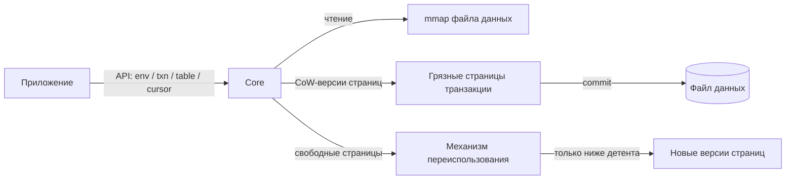
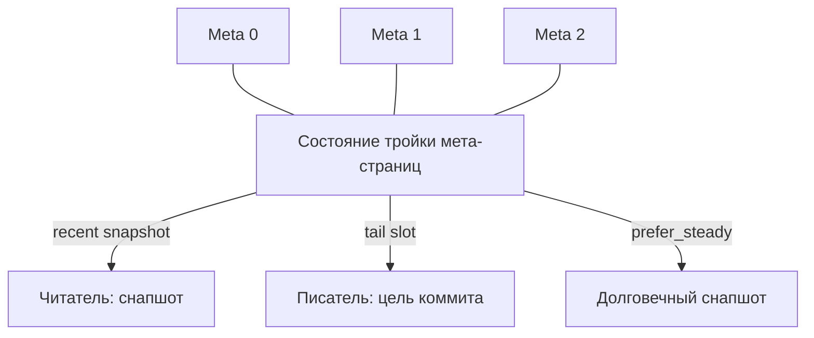
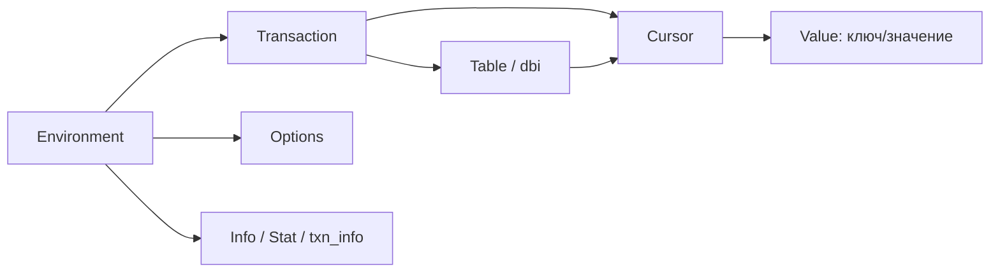
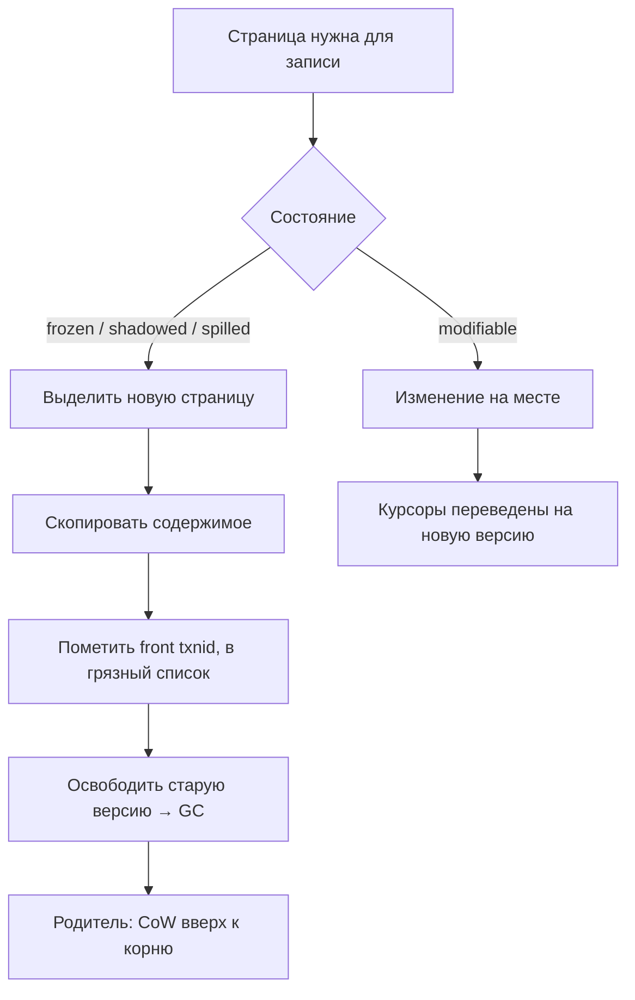
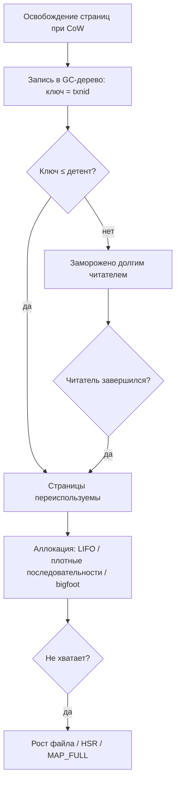

# Как работает libmdbx (функциональная архитектура)

> Часть индекса [Skynet](README.md).
> Функциональный взгляд на архитектуру: подсистемы, механизмы, сущности API и их взаимосвязи —
> «как это работает» — **без привязки к файлам и модулям исходного кода**.
> Сопровождающие документы: [`architecture.md`](architecture.md) (внутренняя структура и инварианты,
> привязана к модулям), [`structure.md`](structure.md) (карта файлов), [`test-coverage.md`](test-coverage.md).

---

## 1. Обзор

**libmdbx** — встраиваемая (embedded) транзакционная key-value база данных, глубоко переработанный
потомок LMDB. Библиотека линкуется в процесс приложения; никакого серверного процесса нет.

Ключевые свойства, определяющие всю архитектуру:

| Свойство | Следствие |
| --- | --- |
| **B+tree** | Данные хранятся в сбалансированных страницах-деревьях; поиск — спуск от корня к листу |
| **MVCC** (multiversion concurrency control) | Каждая страница помечена номером транзакции создания; читатели видят непротиворечивый снапшот без блокировок |
| **Copy-on-Write (CoW)** | Записывающая транзакция никогда не меняет уже видимую читателям страницу, а создаёт новую версию |
| **Memory-mapped файл данных** | Чтение — это обращение к памяти (mmap); нет отдельного буферного кэша в библиотеке |
| **Без WAL и crash-recovery** | Атомарность обеспечивается двухфазным обновлением мета-страниц; после сбоя достаточно выбрать последнюю согласованную мету |
| **Wait-free читатели, один писатель** | Читатели не берут блокировок на пути чтения; все записывающие транзакции сериализованы одним глобальным мьютексом |
| **Встроенный механизм переиспользования страниц (GC)** | Освобождённые страницы возвращаются в оборот только когда они больше не видны ни одному читателю |

Поток данных в самом общем виде:

---

## 2. Концептуальная модель данных

### 2.1. Таблицы и записи

- **Таблица** (в терминах API — `dbi`/map/sub-DB) — именованный B+tree в общем файле.
  Внутри базы существует **главная таблица**, которая хранит дескрипторы всех остальных таблиц
  (имя → корень дерева, флаги, счётчики).
- **Запись** — пара «ключ → значение» (в терминах API — `MDBX_val`/`slice`). Ключи в таблице
  упорядочены компаратором таблицы.
- **Мультизначения** (multimap, флаг dupsort): с одним ключом может быть связано несколько значений.
  Для них либо заводится вложенное поддерево (dupsort-tree), либо значения упаковываются в
  специализированные страницы фиксированного размера (dupfix).
- Значения, не помещающиеся в листовую страницу, уносятся на **overflow-страницы** (см. раздел 7).

Ограничения размеров:
- Ключи ограничены примерно половиной страницы (точный лимит зависит от размера страницы и режима
  таблицы), для integer-ключей — 8 байт.
- Значения — до `MDBX_MAXDATASIZE ≈ 2 ГБ`.
- Максимальное число таблиц (`MDBX_MAX_DBI`) и читателей ограничено константами/настройками среды.

### 2.2. Страница — единица хранения и I/O

Размер страницы выбирается при создании базы (256…65536 байт, по умолчанию 4096) и далее неизменен.

Типы страниц по функциональному назначению:

| Тип | Назначение |
| --- | --- |
| branch | Внутренний узел B+tree: ключи-разделители и указатели на детей |
| leaf | Листовой узел: фактические пары ключ→значение |
| large / overflow | Контигуальный прогон страниц для больших значений (заголовок только на первой) |
| meta | Одна из трёх мета-страниц: глобальный снапшот состояния базы |
| dupfix / subpage | Плотная упаковка мультизначений / вложенная страница для малого числа значений |

Каждая страница несёт **метку транзакции** (`txnid`), создавшей её текущую версию, и номер страницы.
По этим меткам механизм CoW определяет состояние страницы относительно текущей транзакции (раздел 5).

### 2.3. Мета-страницы (тройка) и геометрия

- В базе всегда три мета-страницы (`NUM_METAS = 3`). Это позволяет держать **два валидных снапшота**
  (последний «свежий» и последний «steady» — с гарантированно выгруженными на диск данными)
  и один хвостовой слот для перезаписи. Обновление меты — **двухфазное**: сначала инвалидируется
  половина (запись номера транзакции в одну половину с обнулением второй), затем заполняются поля и
  валидируется вторая половина. Читатель либо видит старую цельную мету, либо новую цельную, но
  никогда «полуобновлённую». Механизм состояния тройки — конечный автомат: состояние каждой
  меты кодируется независимо, полная таблица переходов покрывает 216 (6³) возможных комбинаций
  и исчерпывающе проверяется внутренней валидацией.
- **Геометрия файла** задаётся параметрами: нижняя граница (`lower`), текущий размер (`now`),
  верхняя граница (`upper`), шаг роста (`growth_step`), порог сжатия (`shrink_threshold`).
  Файл растёт автоматически по мере необходимости (страницами, кратными шагу роста) и может
  сжиматься, когда свободный хвост превышает порог и его никто не видит.
- Указатель «первая неразмеченная страница» (`first_unallocated`) отделяет используемое пространство
  от чистого хвоста файла, куда можно дописывать новые страницы.

### 2.4. Инвариант достижимости

Каждая нене-мета страница до `first_unallocated` достижима ровно один раз: либо принадлежит какому-то
дереву (обычной таблице, главной таблице или GC-дереву), либо перечислена в записи GC. На этом
инварианте строится и аудит целостности при коммите, и инструмент проверки базы.

---

## 3. Иерархия API-сущностей

Все операции приложения проходят через небольшой набор сущностей. Их функциональные роли:

| Сущность | Роль | Ключевые операции |
| --- | --- | --- |
| **Environment** (окружение) | «Соединение» с парой файлов (данные + блокировки); владеет геометрией, опциями, таблицей читателей, мьютексом писателя | create/open/close, set options, sync, backup, chk, defrag, set HSR |
| **Transaction** | Атомарная единица работы. Read — снапшот без блокировок; Write — сериализованная запись с CoW; бывают вложенные | begin/commit/abort, reset/renew, park/unpark, clone, checkpoint/rollback/amend |
| **Table** (dbi-хендл) | Условный дескриптор таблицы внутри конкретной транзакции | open/create/drop/rename, flags, stat |
| **Cursor** | Позиция поиска/итерации в таблице | open/bind, get/put/del, seek, count, scan, distance/scroll |
| **Value** (`MDBX_val`/slice/buffer) | Непрозрачное окно на ключ/значение; обычно указывает прямо в mmap | — (контейнер) |
| **Info/Stat** | Диагностика: состояние среды, таблицы, транзакции, GC | env_info, stat, txn_info, gc_info |
| **Options** (`MDBX_opt_*`) | Тонкая настройка поведения: лимиты грязных страниц, спилл, GC, синхронизация, плотность | set_option/get_option |

Как типовые действия ложатся на внутренние механизмы:

| Действие | Задействованные механизмы |
| --- | --- |
| `begin read` | Регистрация слота читателя, снятие снапшота из тройки мета |
| `get` / поиск курсором | Спуск по B+tree от корня к листу (без блокировок) |
| `put` / `del` | CoW-копирование затронутых страниц → грязный список → (возможно) split/rebalance |
| `commit` (write) | GC-обработка освобождённых страниц → refund → спилл → аудит → двухфазное обновление меты → синхронизация |
| `sync` | Принудительный сброс данных и меты в зависимости от режима долговечности |
| резервное копирование | Обход всех страниц в порядке номеров + массовая запись консистентного снимка |
| проверка целостности | Валидационный обход деревьев, GC и счётчиков через специальный режим открытия |

---

## 4. Транзакции и MVCC

### 4.1. Снапшот и wait-free чтение

- Записывающая транзакция, завершаясь, публикует новый номер транзакции в мете. Все изменённые ею
  страницы помечаются этим номером.
- **Читатель** при старте берёт «снапшот»: считывает тройку мета-страниц и фиксирует номер последнего
  устойчивого коммита. Всё, что читатель видит — это состояние базы на момент снапшота, независимо от
  последующих коммитов.
- Читатель **регистрирует свой номер снапшота в таблице читателей** (reader lock table, RLT) в общем
  файле блокировок. Это единственное «записывающее» действие на пути чтения; оно выполняется один раз
  при старте транзакции (или при её возобновлении).
- На самих операциях чтения (поиск, итерация) читатель **не берёт никаких блокировок** — он просто
  ходит по mmap. Именно поэтому читатели называют wait-free.

Защита от «разорванных» чтений 64-битных значений (номеров транзакций в таблице читателей и мете)
обеспечивается специальным атомарным протоколом: значения пишутся «сначала младшее слово, затем
старшее», чтение повторяется при обнаружении «обрывка», а стартовое значение «в процессе
регистрации» маркируется специальным константным порогом, исключающим ложное совпадение с реальным
номером транзакции.

### 4.2. Записывающая транзакция

- Запись в базе **сериализована**: существует ровно один глобальный мьютекс писателя (в общем файле
  блокировок). Два писателя не могут работать одновременно ни в одном процессе/ни на одной машине.
- При старте писатель получает **предварительный номер транзакции** (`front txnid = txnid+1`):
  новые и скопированные CoW-страницы метятся им и не видны читателям до коммита.
- Изменение любой страницы идёт через CoW (раздел 5): старая версия остаётся нетронутой для
  читателей, новая — попадает в грязный список транзакции.
- Освобождённые страницы собираются и передаются механизму переиспользования (раздел 6).

### 4.3. Жизненный цикл

| Операция | Смысл |
| --- | --- |
| begin / commit / abort | Открыть и закрыть транзакцию (commit публикует изменения, abort — отбрасывает) |
| reset / renew | Отдать / вернуть читательский слот без создания новой транзакции |
| park / unpark | Припарковать долгую читательскую транзакцию (освободить слот) и позже продолжить |
| clone | Размножить читательскую транзакцию (несколько позиций на одном снапшоте) |
| nested | Вложенные транзакции: дочерний «под-коммит» внутри родительской записи |
| checkpoint / rollback | Коммит без снятия блокировки + немедленное продолжение / перезапуск |
| amend | Превращение читательской транзакции в записывающую |

### 4.4. Конвейер коммита (записывающей транзакции)

1. Закрыть/проверить курсоры.
2. **GC-обработка**: освобождённые этой транзакцией страницы складываются в записи GC-дерева
   (раздел 6).
3. **Refund**: если освобождённые страницы примыкают к хвосту файла — вернуть их в неразмеченное
   пространство вместо записи в GC (снижает WAF и даёт онлайн-сжатие).
4. **Спилл**: если грязных страниц слишком много — часть выгрузить на диск заранее.
5. **Аудит** (в режимах повышенной проверки): сверка сумм страниц по деревьям и GC.
6. **Двухфазное обновление меты** + синхронизация в соответствии с режимом долговечности (раздел 8).
7. Снять блокировку писателя, обновить кэш старейшего читателя, вычистить мёртвых читателей.

### 4.5. Вложенные транзакции

- Позволяют группировать изменения с возможностью «частичного отката» внутри одной записи.
- Реализованы поверх той же CoW-модели: грязные страницы родителя наследуются, дочерние тени курсоров
  позволяют откатить позиции. Не сочетаются с режимом WRITEMAP.
- Для читающих потоков есть «фиктивные» вложенные read-only транзакции.

---

## 5. Копирование при записи и жизненный цикл страниц

### 5.1. Состояния страницы

Состояние страницы определяется сравнением метки на ней (`mp->txnid`) с номером снапшота текущей
транзакции (`txn->txnid`) и её предварительным номером (`front txnid`):

| Состояние | Условие | Смысл |
| --- | --- | --- |
| frozen («заморожена») | `txnid < txn->txnid` | Видима читателям как старая версия; менять нельзя — только копировать |
| spilled («выгружена») | `txnid == txn->txnid` | Уже записана на диск текущим писателем (после спилла) |
| shadowed («затенена») | `txnid > txn->txnid` | Существует более новая версия; эта — устаревшая |
| modifiable («изменяемая») | `txnid == front txnid` | Новая версия, созданная текущим писателем; можно менять на месте |
| tmp | сигнатура | Служебная пометка ещё-не-закоммиченных сущностей |

Предикаты состояния — фундамент корректности CoW: именно по ним решается, надо ли копировать страницу.

### 5.2. Механизм CoW (touch)

Когда операция должна изменить страницу:

1. Если страница уже «изменяемая» (принадлежит текущему писателю) — изменение на месте.
2. Иначе (страница «заморожена») — **выделяется новая страница** (из GC или из хвоста файла),
   содержимое копируется, новая версия метится `front txnid` и кладётся в грязный список;
   старая страница **освобождается** (переходит в распоряжение GC, раздел 6).
3. Родительская (branch) страница, указывавшая на старую версию, также становится «изменяемой»
   (CoW распространяется вверх к корню — модифицированный путь целиком).
4. Все курсоры, ссылавшиеся на старую версию, переводятся на новую.

### 5.3. Грязный список и спилл

- **Грязный список** транзакции — коллекция страниц, изменённых в памяти и ожидающих записи на диск
  при коммите. В пределах одной транзакции страница попадает в него один раз, сколько бы раз её ни
  меняли — это ключевой фактор сдерживания WAF.
- Если объём грязных страниц превышает лимит (`dp_limit`, по умолчанию ~1/42 от ОЗУ) и дальнейшее
  накопление невозможно, включается **спилл**: часть грязных страниц выгружается на диск заранее.
  Страницы, на которые ещё ссылаются курсоры, спиллу не подлежат; порядок выбора управляется
  опциями-знаменателями (минимум/максимум доли спилла).
- Для не-WRITEMAP режимов грязные страницы — отдельные буферы в памяти, записываемые при коммите;
  для WRITEMAP — непосредственно в mmap с последующей синхронизацией.
- **Loose-страницы** — небольшой кэш освобождённых в текущей транзакции грязных страниц (лимит
  `loose_limit`, по умолчанию 64), чтобы быстро переиспользовать их без обращения к GC.
- **Refund** возвращает освобождённые хвостовые страницы обратно в неразмеченное пространство
  (см. раздел 10 о сжатии).

---

## 6. Утилизация (GC, garbage collection)

### 6.1. Модель записей

У libmdbx нет классического free-list. Освобождённые страницы учитываются **персистентно, внутри
самого файла данных**, в специальном **GC-дереве** (отдельная таблица, корень — в мете):

- **Ключ записи** — номер транзакции, освободившей страницы.
- **Значение записи** — список номеров страниц (в порядке убывания, сжато хранимые диапазоны).

Поскольку каждая страница знает номер транзакции, освободившей её, безопасность переиспользования
выводится напрямую из MVCC-модели:

> Страницы из записи с ключом `T` можно переиспользовать только тогда, когда **все активные читатели
> имеют снапшот новее `T`**, т.е. `T` меньше или равен **детенту** — старейшему активному читательскому
> снапшоту.

### 6.2. Детент и чтение GC

- Старейший активный читательский снапшот вычисляется сканированием таблицы читателей (без блокировок,
  с кэшированием результата) и служит «водоразделом»: записи GC с ключом ≤ детента — кандидаты на
  переиспользование, записи выше детента — «заморожены» до завершения соответствующего читателя.
- Аллокация по умолчанию — **LIFO**: страницы берутся от детента назад, т.е. в первую очередь самые
  свежие освобождения; поддерживается и FIFO-режим.
- Для поиска **плотных последовательностей** (нужных большим значениям) используются векторные
  (SIMD) ядра сканирования списков номеров страниц.
- Служебный набор идентификаторов записей GC ведётся как сортированное множество номеров транзакций
  (rkl): интервал + список; он поддерживает операции «взять следующий свободный номер» и «найти дыры»
  в последовательности освобождений.

### 6.3. Большие объёмы освобождений (bigfoot)

Одна запись GC физически ограничена (≈1000 номеров страниц при странице 4 КБ). Если одна транзакция
освобождает очень много страниц (например, заменяя или удаляя огромное значение), записи GC
оформляются **цепочкой на последовательных номерах транзакций** — это называется bigfoot-режимом и
позволяет не раздувать одно значение сверх предела. Цена — рост числа записей и высоты GC-дерева.

### 6.4. Ограничение стоимости поиска

- **`rp_augment_limit`**: предел накопления списков номеров страниц при поиске контигуальных
  последовательностей для больших значений. Превышение означает, что дешевле дописать новые страницы
  в хвост файла (возможно, с ростом файла), чем дальше копаться в GC-записях.
- **`gc_time_limit`**: тайм-лимит (в 1/65536 секунды) на поиск последовательностей в GC в течение
  записывающей транзакции после достижения `rp_augment_limit`. Позволяет держать коммит
  предсказуемым по времени даже при тяжёлой фрагментации.

### 6.5. Исчерпание переиспользуемых страниц

Когда GC пуст или заморожен читателями:
- писатель пробует **утилизировать steady-коммит** (см. раздел 8) или инициировать новый steady-point,
  чтобы сдвинуть детент;
- вызывает **HSR-колбэк** (Handle-Slow-Readers) для работы с застрявшими читателями (раздел 9);
- в крайнем случае **растёт файл** (до верхней границы геометрии) или возвращает `MDBX_MAP_FULL`.

---

## 7. Большие значения и overflow-страницы

### 7.1. Порог переполнения

Значение, которое не помещается в листовой узел вместе с заголовком узла и ключом
(практически — больше примерно половины страницы), не хранится в листе целиком. Вместо этого
листовой узел получает короткий указатель `{pgno, npages}`, а само значение помещается в
**overflow-страницы**: контигуальный прогон страниц `P_LARGE`, у которых заголовок есть только
на первой.

### 7.2. Последствия для записи, поиска и GC

1. **Контигуальность**: для размещения большого значения аллокатор обязан найти непрерывный диапазон
   страниц. Вместо «любой свободной страницы» нужен «прогон длины N». Поиск такого прогона может
   потребовать сканирования и слияния многих записей GC (плотные последовательности, SIMD-ядро) —
   это и есть дорогой «глубокий поиск» свободного места, ограничиваемый опциями раздела 6.4.
2. **Churn при замене**: обновление большого значения — это CoW всего прогона: выделить новый
   контигуальный диапазон, скопировать данные, освободить старый. Каждая замена порождает записи GC.
3. **Объём GC**: одна запись GC вмещает ≈1000 страниц (≈4 МБ при 4 КБ). Значение на сотни тысяч
   страниц порождает **цепочки bigfoot** — десятки и сотни записей. GC-дерево растёт, его высота
   («глубина поиска в GC») увеличивается, обработка GC на коммите дорожает и ограничивается
   тайм-лимитом.
4. **Удельная стоимость**: запись большого значения стоит пропорционально его размеру
   (переписывание/копирование), а не «одной странице», как для малых значений.

Этот механизм подробно разобран в ответе на контрольный вопрос №1 (раздел 16.1).

---

## 8. Долговечность и синхронизация

### 8.1. Что значит «закоммитить»

Коммит должен (в строгих режимах) сделать две вещи: записать на диск **данные** (страницы новых
версий) и записать на диск **мету** (сделать снапшот «видимым» для будущих открытий базы). Между
этими событиями есть окно, описывающееся понятием «steady»:

- **Weak (слабая) мета** — данные в файле отражены, но не гарантированно сброшены на постоянный носитель;
- **Steady (устойчивая) мета** — данные сброшены на диск, мета валидна; после этого снапшот переживает
  системный сбой.

### 8.2. Режимы долговечности

| Режим | Поведение | Риск |
| --- | --- | --- |
| `MDBX_SYNC_DURABLE` (по умолчанию) | После записи данных — flush данных, затем двухфазное обновление меты и flush меты | Нет: полный ACID |
| `MDBX_NOMETASYNC` | Данные флашатся, мета — отложенно | Потеря последних коммитов при сбое (ACI без D) |
| `MDBX_SAFE_NOSYNC` | Ничего не флашится сразу, но сохраняется предыдущий steady-коммит | При сбое — откат к последнему steady; **эффект «долгого читателя»**: страницы новее steady не переиспользуются, пока не появится новый steady-point (снижает производительность переиспользования, см. раздел 10) |
| `MDBX_UTTERLY_NOSYNC` | Никаких флашей вообще, никаких steady-гарантий | Максимальный риск; база может не пережить сбой |
| `MDBX_WRITEMAP` | Запись через mmap (+msync); позволяет LRU-отслеживание и дополнительные стратегии | Свойства зависят от сочетания с режимами выше |

`SAFE_NOSYNC` — компромисс: производительность записи может вырасти многократно (до 10× и более),
но ценой роста файла и числа I/O, поскольку переиспользование страниц приостановлено до очередного
steady-point. Автоматическая синхронизация (`syncbytes`/`syncperiod`) помогает управлять этим.

### 8.3. Восстановление без WAL

WAL отсутствует намеренно. Атомарность и восстановление обеспечиваются метой:
- после сбоя при открытии выбирается последняя **цельная и валидная** мета (согласованная тройка,
  совпадение половин txnid, проверка контрольной суммы);
- «полузаписанные» транзакции, не успевшие опубликовать мету, просто не существуют;
- специальный режим восстановления (`open for recovery`) позволяет переписать меты монотонно
  нарастающими номерами под эксклюзивной блокировкой, чтобы разрешить «застрявшую» тройку.

---

## 9. Параллелизм и межпроцессная координация

### 9.1. Таблица читателей (RLT) и старейший снапшот

- Читатели регистрируют свой номер снапшота в **таблице читателей**, расположенной в общем файле
  блокировок; запись связывает процесс, поток и номер снапшота.
- Писатели и GC сканируют таблицу (lock-free, с кэшированием) для вычисления **детента** —
  старейшего активного снапшота. Это центральный элемент безопасности переиспользования страниц
  (раздел 6).
- Запись читателя в таблице имеет «живость»: поток, завершившийся без явной отмены, обнаруживается
  и вычищается (проверка живости процессов/потоков средствами ОС, защита от повторного использования
  pid/tid).
- При **парковке** читательской транзакции слот помечается специальным псевдо-идентификатором и
  перестаёт влиять на детент; «выселенный» (ousted) читатель при следующем обращении узнаёт об этом
  и должен перезапустить чтение.

### 9.2. Handle-Slow-Readers (HSR)

Если пространство исчерпано именно из-за читателей (база «полна», но причина — замороженные GC-записи),
вызывается **колбэк HSR** с информацией о проблемном читателе (pid, tid, номер снапшота, отставание,
объём пространства, который освободится после его завершения, счётчик повторов). Возвращаемое
значение управляет дальнейшими действиями: ждать, убить поток/процесс, согласиться на рост файла или
вернуть `MDBX_MAP_FULL`. Это штатный способ разрешения конфликта «долгий читатель против писателя».

### 9.3. Файл блокировок и flavour'ы блокировок

- Межпроцессная синхронизация идёт через отдельный **файл блокировок** (рядом с файлом данных):
  глобальный мьютекс писателя, таблица читателей, статистика, кэши старейшего снапшота.
- Поддерживаются разные реализации примитивов (POSIX-мьютексы, семафоры, SysV, Windows-примитивы),
  выбираемые при сборке; возможен и режим без файла блокировок (один процесс, эксклюзивно).
- Формат файла блокировок версионирован отдельно от формата данных.

### 9.4. Потоки, TLS и форк

- Слот читателя привязывается к **потоку** через локальную память потока (TLS). Деструктор потока
  вычищает его слот из всех открытых сред — это предотвращает «утечку читателей» и связанные с ней
  расы переиспользования страниц после смерти потока. Есть обходы известных багов glibc с
  деструкторами TLS.
- После `fork()` наследник не наследует mmap- и record-блокировки: библиотека сбрасывает картирование
  и регистрации, переводя среду в безопасное «безблокировочное» состояние, из которого читательские
  транзакции можно корректно переоткрыть.

---

## 10. Рост и переполнение базы

Этот раздел собирает механизмы из разделов 6–9 в картину, объясняющую, почему база растёт и когда
она переполняется.

### 10.1. Непереиспользуемые страницы

Пока хотя бы один читатель жив и его снапшот старый, все страницы, освобождённые после его снапшота,
**не могут быть переиспользованы** (раздел 6.2). Писатели вынуждены брать новые страницы из
неразмеченного хвоста файла. Отсюда:

- **Даже при неизменном логическом объёме данных** (например, цикл «положить ключ → удалить ключ»)
  база растёт, потому что физически каждый раз выделяются новые страницы, а старые лежат
  замороженными в GC.
- Объём «потенциально освобождаемого» пространства прямо измерим: у читательской транзакции поле
  `txn_space_retired` показывает суммарный размер страниц, утилизированных писателями после снапшота
  данного читателя — это пространство, которое освободится для переиспользования сразу после
  завершения этого читателя.

### 10.2. Когда база «переполняется»

Рост ограничен **верхней границей геометрии** (`upper`). Когда:
- GC пуст/заморожен, а
- файл упёрся в верхнюю границу и расширять его нельзя,

записывающая транзакция получает `MDBX_MAP_FULL`. Перед этим срабатывают, по возможности,
разрешающие механизмы: новый steady-point (сдвиг детента), HSR-колбэк, выселение припаркованных
читателей.

### 10.3. Краткосрочная и долгосрочная перспектива

**Краткосрочно** (одиночный долгий читатель): рост файла — временный «пузырь». После завершения
читателя замороженные записи GC становятся доступными, начинается их переиспользование; хвостовые
свободные диапазоны возвращаются через refund, и база может автоматически сжаться (если это
разрешено геометрией и файл не используют другие процессы).

**Долгосрочно** (систематические долгие читатели — архитектурная особенность приложения):
- файл постоянно держится у верхней границы, растёт WAF и случайность размещения (деградация
  локальности);
- GC-дерево раздувается (много записей), его обслуживание дорожает;
- возрастает вероятность `MDBX_MAP_FULL` и ошибок записи;
- снимать симптоматику приходится приложением: HSR-колбэком, парковкой читателей, корректной
  верхней границей геометрии, диагностикой по `txn_info`/`env_info`.

Также важно: режим `MDBX_SAFE_NOSYNC` создаёт **постоянный квази-долгий читатель** (последний
steady-коммит), поэтому сам по себе ведёт к росту файла до появления нового steady-point — это
заплатированная цена за производительность.

Подробный разбор — в ответе на контрольный вопрос №2 (раздел 16.2).

---

## 11. Индексный движок B+tree

### 11.1. Поиск и позиционирование

- Любой поиск — спуск от корня к листу: на каждом branch-уровне бинарный поиск по разделителям
  выбирает дочернюю страницу (с branchless/CMOV-ускорением), на листе — поиск ключа/значения.
- Поисковые процедуры специализируются под типы ключей (обычный, обратный, целочисленный,
  фиксированной длины, кастомный компаратор) — выбор делается один раз на таблицу.
- Курсор хранит стек (страница, индекс) от корня до листа — это позволяет эффективно перемещаться
  по соседним узлам и позиционироваться в любую сторону.

### 11.2. Вставка, удаление, обновление

- **Вставка**: найти лист → (если нужно) CoW листа → добавить узел; при нехватке места — **split**
  страницы (обычное деление пополам; в вырожденных случаях — деление «1-на-3»), рекурсивно вверх,
  включая возможность нового корня.
- **Обновление**: найти узел → CoW → перезаписать; для больших значений — заменить весь
  overflow-прогон (раздел 7).
- **Удаление**: CoW листа → удалить узел → при опустошении ниже порога — **rebalance/merge** с
  соседом (настраивается порогом `merge_threshold` и опцией «предпочесть уже изменённую страницу»
  против «равномерности заполнения» — это прямой рычаг WAF, раздел 16.4).
- **Массовые диапазонные удаления** выполняются специализированным быстрым путём (отсечение целых
  веток/страниц), а не по одному ключу.

### 11.3. Мультизначения

- Небольшое число значений одного ключа упаковывается во вложенную страницу (суб-страницу);
  большой набор — в отдельное вложенное дерево; фиксированные по размеру значения — в плотные
  dupfix-страницы. Выбор между этими формами регулируется опциями суб-страниц.

### 11.4. Состояния курсора

Курсор имеет конечный автомат положений: «не установлен», «пустой» (нет данных), «установлен»
(на паре), «установлен и заполнен». Отдельно различаются два конца данных: «логически на конце,
последняя запись ещё читается» и «за концом, чтение запрещено» — эти тонкости важны для корректной
семантики `eof` и навигации.

---

## 12. Сервисные механизмы

### 12.1. Резервное копирование

Онлайн-копия базы без остановки писателя: обход всех страниц в порядке номеров (консистентный
снимок благодаря MVCC) + массовая запись (bulk iovec). Два режима:
- **как есть** — копия сохраняет раскладку страниц (быстро, файл-тот же размер);
- **с уплотнением** — страницы перенумеровываются и укладываются плотно к началу (компактный файл).

### 12.2. Проверка целостности (chk)

Глубокая валидация: согласованность меты и тройки, обходы всех деревьев с проверкой упорядоченности,
сверка покрытия страниц (инвариант достижимости из раздела 2.4), состояние GC, отчёты по областям
(scopes). Работает в специальном «валидационном» режиме открытия, который включает дополнительные
структурные проверки при каждой операции.

### 12.3. Дефрагментация

Онлайн-уплотнение: строится карта связей страниц, живые страницы перемещаются ближе к началу
файла циклами, затем обновляются указатели (с учётом GC). Итог — снижение фрагментации, компактный
файл, лучшая локальность. Взаимодействует с GC и переиспользованием, может выполняться по лимиту
времени и целям свободного пространства.

### 12.4. Статистика и диагностика

- `env_info`/`stat` — состояние среды, геометрия, мета, страницы.
- `txn_info` — **пер-транзакционная** диагностика пространства (раздел 10): занято, лимиты,
  освобождённое после снапшота (`txn_space_retired`), «запас до срабатывания HSR»
  (`txn_space_leftover`), объём грязных страниц.
- `gc_info` — состояние переиспользования.
- счётчики операций со страницами (CoW, split, merge, spill, msync, prefault, минкор и т.д.) —
  источник данных для оценки WAF и локальности.

### 12.5. Валидация и отладка

Уровни проверок (`MDBX_CHECKING`) добавляют утверждения, аудит коммита, трассировку. Это же
инфраструктура, через которую тесты и инструменты диагностики наблюдают за внутренним состоянием.

---

## 13. API-поверхность: C и C++

### 13.1. C API: группы по функциональному назначению

| Группа | Назначение | Примеры |
| --- | --- | --- |
| Окружение | Создание/открытие/закрытие, флаги, имя файлов, геометрия, опции | env_create/open/close, env_set_geometry, env_set_option |
| Транзакции | begin/commit/abort, reset/renew, park/unpark, clone, checkpoint/rollback/amend | txn_begin/commit/abort/park/... |
| Таблицы (dbi) | Открыть/создать/удалить/переименовать таблицу, флаги, перечисление | dbi_open/drop/rename/enumerate_tables |
| CRUD | get/put/del (в т.ч. multivalue, reserve, append, batch), кэш-чтение | get/put/del, cache_get |
| Курсоры | Позиционирование, итерация, put/del через курсор, count, distance, scroll, distribute | cursor_open/get/put/del/scan/... |
| Информация | env_info, stat, txn_info, gc_info, reader list/check | env_info, txn_info, gc_info, reader_list |
| Диагностика и сервис | chk, defrag, copy, warmup, hsr, panic, userctx | env_chk, env_defrag, env_copy*, env_set_hsr |
| Оценка диапазонов | Эвристическая оценка расстояния/диапазона между ключами | estimate_distance/range |
| Преобразование ключей | float/double↔ключ, JSON-целые | key_from_double / ... |
| Ошибки/служебное | коды ошибок, версия, стрerror, компараторы | strerror, version, cmp_* |

### 13.2. Ленивый кэш поиска (get-cached)

Отдельный сервис чтения «повторяющихся» ключей: вместо полного спуска по дереву кэш хранит адрес
значения в mmap + версионные метки и при повторном чтении выполняет минимум действий с ранним
выходом. Подробно — в ответе на контрольный вопрос №3 (раздел 16.3).

### 13.3. C++ API

C++-обёртки повторяют иерархию C-сущностей типами с RAII и безопасностью:
- `env` / `env_managed`, `txn` / `txn_managed`, `cursor` / `cursor_managed` — управляемые хендлы;
- `map_handle` — обёртка таблицы; `slice` / `buffer` — обёртки ключей/значений с владением;
- типизированные операции (typed map over keys/values через трансляцию типов);
- параметры-структуры с fluent-установщиками (геометрия, режим, долговечность, reclaiming);
- иерархия исключений с сопоставлением кодов ошибок C API; фатальные ошибки приводят к завершению.

C++ — это тонкий типобезопасный слой над тем же C-ядром: семантика (MVCC, CoW, GC, долговечность)
полностью определяется механизмами, описанными выше.

---

## 14. Сквозные сценарии

### 14.1. Создание базы и первый коммит

1. Создать окружение → задать геометрию (размер страницы, границы, шаги).
2. Открыть окружение: если базы нет — пишется начальная тройка мет и задаётся размер файла.
3. Начать записывающую транзакцию (получен мьютекс писателя).
4. Создать таблицу: дескриптор помещается в главную таблицу (CoW главного дерева).
5. Положить записи: CoW листьев/Branch, рост деревьев, грязный список.
6. Коммит: GC-обработка → (возможно) спилл → двухфазное обновление меты → синхронизация.

### 14.2. Типичное чтение

1. Начать читательскую транзакцию → зарегистрировать слот, снять снапшот.
2. Открыть таблицу в этой транзакции (хендл лениво привязывается к дереву).
3. Искать через `get` или курсор: спуск по B+tree, mmap-чтения без блокировок.
4. Для повторяющихся ключей — `cache_get`: ранний выход по версионным меткам.
5. Завершить: снять слот (для долгих чтений — парковка вместо снятия).

### 14.3. Интенсивный write-churn

Цикл «обновить горячие ключи»: каждая транзакция CoW-копирует пути деревьев, освободившиеся
страницы уходят в GC. Если рядом работает долгий читатель — страницы замораживаются, файл растёт,
вступают в дело steady-point/HSR/рост (разделы 6, 10). Коммиты можно пакетировать (batch) и
настраивать лимит грязных страниц/спилл для управления пиковой памятью.

### 14.4. Открытие после сбоя

Выбор последней цельной меты из тройки; при «застрявшей» тройке — режим восстановления с
переписыванием мет под эксклюзивной блокировкой; проверка целостности (`chk`) — до или после.

### 14.5. Резервное копирование / проверка / дефрагментация

Запускаются параллельно с работой: copy (как есть или с уплотнением), chk (валидационный обход),
defrag (перемещение страниц к началу) — все три работают поверх той же MVCC-модели и не требуют
остановки записи.

---

## 15. Глоссарий

| Термин | Определение |
| --- | --- |
| **B+tree** | Сбалансированное дерево; данные в листьях, внутренние узлы — разделители |
| **MVCC** | Мультиверсионное управление конкурентным доступом: несколько снапшотов данных одновременно |
| **CoW (copy-on-write)** | Стратегия: изменяемая страница не трогается, создаётся её новая версия |
| **MMap** | Отображение файла в память; файл данных доступен как массив байт |
| **DBI / table** | Именованная таблица (под-БД) внутри общего файла |
| **Overflow / large page** | Контигуальные страницы для больших значений |
| **GC** | Механизм учёта и переиспользования освобождённых страниц (дерево записей внутри файла) |
| **Детент (detent)** | Старейший активный читательский снапшот; водораздел переиспользования |
| **Steady / weak мета** | Устойчивый (данные на диске) / слабый (не гарантирован) снапшот |
| **RLT (reader lock table)** | Таблица читателей в файле блокировок |
| **HSR (Handle-Slow-Readers)** | Колбэк разрешения конфликта с долгими читателями |
| **WAF** | Write Amplification Factor — кратность записи на диск относительно объёма пользовательских данных |
| **DPL / грязный список** | Страницы, изменённые в памяти и ждущие записи при коммите |
| **Спилл** | Заблаговременная выгрузка грязных страниц на диск при переполнении лимита |
| **Loose-страницы** | Небольшой кэш освобождённых страниц внутри транзакции |
| **Refund** | Возврат освобождённых хвостовых страниц в неразмеченное пространство |
| **Bigfoot** | Цепочка GC-записей на последовательных txnid для очень больших освобождений |
| **Trim/Sync modes** | Режимы долговечности (durable/nometasync/safe_nosync/utterly_nosync/writemap) |

---

## 16. Контрольные вопросы и развёрнутые ответы

> Этот раздел — проверка глубины документа. Ответы строятся на механизмах, описанных в разделах 2–13,
> с указанием соответствующих разделов.

---

### 16.1. Почему помещение в БД больших значений может приводить к глубокому поиску и переработке GC?

**Кратко.** Большие значения не помещаются в листовой узел и хранятся на контигуальном прогоне
overflow-страниц (раздел 7). Для них нужен **непрерывный диапазон** страниц, который аллокатор ищет
в записях GC, сканируя и сливая их; а при освобождении такое значение порождает **цепочки записей GC
(bigfoot)**, раздувающие GC-дерево и удорожающие его поиск и обработку на коммите. Плюс сама запись
значения стоит пропорционально его размеру (CoW всего прогона).

**Полный разбор.**

1. **Хранение.** Значение больше примерно половины страницы (за вычетом заголовка узла и ключа)
   помещается не в лист, а на overflow-страницы: листовой узел хранит только указатель
   `{pgno, npages}` (раздел 7.1). Чем больше значение, тем длиннее прогон страниц и тем более
   специфичные требования к свободному месту.

2. **«Глубокий поиск» — поиск непрерывного диапазона.** Обычной странице годится любая свободная;
   большому значению нужен **непрерывный диапазон длины N**. Механизм переиспользования хранит
   свободные страницы как списки номеров в записях GC (раздел 6.1). Чтобы найти прогон, аллокатор:
   - сканирует записи GC от детента назад (LIFO), т.е. просматривает множество записей;
   - сливает списки номеров страниц из разных записей;
   - ищет внутри них плотные последовательности (для этого есть векторные/SIMD ядра).
   
   При фрагментации количество просматриваемых записей и затраты на слияние растут. Именно поэтому
   существуют опции-ограничители (раздел 6.4):
   - `rp_augment_limit` — предел накопления списков: когда поиск последовательности становится дороже,
     чем дописать новые страницы в конец файла (возможно, с ростом файла);
   - `gc_time_limit` — лимит времени на такой поиск в течение записывающей транзакции.
   
   В этом смысле «глубина» — это глубина/объём сканирования GC, а не высота основного дерева.

3. **«Переработка GC» на коммите.** Любая замена или удаление большого значения освобождает весь
   старый прогон (CoW: новый прогон + освобождение старого, раздел 7.2). Эти страницы должны быть
   записаны в GC-дерево при коммите. Здесь включается эффект ёмкости записи: одна запись GC вмещает
   около 1000 номеров страниц (~4 МБ при странице 4 КБ). Значение размером в сотни мегабайт или
   гигабайты (а `MDBX_MAXDATASIZE ≈ 2 ГБ`) порождает **десятки/сотни записей GC**, оформляемых
   цепочкой на последовательных номерах транзакций — режим bigfoot (раздел 6.3).

4. **Рост глубины GC-дерева.** GC-дерево — такое же B+tree внутри файла. Большое число записей
   увеличивает его высоту, а значит:
   - операции «прочитать запись / добавить запись / удалить запись» при коммите становятся глубже;
   - поиск последовательностей пересекает больше записей (п. 2).
   Это и есть вторая составляющая «глубокого поиска» — уже в GC-дереве.

5. **Двойная асимметрия больших значений.**
   - Аллокация требует контигуальности (дороже, чем «любая страница»);
   - утилизация требует много записей (объёмнее, чем «одна запись»);
   - замена = аллокация + утилизация одновременно.
   
   Поэтому сценарии «обновлять большие значения» дают значительно большую нагрузку на GC, чем
   мелкие записи той же суммарной величины, и эта нагрузка регулируется опциями раздела 6.4.

**Практические следствия.** Для очень больших значений полезно:
- подбирать `rp_augment_limit`/`gc_time_limit` (иначе — либо неконтролируемый рост файла, либо
  «застревание» коммита);
- учитывать, что частое перезаписывание больших значений дороже, чем создание новых версий
  меньшего размера;
- использовать диагностику GC (`gc_info`, статистику операций со страницами) для контроля churn.

---

### 16.2. Почему и когда долгие читающие транзакции могут приводить к росту и переполнению БД? Краткосрочные и долгосрочные перспективы.

**Кратко.** Освобождённые страницы можно переиспользовать только когда они не видны ни одному
читателю (раздел 6.2). Долгий читатель «замораживает» детент — старейший активный снапшот; пока он
жив, писатели не могут вернуть освобождённые страницы в оборот и вынуждены выделять новые из хвоста
файла. База растёт даже при неизменном логическом объёме, а при упоре в верхнюю границу геометрии
записывающие транзакции получают `MDBX_MAP_FULL`.

**Когда это происходит.**
- Любая читательская транзакция, живущая «дольше, чем требуется для чтения», пока в базе идёт запись
  (особенно churn: многократное обновление/удаление одних и тех же ключей).
- Режим `MDBX_SAFE_NOSYNC` создаёт **постоянного квази-долгого читателя** — последний steady-коммит
  (раздел 8.2): до появления нового steady-point страницы новее steady не переиспользуются, файл
  растёт. Это плата за производительность в этом режиме.
- «Забытые» читатели (поток завершился, но слот не очищен из-за краха/неправильного использования
  TLS) — то же самое, но незаметное; очисткой занимаются механизмы живости (раздел 9.1).

**Механика роста.** Писатель, которому нужна страница:
1. пробует взять её из GC (только записи с ключом ≤ детента);
2. если заморожено — берёт из **неразмеченного хвоста** файла, при необходимости расширяя файл
   (геометрия, раздел 2.3);
3. когда расширять нельзя (достигнут `upper`) и GC пуст/заморожен — срабатывает `MDBX_MAP_FULL`.
   Перед этим вызываются разрешающие меры: новый steady-point (сдвиг детента), HSR-колбэк,
   выселение припаркованных читателей (разделы 8.3, 9.2).

**Краткосрочная перспектива (единичный долгий читатель).** Рост — временный «пузырь»:
- пока читатель жив — каждый коммит писателя увеличивает «замороженный» запас в GC; файл растёт;
- после завершения читателя записи GC с ключом ≤ новому детенту мгновенно становятся доступными;
  хвостовые свободные диапазоны возвращаются через refund; при разрешённой геометрии и отсутствии
  других процессов файл может автоматически сжаться.
- Измеримость: у читательской транзакции `txn_space_retired` показывает объём, который освободится
  именно после неё, а `txn_space_leftover` — порог, при котором она станет причиной вызова HSR.

**Долгосрочная перспектива (систематические долгие читатели).** Если «долгие чтения» — постоянная
черта приложения:
- файл всё время держится у верхней границы; WAF растёт (страницы выделяются заново вместо
  переиспользования);
- ухудшается локальность размещения (новые страницы — дальше от старых), растёт случайность доступа;
- GC-дерево раздувается замороженными записями, его обслуживание дорожает и нагружает коммиты;
- повышается вероятность `MDBX_MAP_FULL` и ошибок записи при пиковых нагрузках;
- появляется «хроническое» потребление дискового пространства, которое не уходит само.

**Что делать (функционально):**
- ограничивать жизнь читательских транзакций (короткие снапшоты) либо использовать **парковку**
  (освобождение слота) с последующим возобновлением;
- установить HSR-колбэк и принять осознанное решение при исчерпании (ждать / уведомить / завершить
  проблемный поток / разрешить рост) (раздел 9.2);
- закладывать верхнюю границу геометрии с учётом худшего случая заморозки;
- мониторить `txn_info`/`env_info` (в т.ч. `txn_space_retired`), чтобы обнаруживать «долгие чтения»
  до переполнения;
- помнить про эффект `MDBX_SAFE_NOSYNC` (раздел 10.3) и балансировать производительность с ростом
  файла через auto-sync (steady-point периодичность).

---

### 16.3. Как работает кеширование с ленивым поиском и почему оно может ускорять производительность в тысячи раз?

**Кратко.** Это сервис повторного чтения «горячих» ключей: для ключа хранится адрес значения в mmap
и версионные метки (номер страницы, подтверждающий актуальность). При повторном чтении вместо полного
спуска по B+tree выполняется **ленивый (ранний) выход**: спускаемся только пока встречаем страницы,
изменённые после последнего подтверждения; как только страница не менялась — данные из сохранённого
адреса всё ещё валидны и возвращаются сразу. В идеальном случае выполняется лишь пара лёгких
сравнений версий, что на порядки дешевле полного поиска.

**Механизм.**

- Каждая страница несёт метку транзакции создания (раздел 5.1). Если страница на пути поиска
  не изменялась после момента подтверждения кэша, то и содержимое (адрес значения) не могло
  измениться/переехать.
- Запись кэша: `{trunk_txnid, last_confirmed_txnid, offset, length}`.
  `offset` — смещение значения в файле данных (тот самый адрес в mmap), `offset == 0` означает
  «ключа нет» (`MDBX_NOTFOUND`).
- Первый вызов делает полноценный поиск и **заполняет запись**. Последующие вызовы:
  1. спускаются от корня, но **останавливаются на первой странице, не изменённой после
     `last_confirmed_txnid`** — остальной путь гарантированно валиден;
  2. если ничего не менялось вообще — возвращается `MDBX_CACHE_HIT` после нескольких лёгких проверок;
  3. если по пути встретились изменения — либо подтверждается актуальность данных по их новой
     версии (`MDBX_CACHE_CONFIRMED`), либо выполняется полный поиск и запись полностью обновляется
     (`MDBX_CACHE_REFRESHED`).
- Корректность при многопоточности и разных снапшотах обеспечивается статусами:
  - `HIT`/`CONFIRMED`/`REFRESHED` — результат получен (из кэша или после обновления кэша);
  - `DIRTY` — значение лежит на грязной (ещё не закоммиченной) странице; результат валиден только в
    текущей записывающей транзакции и не кэшируется;
  - `BEHIND` — транзакция читателя **старше** версии в кэше; кэш обойти (результат получить обычным
    поиском, кэш не трогать);
  - `UNABLE` — ABA-подобная ситуация в истории версий (например, ключ существовал в промежуточном
    снапшоте, но отсутствует и в старом, и в новом): поиск в обход кэша, чтобы избежать
    ложного отрицательного ответа;
  - `RACE` — другой поток параллельно обновляет запись; поиск в обход кэша (без блокировок);
  - `ERROR` — ошибка, не связанная с отсутствием ключа.
- Для однопоточного использования есть упрощённый вариант без тонкостей гонок.

**Почему «в тысячи раз».** Сравним стоимости:

- **Полный поиск**: спуск от корня к листу, на каждом уровне — чтение страницы из mmap, бинарный
  поиск по массиву разделителей/ключей, зависимые загрузки (адрес дочерней страницы → её заголовок →
  данные). Это O(высота) шагов, каждый с несколькими зависимыми обращениями в память; при высоте
  3–5 и негорячем TLB/кэше — сотни циклов, а при первом обращении к странице — возможный page-fault.
  Плюс накладные расходы самого вызова (создание/инициализация `MDBX_val`, проверки транзакции).
- **Кэш-путь (HIT)**: одна-две независимые загрузки 64-битных версий + сравнение + возврат указателя
  и длины. Это единицы наносекунд без единого обращения к страницам данных.

Отношение полного поиска к кэш-пути легко достигает 10²–10³ и более: во-первых, пропускается весь
спуск с зависимой цепочкой обращений; во-вторых, устраняется плата за вызов при повторяющихся
ключах; в-третьих, при высоких деревьях или «холодных» страницах обычный поиск дополнительно платит
за page-fault/TLB. Именно поэтому для циклов «многократно читать один и тот же ключ» (конфигурация,
счётчики, маркеры, lookaside-таблицы) ускорение — на порядки.

**Ограничения и условия применения.**
- Кэш эффективен для **повторяющихся** ключей с малым числом изменений; для уникальных ключей
  выгоды нет (первый поиск всё равно полный).
- Многопоточное использование требует режима без привязки к потокам (`MDBX_NOSTICKYTHREADS`);
  однопоточный вариант — дешевле.
- Значения в записывающих транзакциях дают статус `DIRTY` (не кэшируются до коммита).
- Данные, на которые указывает кэш, живут в том же mmap; достоверность обеспечивается MVCC-метками
  страниц, а не копированием данных.

---

### 16.4. Как WAF определяется MVCC-подходом libmdbx, какова зависимость WAF от объёма данных и почему?

**Кратко.** WAF (Write Amplification Factor) — отношение записанного на диск к объёму пользовательских
данных. В libmdbx он определяется CoW-природой MVCC: изменение записи переписывает страницу целиком
и весь путь от листа до корня (каждая страница пишется один раз за транзакцию), плюс GC-записи и мета.
Для малых записей доминирует гранулярность страницы (WAF высокий, ~десятки–сотни); с ростом объёма
данных удельная стоимость точечного обновления растёт логарифмически (высота дерева), а для больших
значений — линейно от размера значения.

**Определение.** WAF = (байт, реально записанных в хранилище) / (байт, принятых от приложения).
В контексте libmdbx удобно считать «записанные страницы»: каждая грязная страница при коммите
пишется один раз, независимо от числа модификаций в её пределах внутри транзакции.

**Почему MVCC + CoW порождает амплификацию.**

1. **Страница — атом записи.** CoW не модифицирует старую версию (она видна читателям), а создаёт
   новую. Даже изменение одного байта в листе = запись целой новой страницы.
2. **Путь до корня.** Новая версия листа меняет указатель у родителя → родитель тоже становится
   новым (CoW) → и так до корня. Итого точечное обновление = O(высота) страниц записи:
   `(высота+1) × pagesize` байт на одну операцию. При странице 4 КБ и высоте 3–4 — 16–20 КБ на запись
   записи размером в десятки байт, т.е. амплификация в сотни раз для «единичных» маленьких операций.
3. **Агрегация внутри транзакции.** Это же CoW даёт и главный сдерживающий фактор: в пределах одной
   транзакции страница попадает в грязный список один раз. N модификаций на M уникальных страницах
   записывают `M × pagesize` байт (+GC+мета). Поэтому **батчинг** (много операций в одну транзакцию)
   радикально снижает WAF — амплификация приближается к «1 страница на множество изменений».
4. **GC-записи и мета.** Освобождённые страницы при коммите описываются в GC-дереве — это
   дополнительные записанные страницы (их объём растёт с количеством освобождённых страниц, особенно
   при больших значениях — цепочки bigfoot). Двухфазное обновление меты добавляет 1–3 страницы на
   коммит. Режим синхронизации (fsync каждую транзакцию vs пакетные флаши) добавляет плату за
   длительность, но не за объём.
5. **Спилл.** Когда грязный список переполняет лимит, часть страниц выгружается заранее; если такие
   страницы затем снова изменяются — они пишутся повторно (дополнительная амплификация). Это
   компромисс «память vs WAF».
6. **Merge/rebalance.** Слияния полупустых страниц могут переписывать соседние страницы; опция
   «предпочесть уже изменённую страницу» (`prefer_waf_insteadof_balance`) намеренно жертвует
   равномерностью заполнения ради меньшего числа записываемых страниц — прямолинейный рычаг WAF.
7. **Малые выигрыши.** Loose-страницы (быстрое переиспользование внутри транзакции) и refund
   (возврат хвоста в неразмеченное пространство вместо записи GC) снижают объём записываемого и
   способствуют сжатию.

**Зависимость WAF от объёма данных и почему.**

- **Логарифмический рост для точечных обновлений.** Высота B+tree ~ log_B(N), где N — число страниц
  данных (B — среднее число потомков в узле, сотни). Увеличение объёма данных в 2^k раз добавляет
  ~k уровней, т.е. ~k дополнительных страниц записи на каждое точечное обновление. Значит удельный
  WAF для point-update растёт **медленно (логарифмически)** с объёмом: при 4 КБ и k=10 уровней это
  всего ~40 КБ на обновление сверх прежнего.
- **Гранулярность страницы как нижняя планка.** Для малых записей WAF определяется не объёмом, а
  размером страницы: «одна запись = один (или несколько) записанных страниц». Поэтому на малых
  объёмах WAF практически не зависит от объёма (доминирует страничная гранулярность), а растёт
  преимущественно от числа независимых обновлений и высоты дерева.
- **Прямая зависимость для больших значений.** Замена/удаление большого значения переписывает весь
  его прогон (CoW) + порождает GC-записи (bigfoot). Здесь WAF ≈ (размер значения)/pagesize страниц на
  операцию — **линейно** от размера значения, независимо от общего объёма базы.
- **Косвенное влияние объёма через GC и локальность.** Чем больше база:
  - больше записей в GC-дереве, его обслуживание глубже и дороже (разделы 6, 16.1);
  - выше шанс фрагментации → поиск последовательностей дороже, возможен «рост файла вместо
    переиспользования» (дополнительные страницы, записываемые впервые);
  - хуже локальность → больше случайных (а не последовательных) записей.
- **Эффект долгих читателей.** Заморозка переиспользования (раздел 16.2) заставляет выделять новые
  страницы из хвоста и расти файлу — формально это не «запись», но приводит к переписыванию
  большего объёма в перспективе (последующая дефрагментация/сжатие) и к худшей локальности.

**Итоговая картина.** WAF в libmdbx = страничная гранулярность CoW × (высота дерева + GC-накладные) /
(объём полезной нагрузки в транзакции), где:
- объём полезной нагрузки в транзакции — главный рычаг снижения (батчинг);
- высота дерева (логарифм объёма данных) — медленный рост с объёмом;
- размер больших значений — линейный вклад;
- долгие читатели и фрагментация — косвенное ухудшение через GC и рост файла.

---

*Документ является функциональным описанием и сознательно не ссылается на файлы/модули исходного кода.
Для привязки к конкретным модулям и инвариантам рефакторинга см. [`architecture.md`](architecture.md)
и [`structure.md`](structure.md).*