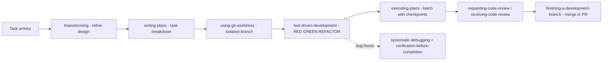

# Superpowers — integrated agent methodology

> Part of the [Skynet project index](../README.md).
> Adapted from [`obra/superpowers`](https://github.com/obra/superpowers) (MIT License,
> © Jesse Vincent / Prime Radiant) — an agentic skills framework and software-development
> methodology. This directory contains **project-adapted** skill files (SKILL.md) tuned for
> libmdbx development on the SourceCraft platform.

---

## 1. What was integrated and why (review & rationale)

| Tier | Skill | Verdict | Rationale |
| --- | --- | --- | --- |
| 1 (core workflow) | `brainstorming` | ✅ take | Design refinement before coding; matches the Architect-mode loop; complex engine features benefit from Socratic questioning and design docs |
| 1 | `writing-plans` | ✅ take | Bite-sized actionable tasks (exact files, verification steps) — the backbone of the whole workflow |
| 1 | `executing-plans` | ✅ take | Batch execution with human checkpoints; maps cleanly onto this platform's task/todo flow |
| 1 | `test-driven-development` | ✅ take | RED-GREEN-REFACTOR is mandatory here: heavy test culture (ut/, issues/, stochastic), any fix must be proven by a failing test first |
| 1 | `systematic-debugging` | ✅ take | The repo ships exploits/ and issue regressions; root-cause discipline fits ASAN/UBSAN/gdb work |
| 1 | `verification-before-completion` | ✅ take | Pairs with debugging: "prove it's fixed" via mdbx_chk, sanitizers, stochastic runs |
| 2 (collaboration) | `requesting-code-review` | ✅ take | SourceCraft has full PR-review tooling (SetDecision, comments) |
| 2 | `receiving-code-review` | ✅ take | Completes the review loop |
| 2 | `using-git-worktrees` | ✅ take | Parallel branches without context switches; standard for multiple in-flight tasks |
| 2 | `finishing-a-development-branch` | ✅ take | Merge/PR decision workflow — maps to SourceCraft PublishPullRequest/MergePullRequest |
| 3 (deferred) | `subagent-driven-development` | ⏸ defer | Subagent-per-task dispatch does not map cleanly to this environment; `executing-plans` covers the flow today. Revisit if subagent tooling becomes available |
| 3 | `dispatching-parallel-agents` | ⏸ defer | Parallel subagents on a single-writer C engine risk interference; low near-term value |
| 3 | `writing-skills` | ⏸ defer | Meta-skill for authoring new skills; load it when we need to write our own SKILL.md files |
| — | `using-superpowers` (bootstrap) | ♻️ replaced | Original relies on Claude Code hooks/CLAUDE.md; its essence (when each skill triggers) is captured here and in `../AGENTS.md` |

## 2. How skills trigger

The methodology forms a pipeline; agents should consult the relevant skill **before** acting:

## 3. Adaptation notes

- **Frontmatter**: kept `name` + `description` (Roo Code / SourceCraft compatible).
- **Platform**: Claude-specific tool names replaced by platform-neutral wording; PR/CI steps
  reference SourceCraft MCP tools (see [`../sourcecraft/README.md`](../sourcecraft/README.md)).
- **Project**: each skill has a "libmdbx project notes" section with concrete commands
  (`make smoke`, `ctest`, `make test-asan/ubsan/memcheck`, `tests/stochastic.sh`, `mdbx_chk`,
  `tests/ut/` + `tests/issues/` placement).
- **Language**: skills are written in English; they may contain Russian annotations where the
  codebase itself uses Russian comments.

## 4. Upstream & license

- Upstream: <https://github.com/obra/superpowers>, MIT License (see `LICENSE` there).
- These files are adapted summaries; the authoritative methodology lives upstream.
- Local adaptations © 2026 project contributors; keep the MIT notice when redistributing.

## 5. Skipped skills — revisit triggers

- `subagent-driven-development` — enable if the platform gains a reliable subagent dispatch API.
- `dispatching-parallel-agents` — revisit for independent, file-disjoint tasks (e.g., doc work).
- `writing-skills` — load from upstream when authoring a new project skill.