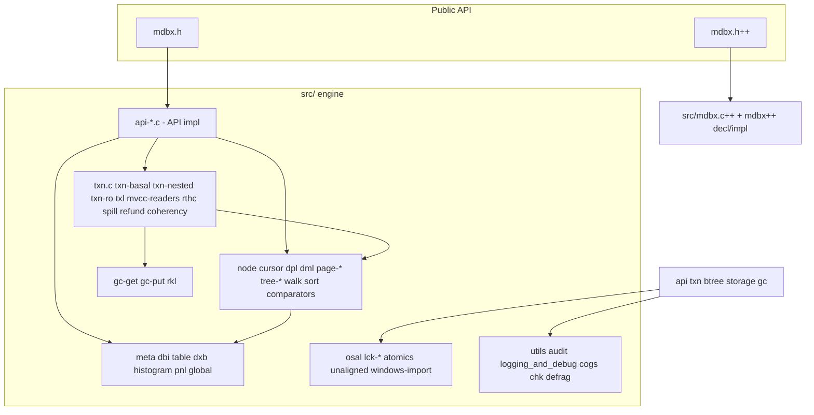

# Repository Structure & Module Classification

> Part of the [Skynet project index](README.md).
> Precise, evidence-based map of the repository for refactoring work: for every `src/` module
> this document records its **role**, **key symbols** and **notes/invariants** (verified against
> headers and sources at scan time). Where an abbreviation expansion is unknown it is stated
> explicitly rather than guessed.

---

## 1. Root level

| Path | Kind | Description |
| --- | --- | --- |
| `CMakeLists.txt` | build | Main CMake build (1619 lines). Detects amalgamated layout (`MDBX_AMALGAMATED_SOURCE=TRUE`, expects `mdbx.c`/`mdbx.h`/`mdbx-internals.h` at root) vs development layout (`FALSE`, expects `.git` + `src/` tree). Includes `cmake/{utils,compiler,profile}.cmake`, runs `semver_provide()` for versioning, generates `src/config.h` from `src/config.h.in`, builds library (static/shared), tools, C++ API (`MDBX_BUILD_CXX`), examples, tests. |
| `GNUmakefile` | build | Legacy GNU Make build (1105 lines), GNU Make >= 3.81 + bash. Targets: `all`, `lib`, `tools`, `check`, `smoke`, `test`/`test-*` (assertion/ci/ci-extra/asan/leak/singleprocess/ubsan/memcheck/long), `dist` (currently prints "amalgamation no longer required"), `doxygen`, `memcheck`, `cross-gcc`, `cross-qemu`, `gcc-analyzer`, `reformat`, `release-assets`, `options`, `help`. Variables: `MDBX_DEBUG`, `MDBX_CHECKING`, `MDBX_BUILD_OPTIONS`, `MDBX_BUILD_TIMESTAMP`, `MDBX_BUILD_CXX`, `MDBX_BUILD_METADATA`, `CC/CXX/CFLAGS/CXXSTD`. Compiler flags are auto-probed (C11, LTO/IPA, `-fno-semantic-interposition`...). |
| `Makefile` | build | Thunk: forwards every known target to `GNUmakefile` via `gmake`. |
| `conanfile.py` | build | Conan 2 recipe (>= 2.7). Package `mdbx`, `package_type=library`, `revision_mode=scm`. ~40 `mdbx.*` options mirroring `options.h` (locking, cacheline_size, bigfoot, dbi_lockfree, dbi_sparse, pgop_stat, profgc, refund, env_checkpid, force_assertions, mmap_*, trust_rtc, txn_checkowner, avoid_msync, build_cxx, build_tools, disable_validation, without_msvc_crt...). |
| `mdbx.h` | public API | C API single header. Doxygen groups: `c_err` Error handling, `c_opening` Opening & Closing, `c_transactions`, `c_dbi` Tables, `c_crud` CRUD, `c_cursors`, `c_statinfo`, `c_settings`, `c_debug`, `c_rqest` Range query estimation, `c_extra`, `api_macros`, `sync_modes`, `value2key`/`key2value`, `chk` Checking and Recovery (internal for `mdbx_chk`). |
| `mdbx.h++` | public API | C++ API single header; includes `mdbx++/begin.h++`, `decl_{slice,buffer,core,env,txn,cursor,exceptions,transcoders}.h++`, `impl_*.h++`, `end.h++`. |
| `AGENTS.md` | rules | Agent instructions: build/test with CMake+CTest on at least Linux and Windows; LLVM code style. |
| `COPYRIGHT`, `LICENSE`, `NOTICE` | legal | Apache-2.0, license-change explanation. |
| `ChangeLog*.md` | docs | Changelogs per version (0.09, 0.10, 0.12, 0.13, Old). |
| `.clang-format`, `.cmake-format.yaml` | style | Formatting rules (LLVM). |
| `docs/` | docs | Doxygen: `Doxyfile.in`, `_preface.md`, `_starting.md`, `_restrictions.md`, `_toc.md`, CSS/HTML assets, logo. |
| `examples/` | docs/code | `example-mdbx.c`, `example-mdbx.c++`, `sample-bdb.txt`, `pcrf/` (PCRF simulator). |
| `.github/workflows/` | CI | GH Actions: linux, macos, windows-msvc, windows-mingw, windows-mscl, cxx-msvc, android. |
| `.sourcecraft/ci.yaml` | CI | SourceCraft CI: workflows `ci-linux-debug-gcc`, `ci-linux-debug-clang`, `ci-linux-release-spilling`; cubes image `dh-mirror.gitverse.ru/jakoch/cpp-devbox:forky-latest`; env `MDBX_BUILD_OPTIONS=-DMDBX_CHECKING=2 -DMDBX_DEBUG=0 -DMDBX_FORCE_ASSERTIONS=1 -DMDBX_DEBUG_SPILLING=1`; runs `tests/ci/ci.sh`; daily cron 03:42 UTC. |
| `.codeassistant/mcp.json` | tooling | MCP config for SourceCraft API (issues/PRs/runs/labels tools). |

---

## 2. `src/` — core engine

Compilation: each module is a separate translation unit; every `.c` includes `internals.h`.
`CMakeLists.txt` lists the sources explicitly; `GNUmakefile` has a parallel list.
`MDBX_INTERNAL` linkage (see `essentials.h`): in non-amalgamated build = plain external
linkage; in amalgamated build (`xMDBX_ALLOY`) = `static`.

### 2.0 Foundation headers (layering)

| File | Role | Key symbols / notes |
| --- | --- | --- |
| `preface.h` | Platform preamble: defines `_GNU_SOURCE`, `_FILE_OFFSET_BITS 64`, `_POSIX_C_SOURCE 200809L`, Windows predefines (`_WIN32_WINNT 0x0A00`, `UNICODE`, `NOMINMAX`), MSVC minimum version check (19.00.24234), compiler guards. | `IS_WINDOWS`, `__restrict`, MSVC pragma shims. |
| `essentials.h` | Internal umbrella #1: pulls `preface.h`, `options.h`, `osal.h`, `atomics-types.h`, `layout-dxb.h`, `layout-lck.h`; defines `LIBMDBX_INTERNALS`, `MDBX_DEPRECATED`, `MDBX_INTERNAL`, `MIN/MAX_MAPSIZE`, `bin128_t`, logger union. | `MDBX_INTERNAL`, `bin128_t`, `MAX_PAGENO`/`PAGELIST_LIMIT` interplay. |
| `options.h` | All `MDBX_*` build options (defaults + comments): `MDBX_BUILD_CXX`, `MDBX_CHECKING`, `MDBX_DEBUG`, `MDBX_LOCKING`, `MDBX_USE_OFDLOCKS`, `MDBX_ENABLE_*` (BIGFOOT, DBI_SPARSE, DBI_LOCKFREE, REFUND, PGOP_STAT, PROFGC, BUNCHES_REMOVAL), `MDBX_WITHOUT_MSVC_CRT`, `MDBX_PNL_ASCENDING`, `MDBX_AVOID_MSYNC`, `MDBX_MMAP_*`, `MDBX_DISABLE_VALIDATION`, `MDBX_WORDBITS`, `MDBX_CACHELINE_SIZE`, `MDBX_DPL_CACHE_NPAGES`, `MDBX_DEBUG_SPILLING`, `MDBX_DEBUG_GCU` etc. | Primary reference: `make options`. |
| `config.h.in` | CMake-configured platform config template → generated `src/config.h` (in build dir). | Included via `MDBX_CONFIG_H`. |
| `layout-dxb.h` | On-disk datafile format. | `MDBX_MAGIC` (56-bit prime `0x59659DBDEF4C11`), `MDBX_DATA_VERSION 3`, `MDBX_DATA_MAGIC`/`_LEGACY_COMPAT`/`_LEGACY_DEVEL`; `FREE_DBI 0`, `MAIN_DBI 1`, `CORE_DBS 2`; `NUM_METAS 3`; `pgno_t` (uint32, DB up to 2^44 bytes at 4K), `txnid_t` (uint64, `MAX_TXNID = SAFE64_INVALID_THRESHOLD-1`), `indx_t` (uint16); `tree_t` (flags, height, dupfix_size, root, branch/leaf/large_pages, sequence, items, mod_txnid); `geo_t` (grow_pv/shrink_pv packed 16-bit, lower/upper/now/end_pgno, first_unallocated); `meta_t` (magic_and_version, two-phase `txnid_a`/`txnid_b`, validator_id, extra_pagehdr, geometry, gc/main trees, canary). |
| `layout-lck.h` | Lock-file format. | `MDBX_LOCK_VERSION 7`; per-locking-flavor `osal_ipclock_t` (`win32files`→void, `SYSV`→pid, `POSIX2001/2008`→pthread_mutex_t, `POSIX1988`→sem_t) and `MDBX_LCK_SIGN`; `gc_prof_stat_t` (GC read/search times, pnl_merge stats); `pgop_stat_t` (newly, cow, clone, split, merge, spill, unspill, wops, msync, fsync, prefault, mincore, incoherence counter, `gc_prof` sub-stats: wloops, coalescences, wipes, flushes, kicks, max_reader_lag, max_retained_pages); Reader Lock Table (readers record txnid in shared table). |
| `internals.h` | Internal umbrella #2 (681 lines): single include point for all modules. Pulls `essentials.h`, `atomics-ops.h`, `rkl.h`, `txl.h`, `unaligned.h`, Windows import; defines core types: `troika_t` (fsm/recent/prefer_steady/tail over `NUM_METAS` metas, `TROIKA_*` macros), `pgr_t` (page+err), `bsr_t` (slot+err), `dp_t`/`dpl_t` (dirty-page list), `clc_t`/`clc_couple_t`/`kvx_t` (comparator+length constraints per key/value, shared per-env table), `enum dbi_state` (DIRTY/STALE/FRESH/CREAT/VALID/SLAIN/OLDEN/LINDO), `enum txn_flags` (ro/nested/nipped/parked/gc_drained...), `struct MDBX_txn` (full layout incl. `wr.{troika, repnl, gc.{reclaimed,ready4reuse,callback,spent}, dirtylist, retired_pages, loose_pages, spilled, refund...}`), env/cur signatures, cursor tracking heads. | `MDBX_txn` is the central struct; refactoring must respect its packed/branching layout and `__restrict` annotations. |
| `proto.h` | Cross-module internal prototypes (211 lines): maps functions to owning modules (audit.c, mvcc-readers.c, dxb.c, txn/basal/nested/ro, env.c, env_options, tree-*, table (`tbl_*`), coherency.c, histogram.c, chk print helpers `chk_line_*`). | Use as the authoritative "who exports what" index. |

### 2.1 Public API implementation (`api-*.c`) — families per `mdbx.h` groups

| File | Implements | Notes |
| --- | --- | --- |
| `api-env.c` | `c_opening`, `c_settings`, `c_statinfo` (env part): `mdbx_env_create/open/close`, set/get options, geometry, `mdbx_env_sync`, `mdbx_env_info`, backup glue | Delegates to `env.c` internals (`env_open`, `env_close`, `env_sync`, `env_info`). |
| `api-txn.c` | `c_transactions`: `mdbx_txn_begin/commit/abort`, reset/renew, nested entry, txn flags handling | Bridges to `txn.c`/`txn-nested.c`/`txn-ro.c`. |
| `api-txn-data.c` | `c_crud` cursor-free: `mdbx_get/put/del`, prefetch, `mdbx_del` variants, txn-level data ops | Contains also bulk/append paths. |
| `api-dbi.c` | `c_dbi`: `mdbx_dbi_open/close/rename/drop`, flags | Bridges to `dbi.c`. |
| `api-cursor.c` | `c_cursors`: `mdbx_cursor_open/get/put/del/seek/count/renew/close`, `mdbx_cursor_eof` | Bridges to `cursor.c` + `tree-search.c`. |
| `api-copy.c` | `c_extra` (copy part): `mdbx_env_copy*` online hot backup | Uses `walk.c` + `iov` machinery. |
| `api-gc.c` | GC introspection: `mdbx_env_get_info` GC fields, `mdbx_txn_break_gc`?, reader enumeration | Bridges to `gc.c` internals and `mvcc-readers.c`. |
| `api-get-cached.c` | "get-cached" lock-free read cache (`c_crud` extension) | Own bookkeeping structures. |
| `api-key-transform.c` | Key transformation / multi-value addressing machinery (`c_crud` dup support) | Used by put/get/del on multimaps. |
| `api-range-estimate.c` | `c_rqest`: `mdbx_estimate_range` | Heuristic on common B-tree paths. |
| `api-opts.c` | Option validation/application (`c_settings`) | Calls `env_options_*`. |
| `api-misc.c` | Version/build-info strings, error names, `mdbx_strerror`, compare-function glue (`mdbx_cmp_*`) | Small but frequently touched. |
| `api-extra.c` | `c_extra`: clone read txn, txn parking (`mdbx_txn_park/unpark`), env info extras | Bridges to `txn-ro.c` park/unpark. |
| `api-cold.c` | Cold-path API helpers (rarely used / error paths) | Marked `__cold`. |

### 2.2 Transactions, MVCC, readers

| File | Role | Key symbols / notes |
| --- | --- | --- |
| `txn.c` | Core transaction machinery: allocation, commit, abort, cursors tracking, GC interaction at commit. | `txn_alloc`, `txn_commit`, `txn_abort`, `txn_setup_primal`, `txn_done_cursors`, `txn_shadow_cursors`, `txn_refund`, `txn_gc_detent`, `txn_check_badbits_parked`. Commit pipeline stages recorded in `commit_timestamp {start, prep, gc, audit, write, sync, gc_cpu}`. |
| `txn-basal.c` | Basal txn layer: create/destroy/start/commit/end/checkpoint/rollback, table-root update. | `txn_basal_create/destroy/start/commit/end/checkpoint/rollback`, `txn_basal_update_tbl_roots`. The basal txn is the environment-owned write txn (`env->basal_txn`). |
| `txn-nested.c` | Nested (sub)transactions: create/abort/commit/checkpoint/rollback, fake read-only nested txns. | `txn_nested_create/abort/commit/checkpoint/rollback`, `txn_nested_fakero_begin/end`. |
| `txn-ro.c` | Read-only transactions: start (with `prepare_only`), park/unpark, clone, reset/free. | `txn_ro_start`, `txn_ro_park`, `txn_ro_unpark`, `txn_ro_clone`, `txn_ro_reset`, `txn_ro_free`. Parking uses `mvcc_kick_laggards`. |
| `txl.c` / `txl.h` | **Txn-id list**: growable sorted array of `txnid_t`. | `txl_alloc/free/append/sort/contain`, `txl_alloclen/size`; granularity 32, max ~2^26. Header comment: "List of txnid". |
| `mvcc-readers.c` | Readers table (MVCC): slot bind/release, oldest-snapshot queries, dead-reader cleanup, laggard kicking. | `mvcc_bind_slot`, `mvcc_snapshot_largest`, `mvcc_snapshot_oldest_rw/ro`, `mvcc_cleanup_dead`, `mvcc_kick_laggards` (see `proto.h`). |
| `rthc.c` / `rthc.h` | **Reader-thread registration bound to TLS.** Registers/deregisters reader-thread entries per env using thread-local storage keys (`pthread_getspecific`/`TlsGetValue`). TLS destructor `rthc_thread_dtor()` runs at thread exit and removes that thread's reader entries from all env objects — this is how readers of terminated threads are cleaned from the readers table. Also handles fork (`rthc_afterfork`) and the glibc TLS-destructor bug (`workaround_glibc_bug21031`, glibc issues #21031/#21032). Exact abbreviation expansion lost. | `rthc_ctor/dtor`, `rthc_register/env`, `rthc_remove`, `rthc_lock/unlock`, `rthc_uniq_check`, `rthc_thread_dtor`, `thread_rthc_get/set`, `thread_key_delete`. |
| `spill.c` / `spill.h` | Dirty-page spilling: when dirty list is full, write pages out temporarily (PNL of spilled pages, pgno<<1 with deleted-slot LSB). | `spill_remove`, `spill_purge`, `spill_slowpath`, inline `txn_spill`, `spill_search`, `spill_intersect`; `MDBX_DEBUG_SPILLING==1` forces spilling in debug. |
| `refund.c` | Refund of reclaimed/loose pages back to the file tail at commit: shrink `first_unallocated` when trailing pages are free (both PNL and loose-pages paths). | `refund_reclaimed`, `refund_loose` (static), driven by `txn_refund` (proto.h); gated by `MDBX_ENABLE_REFUND`. |
| `coherency.c` | Workarounds for incoherent unified page/buffer cache (issue #269): validates meta/trees consistency across mmap view; checks written ranges; timeouts. | `coherency_check_meta`, `coherency_fetch_head`, `coherency_check_written`, `coherency_timeout`; feeds `pgop_stat.incoherence`. |

### 2.3 B+tree engine

| File | Role | Key symbols / notes |
| --- | --- | --- |
| `node.c` / `node.h` | Node layout & manipulation: accessors for pgno/ksize/dsize/flags, key/data pointers; add/delete/shrink nodes; big-data (overflow) read. | `node_pgno/ks/ds/flags`, `node_key/data`, `node_add_branch/leaf/dupfix`, `node_del`, `node_shrink`, `node_read_bigdata`; constants `NODESIZE`, `EVEN_CEIL`. |
| `cursor.c` / `cursor.h` | Cursor implementation and state machine. States documented in Russian comments: `poor` (unset, top=-1, flags<0), `hollow` (top>=0, z_hollow), `pointed` (top>=0, no z_hollow), `filled` (pointed without eof flags). Flags `z_inner`, `z_gcu_preparation`, `z_fresh`, `z_after_delete`, `z_disable_tree_search_fastpath`, `z_eof_soft`/`z_eof_hard` (distinguish "logically at end, data readable" vs "beyond end"), `z_hollow`. | `cursor_init`, `cursor_couple_t` (outer+inner subcursor for dupsort), cursor tracking lists per txn (`txn->cursors`), `cursor_is_tracked`, `cursor_dbi`, `outer_first/next/prev`. |
| `dml.c` / `dml.h` | **Defrag-map list** (NOT "data manipulation"): sorted map of page arcs used by defragmentation. | `da_t` (defrag arc: `key_or_pgno`, `parent`, `mapped:31`, `engaged:1`, `npages:31`, `gc:1`), `dml_t`, `dml_alloc/sort/search/append/free`. Consumed by `defrag.c` and `gc.h`'s `defract_context`. |
| `dpl.c` / `dpl.h` | Dirty-page list: lazy-sorted array of `dp_t{ptr,pgno[,npages]}`; reserve gap (32), mergesort insertion threshold 42; sentinel stub entry at `length+1`. | `txn_dpl_alloc/free/reserve`, `txn_dpl_sort`/`_slowpath`, `txn_dpl_search`, `txn_dpl_intersect`, `dpl_setlen`, `dp_npages`, `dpl_endpgno`, `debug_txn_dpl_find`. |
| `page-get.c` | Page acquisition from GC/repnl; touch/mark dirty; CoW clone of shared pages. | `page_get_*` (via `page-ops.h`), `page_dirty`, `page_new`, `page_touch_*`. |
| `page-ops.c` / `page-ops.h` | Page state predicates and split entry point. States: `is_frozen` (txnid < txn), `is_spilled` (==), `is_shadowed` (>), `is_modifiable` (== front), `is_tmp` (signature), `is_correct`. | `page_split`, `page_check`, `page_get_any/three/large/unchecked`, `page_dirty`, `page_new(_large)`, `page_touch_modifiable/unmodifiable`, `page_touch`; `MDBX_SPLIT_REPLACE`. |
| `page-iov.c` / `page-iov.h` | Scatter/gather bulk write of dirty pages via `iov_ctx` (uses `osal_ioring_t` for async/overlapped I/O); tracks written range for coherency. | `iov_init`, `iov_page`, `iov_write`, `iov_empty`; `MDBX_WRITETHROUGH_THRESHOLD_DEFAULT 2`. |
| `page-split.c` | Node splitting logic (branch/leaf, 1-into-2 and 1-into-3 fallback for oversized nodes). | Called from `page_split`/`node_add_*`. |
| `tree-search.c` | B+tree search: descent from root to foliage, fast path for first/last, `Z_MODIFY/Z_ROOTONLY/Z_FIRST/Z_LAST` flags. | `tree_search`, `tree_search_branch/foliage` via `clc_t` callbacks. |
| `tree-ops.c` | Structural ops: deepen tree (new root), rebalance, key propagation, drop tree. | `tree_deepen_edge`, `tree_deepen_lowest`, `tree_diff_level`, `tree_rebalance`, `tree_propagate_key`, `tree_drop`. |
| `tree-cutoff.c` | Massive deletion by bunches: cut whole branches/pages; range cutoff between two cursors. | `tree_cutoff_twig`, `tree_cutoff_range`; gated by `MDBX_ENABLE_BUNCHES_REMOVAL`. |
| `walk.c` / `walk.h` | Ordered visitor walk over all pages of a table/GC/main tree (used by `mdbx_chk`, backup, copy, count). | `walk_pages`, `walk_tbl`, `walk_func` callback signature (pgno, deep, page_type, txnid, err, sizes), `walk_options_t` (`dont_check_keys_ordering`, `dont_walk_GC`, `dont_walk_MAIN`). |
| `sort.h` | Sorting/binary-search macros: radix threshold 142, network sorts (3,5,...), quicksort with internal stack, cmov-based `SORT_CMP_SWAP`. | `SORT_*` macros, `pnl_sort`, `pnl_search` users. |
| `comparators.c` / `comparators.h` | Key comparators: byte-wise (mempcpy-style), integer 32/64 (aligned/unaligned/align2 variants), used by `INTEGERKEY`/`INTEGERDUP`. | `cmp_uint32/64`, `cmp_uint32/64_unchecked`, `cmp_uint`, `mdbx_cmp_*` glue in `api-misc.c`. |
| `dbi.c` / `dbi.h` | Sub-database management: per-txn DBI state bitmap (sparse optional), open/bind, lazy import (`dbi_check`→`dbi_import`), rename with deferred free, close with defer, snapshots, update of tree records at commit. | `dbi_open`, `dbi_bind`, `dbi_import`, `dbi_gone`, `dbi_snap`, `dbi_update`, `dbi_rename_locked`, `dbi_defer_release`, `dbi_close_release`, `dbi_dig`, `dbi_state`, `dbi_changed`, `TXN_FOREACH_DBI_*` macros; `defer_free_item_t` chain. |
| `table.c` | Table/tree-record operations for named DBs inside the main DB tree. | `tbl_fetch`, `tbl_create`, `tbl_setup`, `tbl_refresh`, `tbl_purge`, `tbl_stat_summary`, `tbl_root_txnid`. |

### 2.4 Storage, metadata, file format

| File | Role | Key symbols / notes |
| --- | --- | --- |
| `meta.c` / `meta.h` | Meta-page handling: troika selection (3 meta pages), sign/steady logic, two-phase txnid update protocol, retry detection. | `meta_tap`, `meta_eq_mask`, `meta_should_retry`, `meta_ptr`, `meta_recent/prefer_steady/tail`, `recent_committed_txnid`, `meta_sync`, `meta_update_begin/end` (atomic ordering: `txnid_b` zeroed then `txnid_a` set, mirrored on end), `meta_sign_*`, `durable_caption`, `troika_verify_fsm`, `troika_dump`. |
| `dxb.c` | Low-level I/O of the mapped data file (`env->dxb_mmap`): setup, pread/pwrite, header read, resize (implicit_grow/shrink, explicit), readahead control, sync (msync/fsync) incl. locked sync with pending meta, sanitize tail for sanitizers. | `dxb_setup`, `dxb_pread/pwrite`, `dxb_read_header`, `dxb_resize`, `dxb_set_readahead`, `dxb_msync/fsync`, `dxb_sync_locked`, `dxb_sanitize_tail`. |
| `histogram.c` | Space-usage histogram helpers (used by `mdbx_chk` reports and geometry). | `histogram_acc_ex/acc`, `histogram_dist`, `histogram_print`. |
| `global.c` | Per-process global state: `globals` (sys_pagesize, bootid, runtime_flags, TLS keys), env registry, global init/cleanup. | `globals.bootid` used in `meta_bootid_match`; `rthc_ctor` wiring. |
| `pnl.c` / `pnl.h` | **Page Number List**: sorted array of `pgno_t`; first element = counter; descending by default (`MDBX_PNL_ASCENDING` switches), allows cheap tail-truncation; contiguous-span detection. | `pnl_*` family (`pnl_alloc/resize/setsize/push/merge/search/...`), `MDBX_PNL_*` macros. |

### 2.5 Garbage collection

| File | Role | Key symbols / notes |
| --- | --- | --- |
| `gc.h` | GC interface + update context. `gcu_t` carries loop state, retired accounting, `rkl_t sequel`, bigfoot, dense histogram (31 entries), embedded cursor/couple. | `gc_put_init/destroy`, `gc_alloc_ex/single`, `gc_update`, `gc_cursor_init`, `gc_merge_loose`, `gc_check_keylen`, `gc_check_rowdata`, `gc_row_pnl` (`glr_t`), `gc_stockpile`, `gc_repnl_*`, `gc_is_reclaimed`, `gc_may_clean_reclaimed`, `defract_context` (defrag state with `dml_t *arcs`). |
| `gc-get.c` | Page allocation from GC: LIFO (default) recycling of retired pages, dense/contiguous sequences, obstacles from slow readers (`gc_reclaiming_obstacle`). | `gc_alloc_*` paths, `ALLOC_*` flags (`DEFAULT`, `UNIMPORTANT`, `RESERVE`, `COALESCE`, `SHOULD_SCAN`, `LIFO`). |
| `gc-put.c` | Retiring freed pages into GC records: store per-txnid records in FREE_DBI tree, merge adjacent, cutoffs, "bigfoot" handling. | `gc_put_init`, `gc_update`, `gc_merge_loose`, `gcu_t` usage; `MDBX_DEBUG_GCU` tracing. |
| `rkl.c` / `rkl.h` | **Sorted set of `txnid_t`** = contiguous interval (`solid_begin..solid_end`) + sorted list, with cheap interval↔list exchange ("magic"). Keeps GC record ids during reclamation (`reclaimed`), ready-for-reuse ids (`ready4reuse`), and ids returned into GC at commit (`comeback`). Both LIFO and FIFO recycling supported. Exact abbreviation expansion unknown. | `rkl_init/reserve/clear/clear_and_shrink/destroy/contain/...`; `rkl_t` (solid_begin/end, list_length/limit, list, inplace[12]). |

### 2.6 OS abstraction & locking

| File | Role | Key symbols / notes |
| --- | --- | --- |
| `osal.c` / `osal.h` | OS abstraction layer (613-line header): compiler/memory barriers, cachectl, threads/TLS keys, memory mapping (`osal_mmap_t`), file I/O incl. overlapped/ioring (`osal_ioring_t`), time, misc syscalls; Windows CRT-less alloc shims (`HeapAlloc`...). | `osal_compiler_barrier`, `osal_memory_barrier`, `osal_thread_self`, `osal_thread_key_*`, `osal_mmap`, `osal_msync/fsync`, `osal_pread/pwrite`, `osal_ioring_*`, `THREAD_CALL`, `THREAD_RESULT`, `OSAL_*` enums. |
| `lck.c` / `lck.h` | Locking framework: lifecycle (setup/init/destroy), seize (exclusive/shared), downgrade/upgrade, reader-table locking, write-txn mutex, reader PID liveness probes. | `lck_setup`, `lck_init`, `lck_destroy`, `lck_seize`, `lck_downgrade`, `lck_upgrade`, `lck_rdt_lock/unlock`, `lck_txn_lock/unlock`, `lck_rpid_set/clear/check`, `lck_ipclock_*`. |
| `lck-posix.c` | POSIX backends: fcntl/OFD (`MDBX_USE_OFDLOCKS`), System V semaphores, POSIX-2001/2008 named mutexes/semaphores. | Selected by `MDBX_LOCKING` compile option; `workaround_glibc_bug21031` interplay. |
| `lck-windows.c` | Windows backend: `LockFileEx` file locking, named mutexes for interprocess sync, reader PID check via `OpenProcess`. | Works on network shares (README note). |
| `atomics-ops.h` / `atomics-types.h` | Portable atomics: C11 `<stdatomic.h>` or compiler builtins fallback; atomic load/store/add with memory orders. | `atomic_load32/64`, `atomic_store32/64`, `mo_*` enum, `mdbx_atomic_uint32/64_t`. |
| `unaligned.h` | Unaligned peek/poke helpers (16/32/64-bit), volatile variants. | `unaligned_peek_u16/32/64`, `unaligned_poke_*`, `unaligned_peek_*_volatile`. |
| `windows-import.c` / `windows-import.h` | Windows API import (dynamic lookup of ntdll functions etc.), SAFESEH assets. | `ntdll.def`, `windows-safeseh-*.asm/obj`. |

### 2.7 Integrity, maintenance, utilities

| File | Role | Key symbols / notes |
| --- | --- | --- |
| `chk.c` | Database integrity check engine (`mdbx_chk`), `MDBX_VALIDATION` page checks, reporting scopes/histograms. | `chk_*` printing helpers declared in `proto.h` (`chk_line_begin/feed/flush`, `chk_println`...); uses `walk.c` + `histogram.c`. |
| `defrag.c` | Online defragmentation (`mdbx_defrag`): remap pages to compact file tail using `dml_t` arcs map, cycle scheduling. | Uses `defract_context` (gc.h), `dml_*` (dml.h), `pnl_*`. |
| `audit.c` | Commit-time audit pass: walks GC + all DBs, sums used pages, verifies against bookkeeping (`retired_stored`), detects leaks/corruption. | `audit_ex(txn, retired_stored, dont_filter_gc)` (proto.h). |
| `logging_and_debug.c` / `logging_and_debug.h` | Panic/assert infrastructure and logging: `panic_at*`, `ENSURE*`, `CHECKS0/1/2_ENABLED()` (levels by `MDBX_CHECKING`), `TRACE/DEBUG/VERBOSE/WARNING/ERROR`, `MDBX_DEBUG` runtime log levels. | `MDBX_panic_point`, `globals.runtime_flags` gates (MDBX_DBG_ASSERT/AUDIT). |
| `utils.c` / `utils.h` | Generic helpers: `F_ISSET`, `EVEN_CEIL/FLOOR`, `CMP2INT`, `ptr_disp/dist`, ASAN poison wrappers, min/max/clamp, power-of-2, `ceil_log2n`, hash `rrxmrrxmsx_0`, hex/base58/base64, uuid/bootid helpers. | Used everywhere; stable names. |
| `cogs.c` / `cogs.h` | Size/cost accounting: `pv2pages`/`pages2pv` (packed exponential-quantized page-value), node/key/value length-limit math (`BRANCH_NODE_MAX`, `LEAF_NODE_MAX`, overflow rules), verification helper. Exact abbreviation expansion unknown. | `pv2pages`, `pages2pv`, `pv2pages_verify`, `LEAF_NODE_MAX`, `BRANCH_NODE_MAX`. |
| `alloy.c` | Amalgamation driver: source-fusing engine used by old `make dist` rules to produce single-file `mdbx.c`/`mdbx.c++`/`mdbx-internals.h` from `src/` (replaces `MDBX_INTERNAL`→`static`). | Historically invoked via `GNUmakefile` ALLOY rules; `src/amalgam.in` is the header template. |
| `version.c.in` | Version source template (filled by CMake/GNUmakefile with `MDBX_GIT_DESCRIBE`, timestamp). | Generated `src/version.c`. |
| `amalgam.in` | Amalgamated-file banner template (`@MDBX_GIT_DESCRIBE@`/`@MDBX_GIT_TIMESTAMP@`). | — |
| `debug_begin.h` / `debug_end.h` | Scoped instrumentation: enter/leave tracing, timing jitter injection (`jitter4testing`). | — |
| `bits.md` | Internal notes on bit/flag layouts. | — |

### 2.8 C++ API glue

| File | Role | Key symbols / notes |
| --- | --- | --- |
| `src/mdbx.c++` | Non-inline part of the C++ API (1935 lines): requires `MDBX_BUILD_CXX=1`, includes `../mdbx.h++` + `internals.h`; implements env/txn/cursor/buffer/slice non-inline methods, filesystem shims, transcoder machinery. | `mdbx::*` implementations; trouble_location diagnostics. |

### 2.9 Tools & man-pages

| File(s) | Resulting binary | Notes |
| --- | --- | --- |
| `src/tools/chk.c` | `mdbx_chk` | Integrity check CLI; uses `chk.c` engine. |
| `src/tools/copy.c` | `mdbx_copy` | Hot backup CLI. |
| `src/tools/drop.c` | `mdbx_drop` | Drop DB/tables CLI. |
| `src/tools/dump.c` | `mdbx_dump` | Dump CLI (custom + export formats). |
| `src/tools/load.c` | `mdbx_load` | Load CLI. |
| `src/tools/stat.c` | `mdbx_stat` | Stats CLI. |
| `src/tools/defrag.c` | `mdbx_defrag` | Defrag CLI (uses `defrag.c` engine). |
| `src/tools/wingetopt.c` / `.h` | — | `getopt` implementation for Windows. |
| `src/man1/mdbx_*.1` | — | Man pages for the six utilities. |

---

## 3. `mdbx++/` — C++ API internals

| File | Role |
| --- | --- |
| `begin.h++` / `end.h++` | Preamble/epilogue of the C++ API header (`mdbx.h++`). |
| `decl_slice.h++` / `impl_slice.h++` | `slice` type: byte-view over keys/values, conversions, transcoders integration. |
| `decl_buffer.h++` / `impl_buffer.h++` | `buffer` type: owning storage with allocator hooks. |
| `decl_core.h++` / `impl_core.h++` | Core declarations: base classes, constants, feature macros. |
| `decl_env.h++` / `impl_env.h++` | `env` class: open/create/options/geometry/backup, RAII. |
| `decl_txn.h++` / `impl_txn.h++` | `txn` class: begin/commit/abort, nested txns, CRUD wrappers. |
| `decl_cursor.h++` / `impl_cursor.h++` | `cursor` class: typed cursor over slices, seek/iteration. |
| `decl_exceptions.h++` / `impl_exceptions.h++` | Exception hierarchy (`error` with `error_code`, derived `map_full`, `bad_dbi`, ...). |
| `decl_transcoders.h++` | Key/value transcoders for typed access (integers, strings, custom). |

---

## 4. `tests/`

| Path | Purpose |
| --- | --- |
| `tests/CMakeLists.txt` | Registers tests; helper `add_simple_test(name, SOURCE, LIBRARY, TIMEOUT, DEPEND, DLLPATH, DISABLED)`; framework library target; per-test executables linked against libmdbx. |
| `tests/framework/` | Framework lib: `base.h++` (asserts/logging), `config.c++/h++`, `keygen.c++/h++` (key generators), `log.c++/h++`, `chrono.c++/h++`, `fork.c++`, `nested.c++`, `copy.c++`, `dead.c++`, `hill.c++`, `jitter.c++`, `ttl.c++`, `try.c++`, `main.c++` (scenario driver), `cases.c++`, `append.c++`, `test.c++/h++`, osal shims (`osal-unix.c++`, `osal-windows.c++`, `osal.h++`), `stub/` (pthread_barrier for Windows, BSD-licensed stub). |
| `tests/ut/` | Unit tests, each a standalone executable: `dbi.c++`, `txn.c++`, `open.c++`, `cursor_closing.c++`, `crunched_delete.c++`, `bunches_removal.c++`, `details_rkl.c`, `distance_scroll_distribute.c++`, `doubtless_positioning.c++`, `dupfix_addodd.c`, `dupfix_multiple.c++`, `early_close_dbi.c++`, `get_cached.c++`, `global_init.c`, `hex_base64_base58.c++`, `maindb_ordinal.c++`, `nested_drop_abort.c`, `probe.c++`, `rename_dbi.c`, `reverse_insertions.c++`, `upsert_alldups.c++`, `buffers.c++`. |
| `tests/issues/` | Regression tests per issue: `issue_gh0010`, `gh0011`, `gh0016`, `gh0017`, `gh0023`-`gh0026`, `gh0028`, `gh0030`, `gh0033`. Registration in `tests/issues/CMakeLists.txt`. |
| `tests/exploits/` | PoCs found by fuzzing/analysis: `poc-node_ds-oob.c`, `pos-badgeo-oos.c`. |
| `tests/stochastic.sh` | Long stochastic scenario runner (bash >= 4.3; RAM-disk recommended). |
| `tests/battery-tmux.sh` + `tests/tmux.conf` | Battery of scenarios in tmux panes. |
| `tests/dump-load.sh` | Dump/load round-trip testing script. |
| `tests/ci/ci.sh` | CI entry: builds via make/cmake and runs targets per `CI_MAKE_TARGET` (smoke/test/check). |
| `tests/.gdbinit`, `tests/with.gdb` | Debugging helpers. |

---

## 5. `examples/`

| Path | Purpose |
| --- | --- |
| `example-mdbx.c` | Minimal C usage example. |
| `example-mdbx.c++` | C++ API usage example. |
| `sample-bdb.txt` | Sample data. |
| `pcrf/pcrf_simulator.c`, `pcrf/README.md` | PCRF charging-rule simulator stress test. |

---

## 6. `docs/`

Doxygen sources: `Doxyfile.in`, `_preface.md`, `_starting.md`, `_restrictions.md`, `_toc.md`,
`doxygen.css`, `doxygen-extra.css`, `header.html`, `footer.html`, `ld+json`, `sitemap.add`,
`title`, `libmdbx-logo.svg`. Published site: <https://libmdbx.dqdkfa.ru>.

---

## 7. Cross-cutting relationships

Include/dependency backbone (bottom-up): `preface.h` ← `essentials.h` ← `{options, osal, atomics,
layouts}` ← `internals.h` (adds `rkl`, `txl`, `unaligned`, core structs) ← all module `.c` files.
`proto.h` holds the cross-module function index (audit, mvcc-readers, dxb, txn family, env,
tree family, tbl family, coherency, histogram, chk printing).

---

## 8. Refactoring quick-reference (facts verified at scan time)

- `MDBX_INTERNAL` is the module-linkage marker; amalgamation swaps it to `static` — never add
  external linkage dependencies between modules without declaring them in `proto.h`.
- `internals.h` defines the single `MDBX_txn` struct consumed by all txn paths; the `wr` union
  (dirtylist/spilled/repnl/gc/refund/loose) is the highest-coupling area.
- DBI state is per-txn (`txn->dbi_state[]` + optional sparse bitmap `dbi_sparse[]`); sequences
  `env->dbi_seqs[]` detect out-of-txn changes (`dbi_changed`).
- Cursor positioning semantics rely on the `z_eof_soft`/`z_eof_hard` pair and the four-state
  machine (`poor/hollow/pointed/filled`) — tests in `tests/ut/cursor_closing.c++` and
  `distance_scroll_distribute.c++` pin this behavior.
- Page state machine (`frozen/spilled/shadowed/modifiable/tmp`) is implemented in `page-ops.h`
  via comparisons with `txn->txnid` and `txn->front_txnid`.
- GC allocation honors `ALLOC_LIFO` (default) and must not hand out pages protected by active
  readers (`gc_reclaiming_obstacle`, `mvcc_kick_laggards`).
- TLS destructor correctness (incl. glibc bugs #21031/#21032) is handled in `rthc.c`; any
  refactoring of per-thread state must keep the `rthc_thread_dtor` cleanup contract.
- Options surface (`options.h` ↔ `conanfile.py` ↔ `GNUmakefile`/CMake `-DMDBX_*`) must stay in
  sync; `make options` is the user-facing reference.