# Development Workflows

> Part of the [Skynet project index](README.md).
> How work flows through this repository: branches, PRs/reviews, CI gates, release and
> amalgamation, plus practical pre-merge checklists. Platform specifics (SourceCraft MCP tooling)
> live in [`sourcecraft/README.md`](sourcecraft/README.md).

---

## 1. Repository & branches

- Canonical origin: **SourceCraft** (`dqdkfa/libmdbx-devel`); GitHub is only a mirror
  ([Mithril-mine/libmdbx](https://github.com/Mithril-mine/libmdbx)) and is explicitly not used
  as the origin (history: repo was deleted by GitHub administration in 2022).
- Branch policy (from README): `stable` for production/staging, `master` for development of
  derivative projects. This dev repository tracks the development line.
- Versioning is git-tag driven: `v<major>.<minor>.<patch>` annotated tags; `GNUmakefile`
  computes `MDBX_GIT_DESCRIBE`, `MDBX_VERSION_PURE`, etc. from tags (`make dist`/`release-assets`
  require fetched tags; tarball builds without `.git` are refused).

## 2. Contribution flow (typical)

```mermaid
flowchart LR
    A[Issue / idea] --> B[Brainstorm design - superpowers brainstorming]
    B --> C[Create branch or git worktree]
    C --> D[Implement with TDD - tests first]
    D --> E[Run local checks]
    E --> F[Push + create PR draft]
    F --> G[Publish PR - CI runs on SourceCraft]
    G --> H[Code review + fixes]
    H --> I[Merge via SourceCraft]
    I --> J[CI daily regression continues]
```

- Issues: created/updated via SourceCraft MCP (`CreateIssue`, `UpdateIssue`, labels,
  linked PRs) — see [`sourcecraft/README.md`](sourcecraft/README.md).
- Worktrees: the repo supports parallel worktrees; the Superpowers `using-git-worktrees`
  skill describes the discipline (see [`skills/superpowers/`](skills/superpowers/README.md)).

## 3. Local validation before pushing (checklist)

Escalate per the **verification levels** defined in
[`skills/superpowers/verification-before-completion/SKILL.md`](skills/superpowers/verification-before-completion/SKILL.md)
(L1 specific test → L1-x sanitizer rebuild → L2 all `ctest` → L3 `make check` →
L4 sanitizer sweeps → L5 memcheck → L6 `stochastic.sh` → L7 human-controlled soak).

| Level | Command | Purpose |
| --- | --- | --- |
| L1 | `ctest -R <name>` (or run binary) | the specific test for your change |
| L1-x | sanitizer build dir + `ctest -R <name>` | same test under ASAN/UBSAN/MEMCHECK |
| L2 | `ctest --output-on-failure` (or `make ctest`) | all deterministic tests: `ut/` + `issues/` + few `mdbx_test` scenarios |
| L3 | `make check` | smoke + install + amalgamation (`dist/`) validation |
| L4 | `make test-asan` / `test-ubsan` | sanitizer sweeps (`MDBX_CHECKING=2`) |
| L5 | `make test-memcheck` | valgrind sweep |
| L6 | `make test-stochastic` or targeted `tests/stochastic.sh` | stochastic parameter sweep, bounded iterations |
| L7 | `tests/battery-tmux.sh`, `make test-long` | human-supervised extended soak (hours/days) |
| +style | `make reformat` | `clang-format` (LLVM, `.clang-format`); must be idempotent |
| +locking | `make check-posix-locking` | SYSV/1988/2001/2008 variants |

Note: sanitizer targets rebuild with their own `CFLAGS_EXTRA`/`CMAKE_OPT` and `MDBX_CHECKING`
(see [`build.md`](build.md) §6.4) — always run them after touching `src/`.

## 4. CI gates

- **SourceCraft** (primary): `ci-linux-debug-gcc` (smoke, no C++), `ci-linux-debug-clang`
  (test, C++ ON), `ci-linux-release-spilling` (check, incl. amalgamation & install). Runs on
  push and daily at 03:42 UTC. Cube timeout 30m — keep smoke/test within budget.
- **GitHub Actions** (mirror): cross-platform matrix (linux/macos/windows-msvc/mingw/mscl/
  cxx-msvc/android) — informational for the dev repo.
- Required locally per `AGENTS.md`: Linux **and** Windows builds/tests (CMake + CTest).

## 5. Code review & merge (SourceCraft)

- PRs start as drafts (`CreatePullRequest`, `publish: false`), then `PublishPullRequest` →
  CI triggers. Link issues via `AddLinkedPRs`.
- Review: inline comments (`CreatePullRequestComment` with `anchor.path/position`, iteration),
  resolve threads (`resolution_state`), set decision `approve`/`block`/`trust`/`abstain`
  (`SetDecision`); `GetMergeChecks` shows approval/CI/conflict status.
- Merge: `MergePullRequest` (squash/rebase options, `delete_branch`).
- See [`sourcecraft/README.md`](sourcecraft/README.md) for exact tool mapping.

## 6. Release process

1. Ensure `master`/dev line is green (full `test-ci-extra` + daily CI).
2. `git fetch --tags --force`; confirm a clean tree at the release tag
   (`release-assets` enforces: `git describe` must equal the clean annotated `v*` tag).
3. `make dist` → generates `dist/` (amalgamated flat sources) + verifies standalone
   `@dist-check` build (`make all check ninja-assertions` inside the copy).
4. `make release-assets` → tarballs (`libmdbx-amalgamated-<ver>.tar.{gz,xz,bz2}`,
   `.zip`, `.zpaq`).
5. Update changelogs (`ChangeLog*.md` per version file) and the version tag; publish via
   SourceCraft. The amalgamated distribution is what downstream embeds — see
   [`build.md`](build.md) §7 for what exactly ships (and the `dist-cutoff` rules that keep
   tests/dev-only code out).

## 7. Testing culture (important for contributions)

- The project relies on a **stochastic framework** (`mdbx_test`) plus deterministic regressions;
  bug fixes must first reproduce the bug (TDD red), then verify with the appropriate scenario
  (see [`build.md`](build.md) §6 and the `test-driven-development` skill).
- Issue numbers in `tests/issues/issue_gh00XX.c++` map to SourceCraft/GitHub issue numbers;
  new bug reports should add a regression there.
- `MDBX_CHECKING=2` + `MDBX_FORCE_ASSERTIONS=1` (as CI does) surfaces internal invariant
  violations (`ENSURE`, `CHECKS0/1/2`, panic points) early.
- The `mdbx_chk -vvn[w]` step after every stochastic probe validates on-disk integrity —
  never skip it when developing engine changes.

## 8. Style & format

- LLVM code style; `clang-format` via `make reformat` (clang-format-19 preferred).
- CMake files formatted per `.cmake-format.yaml`.
- Internal API: module functions `MDBX_INTERNAL`, cross-module exports declared in
  `src/proto.h` (see [`structure.md`](structure.md) §2.0).
- Comments in this codebase are bilingual (Russian + English); match the surrounding language
  when editing.